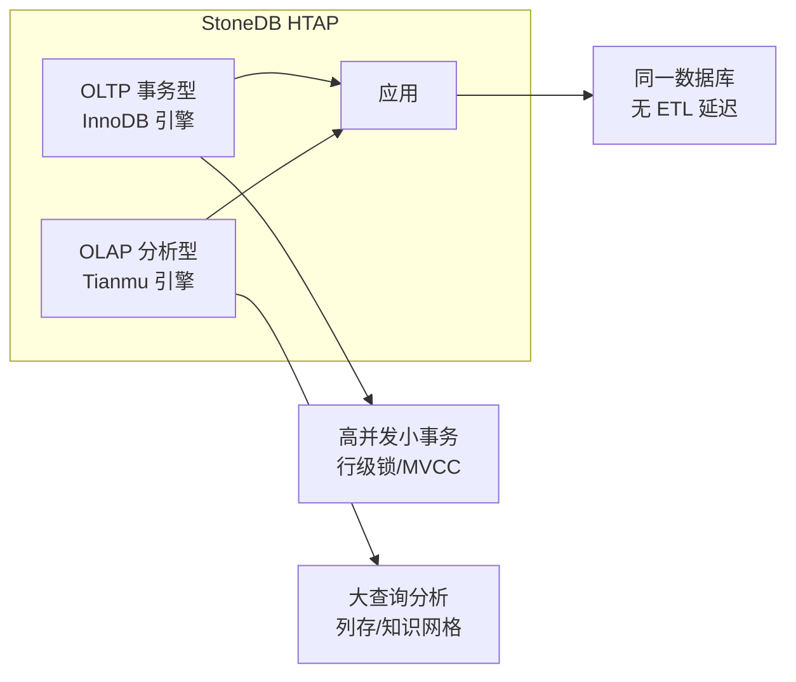
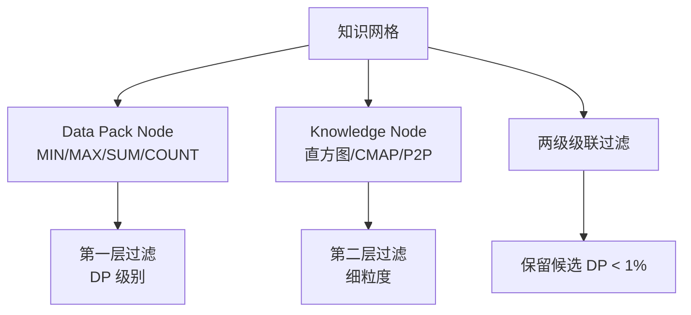
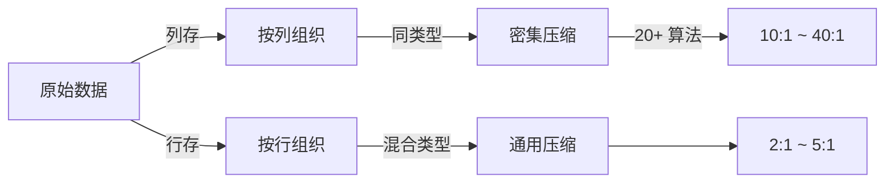
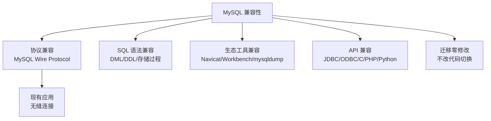
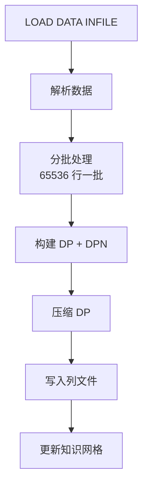
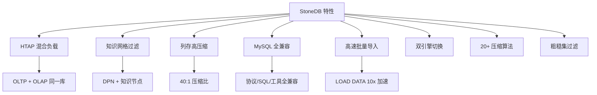

# 关键特性

## 学习目标

- 理解 StoneDB 相比 MySQL 的核心增强特性
- 掌握 Tianmu 引擎的关键技术优势

## HTAP 混合负载

StoneDB 的核心定位是 HTAP——同时处理 OLTP 和 OLAP 负载：



### HTAP 的优势

| 维度 | 传统方案（MySQL + ETL + 分析库） | StoneDB 方案 |
|------|----------------------------------|-------------|
| 数据延迟 | ETL 过程有时间差（分钟级） | 实时，写后即可查 |
| 运维复杂度 | 维护两套系统 | 一套系统 |
| 存储冗余 | 两份数据 | 一份数据 |
| 查询一致性 | 无法保证 | 同一数据的实时视图 |

## 知识网格

知识网格是 Tianmu 引擎最核心的特性：



## 列式存储与高压缩比



## MySQL 全兼容



## LOAD DATA 高速导入

Tianmu 引擎针对批量导入做了深度优化：



性能对比：

| 数据量 | MySQL InnoDB 导入 | StoneDB Tianmu 导入 |
|--------|------------------|--------------------|
| 1GB | ~30s | ~3s |
| 10GB | ~5min | ~30s |
| 100GB | ~50min | ~5min |

## 双引擎可切换

用户可随时指定表的存储引擎：

```sql
-- 创建行存表（OLTP）
CREATE TABLE users (
    id INT PRIMARY KEY,
    name VARCHAR(100)
) ENGINE=InnoDB;

-- 创建列存表（OLAP）
CREATE TABLE orders (
    id INT,
    amount DECIMAL(10,2),
    city VARCHAR(50)
) ENGINE=Tianmu;

-- 转换引擎
ALTER TABLE orders ENGINE=InnoDB;
```

## 特性全景



## 要点总结

- StoneDB 是 HTAP 数据库，同一实例处理 OLTP 和 OLAP 负载
- 知识网格是核心创新：两级元数据过滤，减少 I/O
- 列存 + 20+ 压缩算法实现 10:1 ~ 40:1 压缩比
- MySQL 全兼容，应用迁移零修改
- LOAD DATA 批量导入比 InnoDB 快 10 倍

## 思考题

1. StoneDB 的 HTAP 方案和"MySQL + ETL + ClickHouse"方案相比，各自优缺点是什么？
2. 知识网格的过滤效率取决于统计信息的精度。如果数据分布极度不均匀，过滤效果会如何？
3. 列存引擎在 INSERT/UPDATE 频繁的场景下，相比行存有哪些劣势？StoneDB 如何通过双引擎缓解？