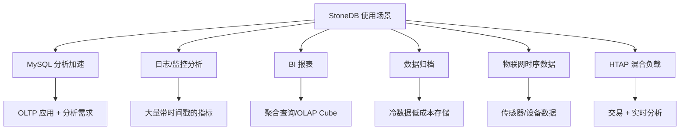
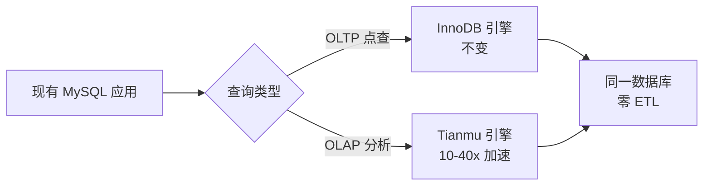
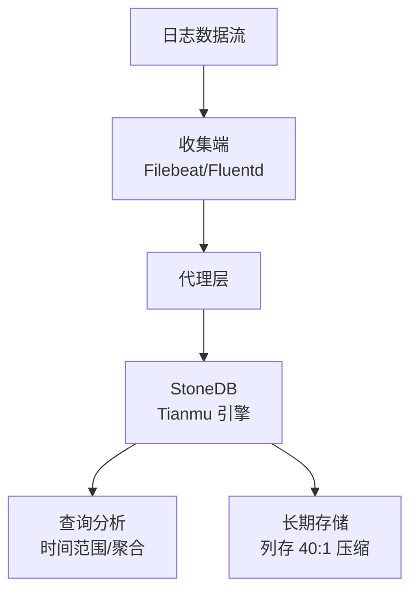
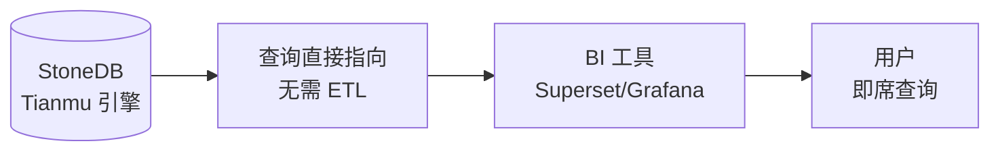
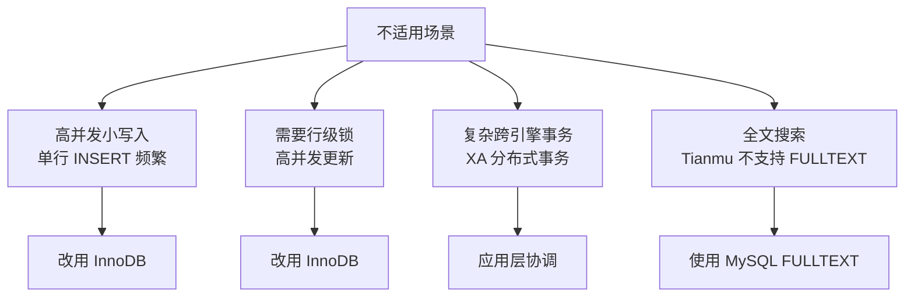

# 使用场景

## 学习目标

- 理解 StoneDB 的典型应用场景
- 掌握场景与引擎选择的对应关系

## 场景概述



## 场景一：MySQL 分析加速

**问题**：MySQL 上跑复杂分析查询（GROUP BY、COUNT、SUM）速度慢，特别是大表聚合。

**解决**：将分析表切换到 Tianmu 引擎，无需改代码。



**效果**：
- 聚合查询：10-40x 加速
- 存储压缩：10:1 以上
- 迁移成本：零代码修改

## 场景二：日志/监控分析

**问题**：存储大量日志数据，需要快速检索和分析。

**方案**：



**特点**：
- 时间范围查询：利用知识网格过滤大部分无关 Data Pack
- GROUP BY + 聚合：列存 + 向量化执行
- 压缩比高：原始 100GB → 磁盘 2.5GB

## 场景三：BI 报表

**问题**：BI 系统需要快速响应复杂聚合查询。

**方案**：



**StoneDB 的 BI 优势**：
- 实时数据：无需 ETL 延迟
- 任意维度：无需预建 Cube，列存支持任意维度组合
- 聚合加速：知识网格直接回答常见聚合

## 场景四：数据归档

**问题**：历史数据占用大量存储空间，但仍需查询。

**方案**：

```sql
-- 将旧数据迁移到 Tianmu 引擎
ALTER TABLE orders_2025 ENGINE=Tianmu;

-- 或者创建列存归档表
INSERT INTO orders_archive SELECT * FROM orders WHERE date < '2025-01-01';
```

**效果**：
- 存储成本：降低 40x → 40TB 数据仅需 1TB
- 查询能力：仍然支持 SQL 查询
- 与在线数据共用同一数据库

## 场景五：物联网时序数据

**问题**：IoT 设备产生大量带时间戳的有序数据。

**方案**：

```sql
CREATE TABLE sensor_data (
    device_id INT,
    ts DATETIME,
    temperature FLOAT,
    humidity FLOAT,
    pressure FLOAT,
    INDEX idx_device_ts (device_id, ts)
) ENGINE=Tianmu;

-- 批量导入
LOAD DATA INFILE 'sensors_2025.csv' INTO TABLE sensor_data;
```

**特点**：
- 时序数据连续写入：知识网格的 Data Pack 有序构建
- Delta 编码对时序数据压缩效果极好
- 时间范围查询通过知识网格快速过滤

## 场景选择矩阵

| 场景 | 推荐引擎 | 原因 |
|------|---------|------|
| 高并发点查（OLTP） | InnoDB | 行存 + B+Tree 索引 |
| 复杂分析查询 | Tianmu | 列存 + 知识网格 |
| 混合负载 | 双引擎 | 根据表粒度选择 |
| 大量数据导入 | Tianmu | LOAD DATA 10x 加速 |
| 实时写入 + 实时查询 | InnoDB + Tianmu | 根据不同表分离 |
| 低成本归档 | Tianmu | 40:1 压缩比 |

## 不适用场景



## 要点总结

- StoneDB 最适合 MySQL 用户的 AP 加速场景
- Tianmu 引擎在 OLAP 场景（聚合、大表扫描、数据归档）表现优异
- InnoDB 引擎继续负责 OLTP 场景
- 双引擎可灵活切换，无需修改应用代码
- 数据归档和日志场景利用列存高压缩比大幅降低存储成本

## 思考题

1. 如果你的系统已经是 MySQL + ETL + ClickHouse 的组合，StoneDB 能否替代 ClickHouse？替换成本是什么？
2. 在 IoT 场景中，Tianmu 引擎的批量写入模式和传感器数据的持续写入是否匹配？
3. 在 BI 场景下，列存引擎的查询性能优势主要体现在哪些类型的 SQL 上？