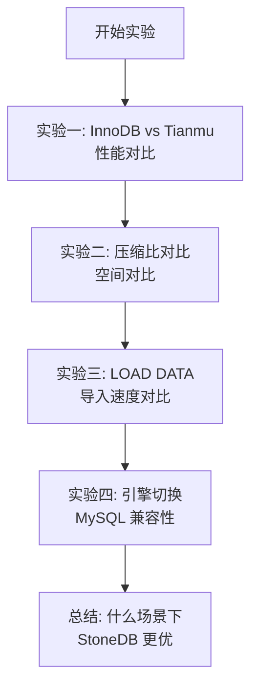

# 动手实验

## 学习目标

- 能够快速部署和体验 StoneDB
- 掌握 Tianmu 引擎的基本操作和性能对比

## 环境准备

### 使用 Docker 部署

```bash
# 拉取 StoneDB 镜像
docker pull stoneatom/stonedb:latest

# 启动容器
docker run -d \
  --name stonedb \
  -p 3306:3306 \
  -e MYSQL_ROOT_PASSWORD=stonedb123 \
  stoneatom/stonedb:latest

# 连接到 StoneDB
mysql -h127.0.0.1 -P3306 -uroot -pstonedb123
```

### 从源码编译

```bash
git clone https://github.com/stoneatom/stonedb.git
cd stonedb

# Ubuntu 20.04
cmake -B build -DCMAKE_BUILD_TYPE=RelWithDebInfo \
  -DDOWNLOAD_BOOST=1 -DWITH_BOOST=/usr/local/boost
cmake --build build -j$(nproc)

# 初始化
scripts/stonedb-install.sh --basedir=/usr/local/stonedb
```

## 实验一：对比 InnoDB 和 Tianmu

### 创建测试表

```sql
-- 创建相同结构的行存表和列存表
CREATE TABLE t_innodb (
    id INT NOT NULL AUTO_INCREMENT PRIMARY KEY,
    city VARCHAR(50),
    amount DECIMAL(10,2),
    ts DATETIME
) ENGINE=InnoDB;

CREATE TABLE t_tianmu (
    id INT NOT NULL AUTO_INCREMENT PRIMARY KEY,
    city VARCHAR(50),
    amount DECIMAL(10,2),
    ts DATETIME
) ENGINE=Tianmu;
```

### 导入测试数据

```sql
-- 生成 100 万行测试数据
INSERT INTO t_innodb (city, amount, ts)
SELECT
    ELT(FLOOR(RAND() * 10) + 1, '北京','上海','广州','深圳','杭州','成都','武汉','南京','西安','重庆'),
    ROUND(RAND() * 10000, 2),
    NOW() - INTERVAL FLOOR(RAND() * 365) DAY
FROM information_schema.CHECK_CONSTRAINTS c1
CROSS JOIN information_schema.CHECK_CONSTRAINTS c2 LIMIT 1000000;

-- 同样的数据导入 Tianmu
INSERT INTO t_tianmu SELECT * FROM t_innodb;
```

### 性能对比

```sql
-- 测试 1：聚合查询
SELECT city, COUNT(*), AVG(amount), SUM(amount)
FROM t_innodb GROUP BY city;
-- 记录执行时间

SELECT city, COUNT(*), AVG(amount), SUM(amount)
FROM t_tianmu GROUP BY city;
-- 记录执行时间

-- 测试 2：范围查询 + 聚合
SELECT COUNT(*), AVG(amount)
FROM t_innodb WHERE amount > 5000;
-- 记录执行时间

SELECT COUNT(*), AVG(amount)
FROM t_tianmu WHERE amount > 5000;
-- 记录执行时间
```

### 观察知识网格效果

```sql
-- 查询 DPN 信息（StoneDB 提供的元数据表）
SHOW STATUS LIKE '%Knowledge%';
SHOW STATUS LIKE '%DataPack%';
```

## 实验二：压缩比对比

```sql
-- 查看表空间大小
SELECT
    table_name,
    engine,
    ROUND(data_length / 1024 / 1024, 2) AS data_mb,
    ROUND(index_length / 1024 / 1024, 2) AS index_mb,
    ROUND((data_length + index_length) / 1024 / 1024, 2) AS total_mb
FROM information_schema.tables
WHERE table_name IN ('t_innodb', 't_tianmu');
```

预期结果：

| 表 | 引擎 | 数据大小 | 压缩比 |
|----|------|---------|-------|
| t_innodb | InnoDB | ~50MB | 1x |
| t_tianmu | Tianmu | ~3MB | ~16x |

## 实验三：LOAD DATA 导入

```bash
# 生成测试 CSV
seq 1 1000000 | awk '{printf "%d,%s,%d,%s\n", $1, "City"$1, int(rand()*10000), "2025-01-01"}' > test_data.csv
```

```sql
-- 导入到 InnoDB
LOAD DATA INFILE '/tmp/test_data.csv'
INTO TABLE t_innodb(id, city, amount, ts);

-- 导入到 Tianmu（测试 10x 加速）
LOAD DATA INFILE '/tmp/test_data.csv'
INTO TABLE t_tianmu(id, city, amount, ts);
```

## 实验四：MySQL 应用迁移

```sql
-- 1. 创建原始 InnoDB 表
CREATE TABLE orders (
    order_id INT AUTO_INCREMENT PRIMARY KEY,
    customer_id INT,
    amount DECIMAL(10,2),
    order_date DATE,
    status VARCHAR(20)
) ENGINE=InnoDB;

-- 2. 导入一些数据
INSERT INTO orders (customer_id, amount, order_date, status)
VALUES (1, 100, '2025-01-01', '完成'), (2, 200, '2025-01-02', '处理中');

-- 3. 应用代码不变的情况下切换引擎
ALTER TABLE orders ENGINE=Tianmu;

-- 4. 验证查询仍然正常工作
SELECT * FROM orders WHERE order_id = 1;  -- 点查
SELECT customer_id, SUM(amount) FROM orders GROUP BY customer_id;  -- 聚合
```

## 实验建议



## 要点总结

- Docker 是最快的 StoneDB 体验方式
- 通过同一数据的 InnoDB 和 Tianmu 引擎对比，直观感受性能差异
- LOAD DATA 批量导入在 Tianmu 引擎下显著更快
- ALTER TABLE ENGINE 可在不中断应用的情况下切换引擎

## 思考题

1. 实验中 Tianmu 引擎的聚合查询比 InnoDB 快多少倍？这个倍数与数据量有关系吗？
2. 如果测试数据量增加到 1 亿行，Tianmu 的压缩比和查询性能会如何变化？
3. 在真实业务中，如何决定哪些表使用 InnoDB、哪些使用 Tianmu？