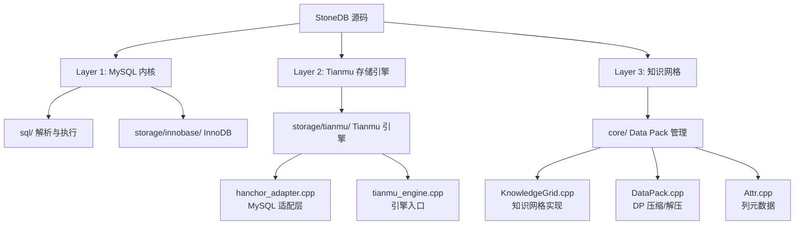
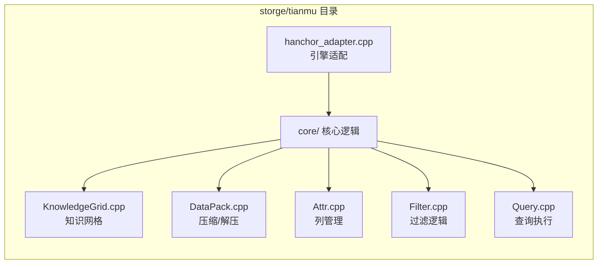
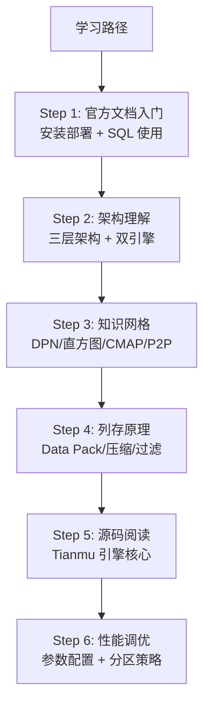
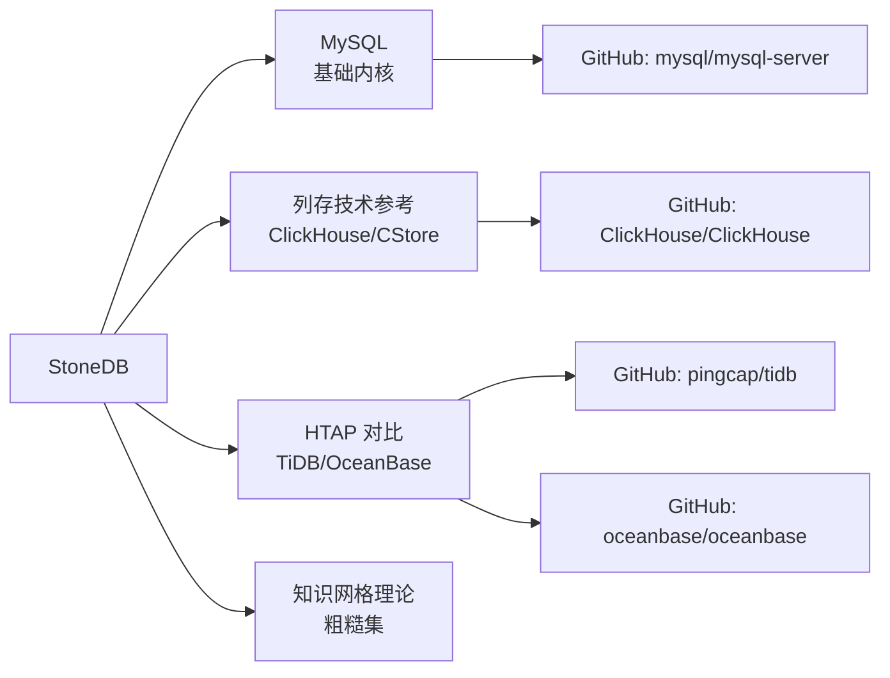

# 学习资源

## 学习目标

- 获取 StoneDB 的优质学习资源
- 建立从入门到深入的学习路径

## 官方资源

### 文档

- **StoneDB 官方文档**：[https://stonedb.io/docs](https://stonedb.io/docs)
  - 包含完整的安装部署、使用指南、SQL 参考
  - 中文版：[https://stonedb.io/zh/docs](https://stonedb.io/zh/docs)
- **GitHub 仓库**：[https://github.com/stoneatom/stonedb](https://github.com/stoneatom/stonedb)
  - 源码、Issue、PR 社区讨论
- **架构说明**：`Docs/00-about-stonedb/architecture.md`
  - Tianmu 引擎架构的详细说明

### 社区

- **Slack**：[StoneDB Slack](https://stonedb.slack.com)
- **Twitter**：[@StoneDataBase](https://twitter.com/StoneDataBase)
- **技术博客**：[https://stonedb.io/blog](https://stonedb.io/blog)

## 源码研读路径

### 关键源码文件

## 技术文章

| 主题 | 说明 |
|------|------|
| StoneDB 架构解析 | 官方架构文档 + 社区博客 |
| 知识网格技术详解 | 粗糙集理论在数据库中的应用 |
| 列存压缩对比 | 行存 vs 列存压缩比实验对比 |
| HTAP 方案选型 | StoneDB vs ClickHouse vs TiDB |

## 学习路径

### 推荐阅读顺序

1. **StoneDB 官方文档**：[介绍](https://stonedb.io/docs/about-stonedb/intro) → [架构](https://stonedb.io/docs/about-stonedb/architecture)
2. **知识网格实现**：`storge/tianmu/core/KnowledgeGrid.cpp`
3. **Data Pack 操作**：`core/DataPack.cpp`
4. **查询执行路径**：`core/Query.cpp`
5. **博客文章**：官方博客的最新技术分享

## 相关项目

## 要点总结

- StoneDB 的源码在 `storge/tianmu/` 目录，核心逻辑在 `core/` 子目录
- 官方文档 + 源码阅读是最佳学习组合
- 知识网格是理解 StoneDB 的关键
- 对比学习：对照 MySQL、ClickHouse、TiDB、OceanBase 理解 HTAP 设计

## 思考题

1. 从源码层面看，Tianmu 引擎与 MySQL 的 handler 接口是如何适配的？
2. KnowledgeGrid.cpp 中实现了哪些关键的数据结构？
3. 与其他列存数据库（如 ClickHouse）相比，StoneDB 的知识网格方案有什么独特之处？