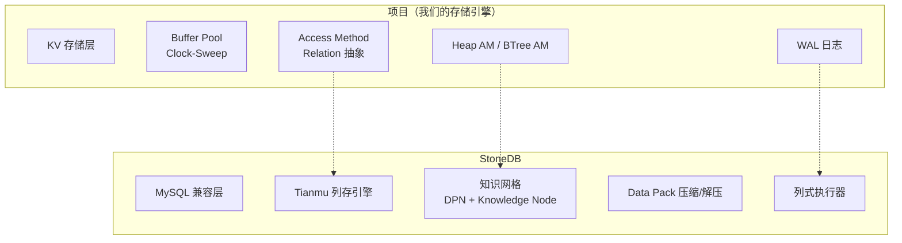
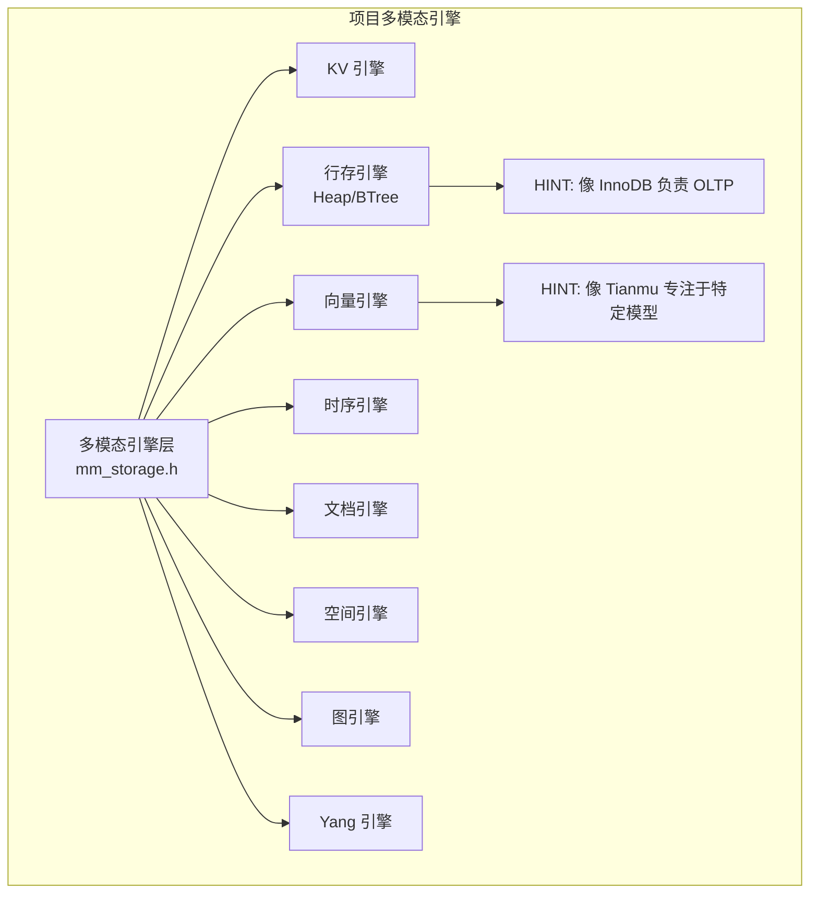
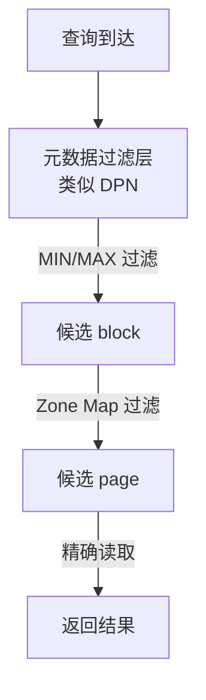
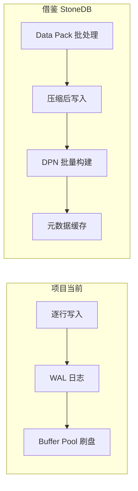
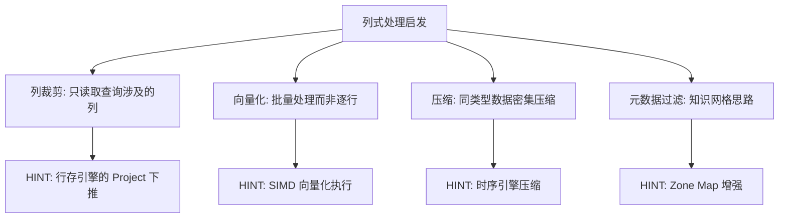
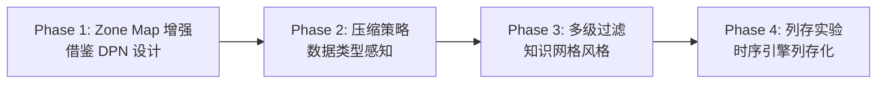

# 与我项目的关联

## 学习目标

- 分析 StoneDB 的设计对项目存储引擎的启发性
- 找出项目中可借鉴的技术点

## 项目 vs StoneDB 架构对比

## 可从 StoneDB 借鉴的设计

### 1. 多引擎共存模式

StoneDB 的双引擎（InnoDB + Tianmu）设计启发了项目中"多模态存储引擎"的架构：

StoneDB 的启示：不同存储引擎服务于不同的查询模式，通过统一的存储接口切换。

### 2. 知识网格的过滤思路

知识网格的 DPN + 多级过滤可以借鉴到项目的索引设计中：

我们的项目中已经实现了类似的 Zone Map（在 BTree AM 中），但不完整。可以借鉴：

- **DPN 的 MIN/MAX 统计**：每个数据块维护 MIN/MAX/COUNT 信息
- **Data Pack 三分类**：相关/无关/可疑的过滤逻辑
- **多级级联过滤**：从粗到细的过滤流水线

### 3. 批量写入与压缩

可借鉴点：
- **批量压缩写入**：在时序引擎中，批量积累数据后压缩写入
- **自定义压缩策略**：根据数据类型选择压缩算法（我们的 Delta 编码已在时序引擎中实现）
- **元数据缓存**：块级别的统计信息常驻内存

### 4. 列式处理的启发

虽然项目目前以行存为主，但列式处理的思路对向量引擎和时序引擎有启发：

## 技术债务与改进

| 项目当前状态 | 可借鉴的 StoneDB 方案 | 优先级 |
|-------------|---------------------|--------|
| Zone Map 只支持简单的 MIN/MAX | 多级知识网格过滤（DPN + 直方图 + CMAP） | 中 |
| 时序引擎压缩算法单一 | 多算法自适应选择（类似 20+ 压缩算法） | 中 |
| Buffer Pool 替换策略固定 | Data Pack 缓存的 LRU 参数可调 | 低 |
| 没有列存支持 | Tianmu 列存引擎的设计思路 | 长期 |

## 项目提升计划

## 要点总结

- StoneDB 的双引擎架构对项目的多模态引擎设计有直接参考价值
- 知识网格的 DPN + 多级过滤思路可以增强项目的 Zone Map 实现
- 批量压缩写入模式适合项目的时序引擎和向量引擎
- 列式处理的列裁剪、向量化、压缩思路值得长期借鉴

## 思考题

1. 如果要在项目中实现一个"知识网格"风格的过滤层，应该如何设计 API？
2. 我们的时序引擎能否借鉴 StoneDB 的 Data Pack 设计，实现块级别的统计信息缓存？
3. 项目的多模态引擎接口（storage_engine_t）和 StoneDB 的 handler 接口设计，有哪些异同？