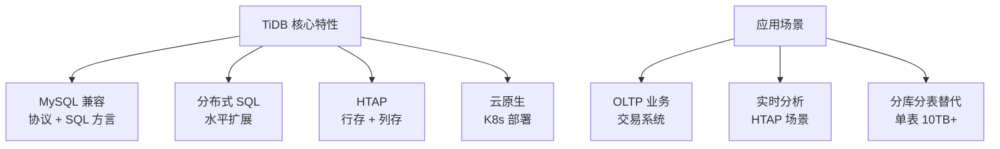
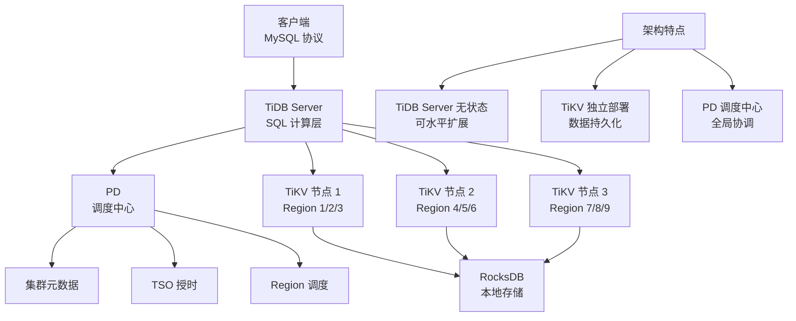
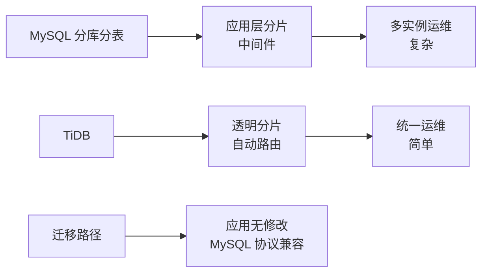
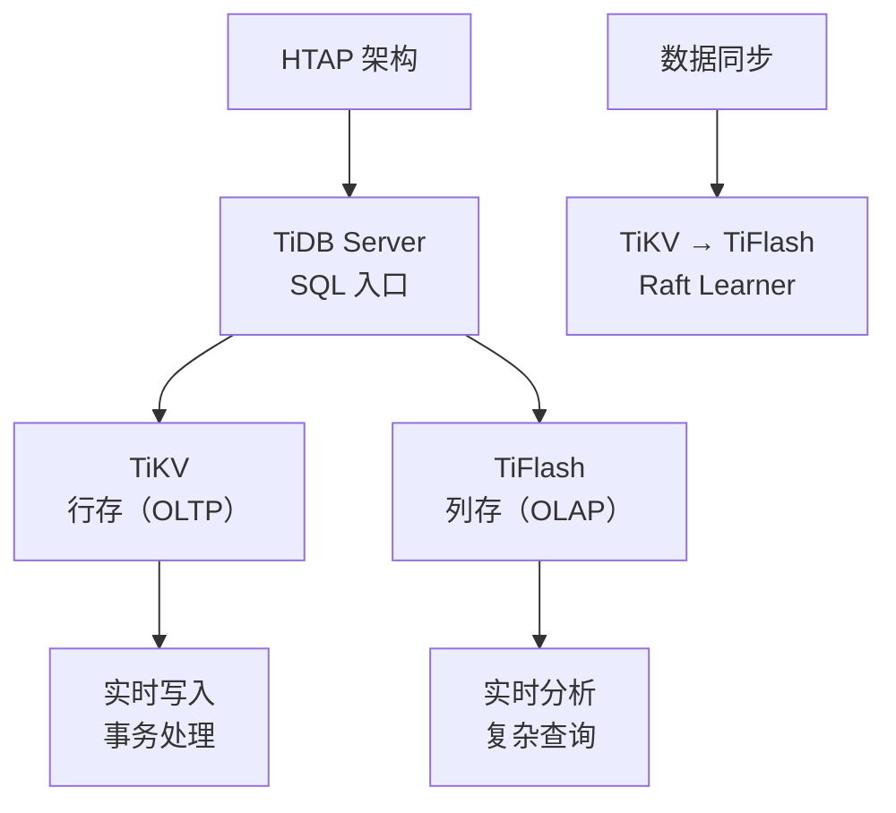

# TiDB 概述

## 学习目标

- 掌握 TiDB 的核心定位：MySQL 兼容的分布式 SQL 数据库
- 理解 TiDB 的三层架构设计：计算存储分离
- 对比 TiDB 与 CockroachDB 的架构差异

## TiDB 简介

TiDB 是 PingCAP 开发的开源分布式 SQL 数据库，兼容 MySQL 协议和语法。

### 与 CockroachDB 的核心差异

| 维度 | TiDB | CockroachDB |
|------|------|------------|
| 架构理念 | **计算存储分离** | **对等架构** |
| 计算层 | TiDB Server（无状态） | 每节点计算 + 存储 |
| 存储层 | TiKV（独立进程） | 每节点 RocksDB |
| 调度中心 | PD（Placement Driver） | Gossip 协议 |
| 事务模型 | Percolator（Google 论文） | HLC + Write Intent |
| 时钟方案 | TSO（PD 集中式授时） | HLC（混合逻辑时钟） |
| SQL 兼容 | MySQL | PostgreSQL |
| 适用场景 | 分库分表替代、HTAP | 分布式 OLTP |

## 三层架构

TiDB 采用计算与存储分离的三层架构。

### TiDB Server（计算层）

- **无状态**：不存储数据，可水平扩展
- **SQL 引擎**：解析、优化、执行 SQL
- **协议兼容**：MySQL 协议，应用无感知迁移

### TiKV（存储层）

- **分布式 KV**：基于 RocksDB
- **Region 分片**：数据按 Key 范围分片
- **Raft 复制**：每个 Region 3 副本

### PD（调度层）

- **元数据管理**：Region 位置、状态
- **TSO 授时**：全局单调递增时间戳
- **自动调度**：Region 迁移、Leader 转移

## 与传统数据库对比

### TiDB vs MySQL 分库分表

| 维度 | MySQL 分库分表 | TiDB |
|------|---------------|------|
| 分片方式 | 应用层分片（ShardingSphere） | 存储层分片（Region） |
| 事务支持 | 跨库事务困难 | 分布式事务（Percolator） |
| 扩展方式 | 手动加实例 | 自动水平扩展 |
| 运维复杂度 | 高（多实例） | 低（统一集群） |

### TiDB vs CockroachDB

| 维度 | TiDB | CockroachDB |
|------|------|------------|
| 架构 | 计算存储分离（三层） | 对等架构（五层） |
| 时钟 | TSO（集中式） | HLC（分布式） |
| 事务 | Percolator（乐观锁） | Write Intent（无锁） |
| SQL 兼容 | MySQL | PostgreSQL |
| 适用场景 | 分库分表替代、HTAP | 分布式 OLTP |

## HTAP 能力

TiDB 支持混合事务/分析处理（HTAP）。

**TiFlash**：

- 列式存储：高效压缩、向量化执行
- 实时同步：通过 Raft Learner 复制
- 透明访问：优化器自动选择行存/列存

## 要点总结

- TiDB 是 MySQL 兼容的分布式 SQL 数据库
- 三层架构：TiDB Server（计算）+ TiKV（存储）+ PD（调度）
- 计算存储分离：TiDB Server 无状态，可水平扩展
- Percolator 事务模型：TSO 授时 + 两阶段提交
- HTAP 能力：TiKV 行存 + TiFlash 列存
- 与 CockroachDB 对比：计算存储分离 vs 对等架构，TSO vs HLC，MySQL vs PostgreSQL 兼容

## 思考题

1. TiDB 的计算存储分离架构相比 CockroachDB 的对等架构，在运维和扩展性上有何优劣？
2. TiDB 的 TSO 集中式授时与 CockroachDB 的 HLC 分布式时钟，在延迟和可用性上有何差异？
3. TiDB 为什么选择 MySQL 兼容而非 PostgreSQL 兼容？这对应用迁移有何影响？
4. TiDB 的 HTAP 能力（TiFlash 列存）相比传统 OLAP 数据仓库（如 ClickHouse）有何优势？