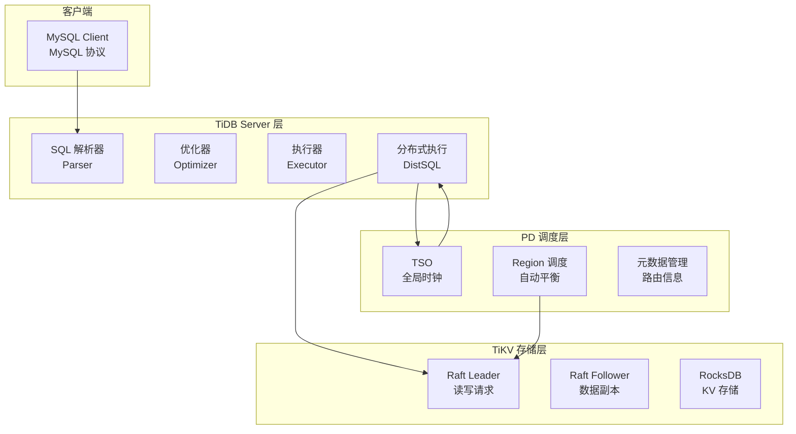
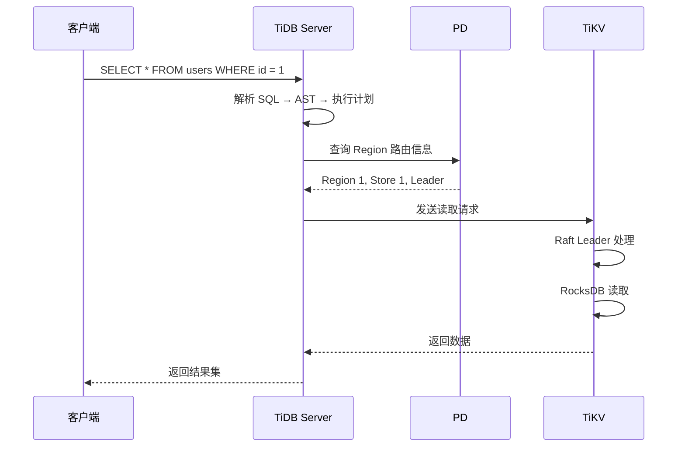
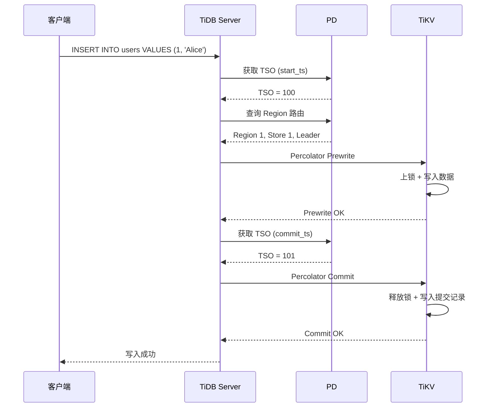
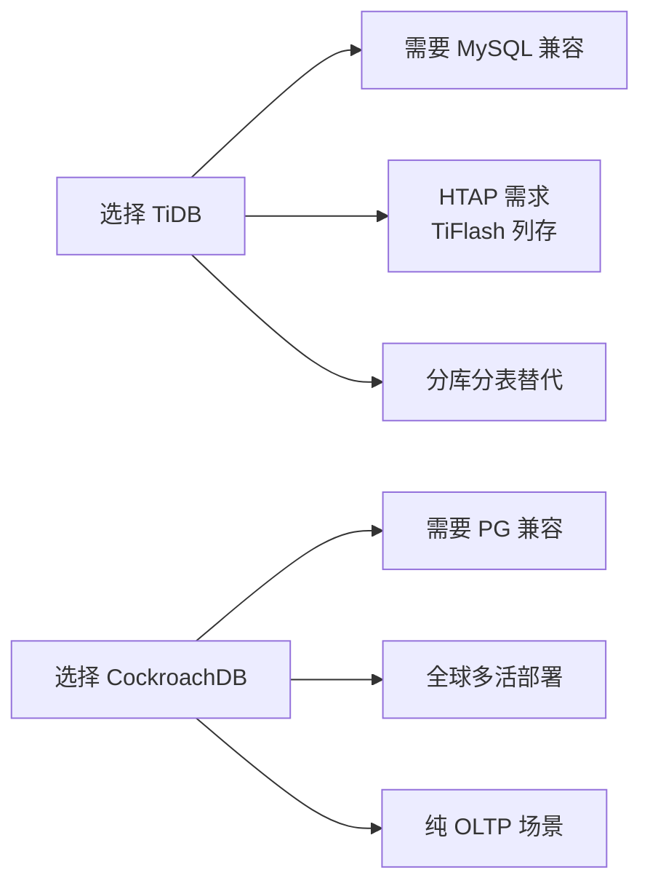

# TiDB 架构详解

## 学习目标

- 掌握 TiDB 的三层架构设计：TiDB Server + TiKV + PD
- 理解 TiDB 与 CockroachDB 的架构设计理念差异
- 掌握 TiDB 请求处理的全链路流程

## 三层架构

TiDB 采用计算与存储分离的三层架构，每层独立扩展。

### TiDB Server 层

**职责**：

- SQL 解析：MySQL 语法解析为 AST
- 查询优化：Cascades/RBO 优化器
- 分布式执行：生成 DistSQL 执行计划
- 结果聚合：合并 TiKV 返回的数据

**特点**：

- 无状态：不存储数据
- 可扩展：支持多个 TiDB Server 实例
- 负载均衡：前端负载均衡器分发请求

### PD（Placement Driver）层

**职责**：

- TSO 授时：全局单调递增时间戳
- Region 调度：Leader 迁移、Region 分裂/合并
- 元数据管理：存储 Region 路由信息

**特点**：

- Raft 高可用：PD 自身用 Raft 做高可用
- 自动调度：Region 数量、分布自动优化
- 关键依赖：所有事务依赖 TSO

### TiKV 层

**职责**：

- 数据存储：基于 RocksDB 的分布式 KV
- 数据复制：Raft Group 复制
- 分布式事务：Percolator 事务模型

**特点**：

- 分片存储：数据按 Region 分片
- Raft 复制：每个 Region 3 副本
- 本地存储：RocksDB 持久化

## 请求处理流程

### 读请求流程

### 写请求流程

## 与 CockroachDB 架构对比

| 维度 | TiDB（三层） | CockroachDB（五层） |
|------|-------------|-------------------|
| 计算层 | TiDB Server（独立进程） | 每节点内嵌 SQL 层 |
| 存储层 | TiKV（独立进程） | 每节点内嵌 RocksDB |
| 调度层 | PD（独立进程） | Gossip 协议（去中心化） |
| 复制方式 | Raft（TiKV 层） | Raft（复制层） |
| 时钟方案 | TSO（集中式） | HLC（分布式） |
| 扩展性 | 计算/存储独立扩展 | 节点整体扩展 |
| 部署复杂度 | 3 组件独立部署 | 1 组件统一部署 |

### 架构设计理念差异

**TiDB 的理念**：计算存储分离

- 计算层和存储层独立扩展
- TiDB Server 无状态，扩缩容无感知
- TiKV 存储独立，支持多计算层连接

**CockroachDB 的理念**：对等架构

- 每个节点兼具计算和存储能力
- 新节点自动加入集群
- 数据自动再平衡，无需人工介入

### 适用场景选择

## 要点总结

- TiDB 采用计算存储分离的三层架构：TiDB Server（无状态）+ TiKV（KV 存储）+ PD（调度中心）
- 读请求：TiDB → PD 获取路由 → TiKV Raft Leader 读取
- 写请求：TiDB → PD 获取 TSO → TiKV Percolator 事务
- 与 CockroachDB 对比：三层 vs 五层，集中式 TSO vs 分布式 HLC
- TiDB 适合 MySQL 兼容、HTAP、分库分表替代场景

## 思考题

1. TiDB 的计算存储分离架构中，TiDB Server 无状态的设计对运维有何好处？扩缩容时数据迁移是否受影响？
2. PD 单点是否成为系统瓶颈？PD 的高可用（Raft）如何确保 TSO 持续可用？
3. TiDB 三层架构相比 CockroachDB 五层架构，在部署和运维复杂度上哪个更简单？
4. 如果 TiKV 的 Raft Leader 发生切换，正在执行的读写请求如何处理？