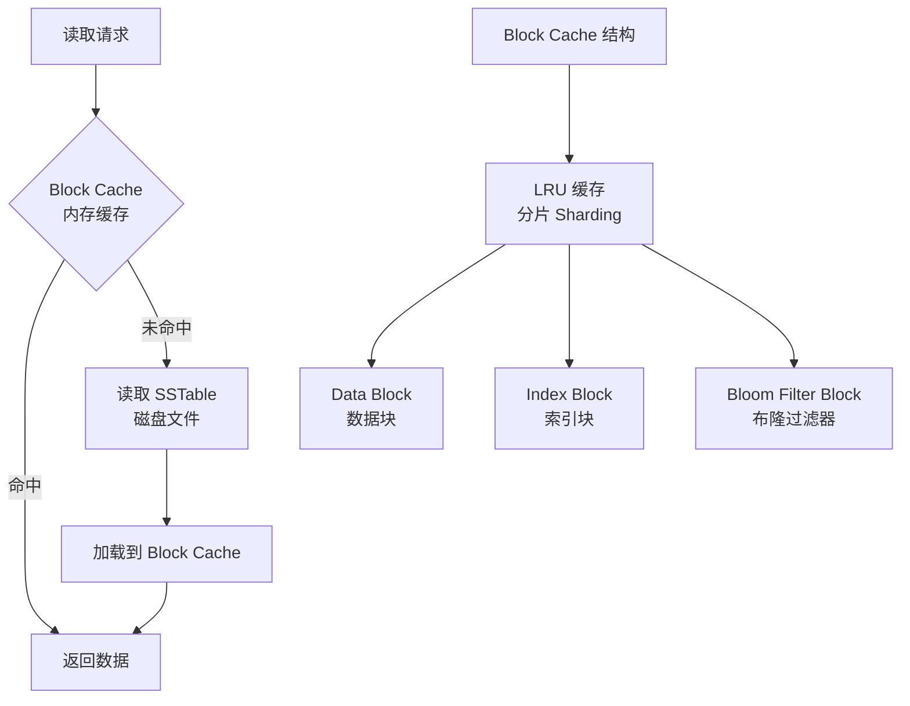
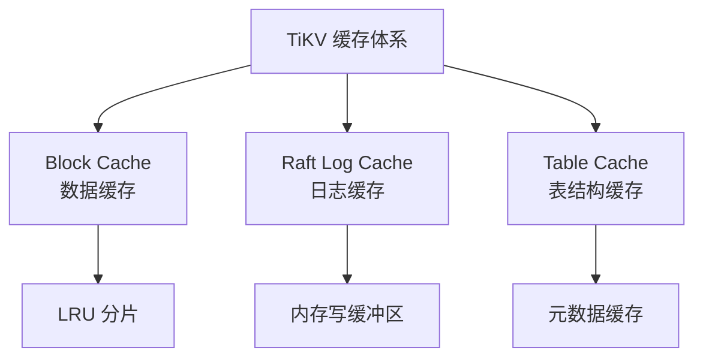

# TiDB Buffer Pool（Block Cache）

## 学习目标

- 掌握 TiKV 的 Block Cache 设计：RocksDB Block Cache + 分片 LRU
- 理解 TiKV 的 Block Cache 与 CockroachDB Block Cache 的差异
- 对比 TiKV 的缓存机制与 PostgreSQL 的 Shared Buffers

## TiKV 的 Block Cache

TiKV 使用 RocksDB 的 Block Cache 作为内存缓存，与 CockroachDB 类似。

### Block Cache 架构



### Block Cache 配置

TiKV 通过配置文件设置 Block Cache 大小：

```toml
# tikv.toml 配置
[storage.block-cache]
capacity = "4GB"  # Block Cache 总大小（建议总内存的 30%）

[rocksdb.defaultcf]
block-size = "64KB"  # 数据块大小
```

### 与 CockroachDB Block Cache 的对比

| 维度 | TiKV | CockroachDB |
|------|------|------------|
| 底层实现 | RocksDB Block Cache | RocksDB Block Cache |
| 配置方式 | 配置文件（tikv.toml） | 启动参数（--cache） |
| 建议大小 | 总内存 30% | 总内存 25% |
| 分片数 | 默认 64 | 默认 64 |
| 缓存粒度 | Block（64KB） | Block（4KB-64KB） |
| 置换策略 | LRU | LRU |

### 与 PostgreSQL Buffer Pool 的对比

| 维度 | TiKV (Block Cache) | PostgreSQL (Shared Buffers) |
|------|--------------------|----------------------------|
| 缓存对象 | SSTable Block | 堆表页面 + 索引页面 |
| 置换策略 | LRU | Clock-Sweep |
| 脏页管理 | 无需（SSTable 只读） | 需要（BgWriter + Checkpoint） |
| 压缩支持 | 支持（Snappy/Zstd） | 不支持 |

## Raft 日志缓存

除了 Block Cache，TiKV 还有 Raft 日志缓存（Raft Log Cache）：



## 要点总结

- TiKV 使用 RocksDB Block Cache 作为数据缓存（LRU 分片）
- Block Cache 缓存 SSTable Block，无脏页管理
- 与 CockroachDB 类似，都基于 RocksDB Block Cache
- 配置建议：总内存 30%
- 除了 Block Cache，还有 Raft 日志缓存和表结构缓存

## 思考题

1. TiKV 的 Block Cache 建议大小（30%）与 CockroachDB（25%）不同，为什么？
2. TiKV 的 Raft 日志缓存如何影响写入性能？如果缓存太小会有什么问题？
3. Block Cache 的分片数（64）如何影响并行读取性能？