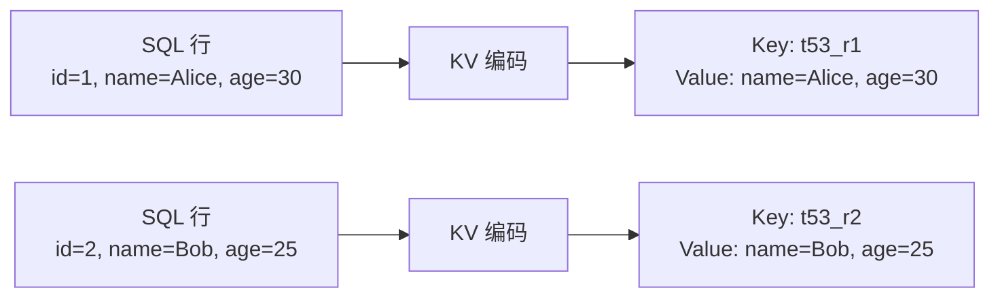
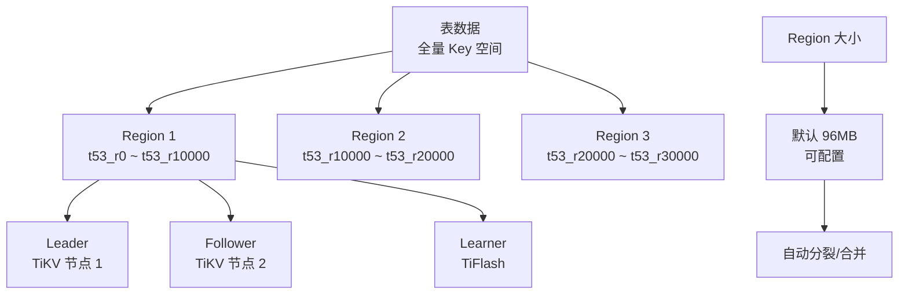

# TiDB 堆表存储（KV 映射）

## 学习目标

- 掌握 TiDB 的表存储方式：SQL 表到 KV 映射
- 理解 TiDB 的 KV 编码方案与 CockroachDB 的差异
- 对比 TiDB 的 KV 存储与 PostgreSQL 的堆表存储

## SQL 表到 KV 映射

TiDB 将 SQL 表编码为 KV 对，存储在 TiKV 中。

### 表结构示例

```sql
CREATE TABLE users (
    id INT PRIMARY KEY,
    name VARCHAR(100),
    age INT
);
```

### KV 编码方案



**KV 编码规则**：

- **Key**：`t<table_id>_r<row_id>`
- **Value**：非主键列的值（编码后的元组）

### 与 CockroachDB KV 编码对比

| 维度 | TiDB | CockroachDB |
|------|------|------------|
| 编码格式 | `t<table_id>_r<row_id>` | `/table/<table_id>/<primary_key>` |
| 主键编码 | row_id（int64 编码） | primary_key 直接编码 |
| 索引编码 | `t<table_id>_i<index_id>` | `/table/<table_id>/<index_id>` |
| 值编码 | 元组编码 | column 序列化 |

## Region 分片存储

TiDB 的数据按 Key 范围分片为 Region。



## 二级索引 KV 编码

```sql
CREATE INDEX idx_age ON users (age);
```

**索引 KV 编码**：

- **Key**：`t53_i1_<age>_<row_id>`
- **Value**：NULL

**示例**：

```
Key: t53_i1_25_2
Value: NULL

Key: t53_i1_30_1
Value: NULL

Key: t53_i1_35_3
Value: NULL
```

## 与 PostgreSQL 堆表的对比

| 维度 | TiDB (KV 存储) | PostgreSQL (堆表) |
|------|---------------|------------------|
| 存储模型 | KV 对（Key-Value） | 堆表（Tuple） |
| 主键存储 | Key 编码 | BTree 索引 + 堆表 |
| 更新操作 | 写入新版本（LSM-Tree） | 原地更新（MVCC） |
| 删除操作 | Tombstone 标记 | 标记删除（VACUUM） |
| 空间回收 | Compaction 自动回收 | VACUUM 手动回收 |

## 要点总结

- TiDB 将 SQL 表编码为 KV 对：`t<table_id>_r<row_id>`
- 二级索引编码：`t<table_id>_i<index_id>_<key>_<row_id>`
- Region 分片（96MB）自动分裂/合并
- 与 CockroachDB 编码格式不同但原理类似
- 相比 PostgreSQL 堆表，写入性能更好但读取性能略差

## 思考题

1. TiDB 的 KV 编码方案（`t53_r1`）与 CockroachDB（`/table/53/1`）在存储效率和查询性能上有何差异？
2. Region 大小（96MB）相比 CockroachDB（512MB）更小，对 Region 数量和调度效率有何影响？
3. 如果一个表有 10 个二级索引，插入一行需要写入多少个 KV 对？