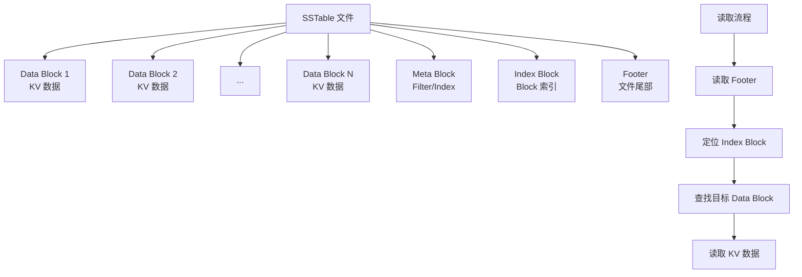

# TiDB 页面布局（SSTable）

## 学习目标

- 掌握 TiKV 的 RocksDB SSTable 文件结构和 Block 布局
- 理解 TiKV 的 Region 分片布局
- 对比 TiKV 与 CockroachDB 的 SSTable 布局

## SSTable 文件结构

TiKV 使用 RocksDB 的 SSTable 文件格式。

### SSTable 整体结构



### Data Block 结构

每个 Data Block 包含多个 KV 对：

```
Data Block 结构：
┌────────────────────────────────────┐
│ Record 1 (Key1, Value1)           │
├────────────────────────────────────┤
│ Record 2 (Key2, Value2)           │
├────────────────────────────────────┤
│ ...                                │
├────────────────────────────────────┤
│ Record N (KeyN, ValueN)           │
├────────────────────────────────────┤
│ Restart Points（重启点）           │
├────────────────────────────────────┤
│ Trailer                            │
└────────────────────────────────────┘
```

## Region 分片布局

TiKV 的 Region 是数据分片单元。

```mermaid
graph TB
    A[TiKV 节点] --> B[Region 1<br/>Key 范围: [t, t_10000)]
    A --> C[Region 2<br/>Key 范围: [t_10000, t_20000)]
    A --> D[Region 3<br/>Key 范围: [t_20000, t_30000)]

    B --> E[RocksDB 实例<br/>CF Default]
    B --> F[RocksDB 实例<br/>CF Write]
    B --> G[RocksDB 实例<br/>CF Lock]

    E --> H[SSTable 文件]
    F --> H
    G --> H
```

### 列族（Column Family）

TiKV 使用 RocksDB 的 Column Family 功能：

- **CF Default**：存储数据
- **CF Write**：存储提交记录（Write 记录）
- **CF Lock**：存储锁记录（Lock 记录）

## 与 CockroachDB SSTable 对比

| 维度 | TiKV | CockroachDB |
|------|------|------------|
| 底层引擎 | RocksDB | RocksDB |
| Column Family | 3 个（Default/Write/Lock） | 1 个（Default） |
| 分片单元 | Region（96MB） | Range（512MB） |
| 分片分裂 | 自动分裂/合并 | 自动分裂/合并 |
| Block 大小 | 默认 64KB | 默认 4KB-64KB |
| 压缩算法 | Snappy/LZ4/Zstd | Snappy/Zstd |

## 要点总结

- TiKV 使用 RocksDB SSTable 文件格式，与 CockroachDB 相同
- TiKV 使用 3 个 Column Family：Default（数据）、Write（提交记录）、Lock（锁记录）
- Region 分片默认 96MB，自动分裂/合并
- 与 CockroachDB 的主要差异：Column Family 数量和分片大小

## 思考题

1. TiKV 的 3 个 Column Family 相比 CockroachDB 的单一 Column Family，在事务性能和存储效率上有何差异？
2. Region 大小（96MB）相比 CockroachDB（512MB）更小，对 SSTable 数量和 Compaction 频率有何影响？
3. 为什么 TiKV 在 Lock CF 中存储锁记录？这与 Percolator 事务模型有何关系？