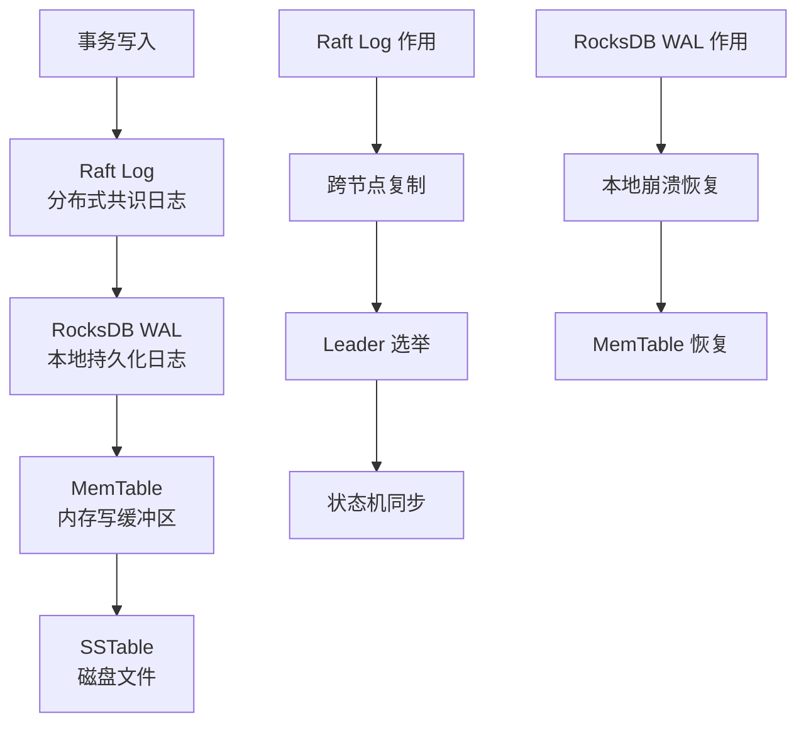

# TiDB WAL 日志（Raft Log + RocksDB WAL）

## 学习目标

- 掌握 TiKV 的双层 WAL：Raft Log + RocksDB WAL
- 理解 TiKV 的 Raft 日志与 CockroachDB 的双层 WAL 的差异
- 对比 TiKV 的日志机制与 PostgreSQL WAL

## 双层 WAL 架构

TiKV 使用双层 WAL：Raft Log（分布式共识）+ RocksDB WAL（本地持久化）。



### Raft Log 结构

```
Raft Log Entry 结构：
┌────────────────────────────────────────────┐
│ Term: 3                                    │
├────────────────────────────────────────────┤
│ Index: 1024                                │
├────────────────────────────────────────────┤
│ Type: EntryNormal                          │
├────────────────────────────────────────────┤
│ Data: [Put t53_r1, Alice]                  │
└────────────────────────────────────────────┘
```

### RocksDB WAL 结构

```
RocksDB WAL Record 结构：
┌────────────────────────────────────────────┐
│ Sequence Number: 50000                     │
├────────────────────────────────────────────┤
│ WriteBatch:                                │
│   - Put CF_Default: t53_r1 → Alice        │
│   - Put CF_Write: t53_r1 → commit_ts      │
│   - Put CF_Lock: t53_r1 → lock_info       │
├────────────────────────────────────────────┤
│ CRC32 Checksum                             │
└────────────────────────────────────────────┘
```

## 与 CockroachDB 双层 WAL 对比

| 维度 | TiKV | CockroachDB |
|------|------|------------|
| Raft Log | Region 级别 Raft | Range 级别 Raft |
| WAL 结构 | RocksDB WAL（3 CF） | RocksDB WAL（单 CF） |
| 日志复制 | Raft Log 复制 | Raft Log 复制 |
| 本地恢复 | RocksDB WAL 回放 | RocksDB WAL 回放 |
| GC 策略 | Raft Log Truncated | Raft Log Truncated |

## 与 PostgreSQL WAL 对比

| 维度 | TiKV | PostgreSQL |
|------|------|------------|
| 日志层次 | Raft Log + RocksDB WAL（双层） | WAL（单层） |
| 日志内容 | KV 操作（Put/Delete） | 页面级修改（Page Image） |
| 复制方式 | Raft 共识复制 | 流复制（LSN 同步） |
| 恢复粒度 | 日志 + SSTable Compaction | WAL 重放 + Checkpoint |

## 要点总结

- TiKV 使用双层 WAL：Raft Log（分布式共识）+ RocksDB WAL（本地持久化）
- Raft Log 负责 Region 级别的日志复制和 Leader 选举
- RocksDB WAL 负责本地崩溃恢复
- 与 CockroachDB 类似，都是双层 WAL 架构
- 主要差异：TiKV 使用 3 个 Column Family 存储 Lock/Write/Data

## 思考题

1. TiKV 的 Raft Log 相比 CockroachDB 的 Raft Log，在 Region/Range 级别上有何差异？
2. RocksDB WAL 的 3 个 Column Family（Default/Write/Lock）如何影响写入性能？
3. 如果 TiKV 的 Raft Log 和 RocksDB WAL 同时损坏，如何恢复数据？