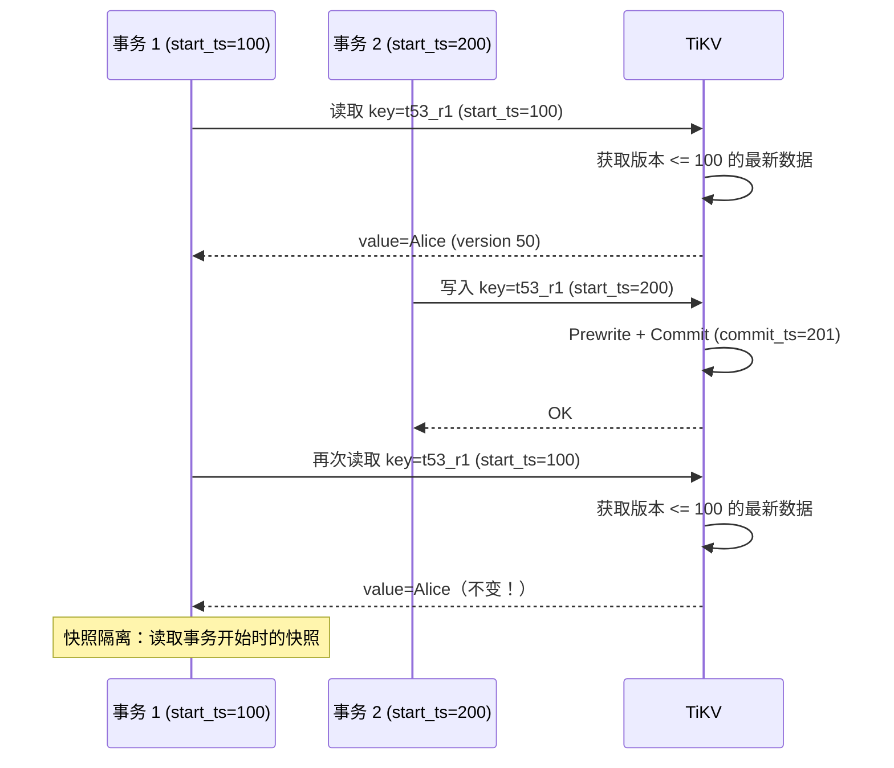

# TiDB 事务隔离级别（Snapshot Isolation）

## 学习目标

- 掌握 TiDB 的 SI（Snapshot Isolation）隔离级别
- 理解 SI 与 CockroachDB SERIALIZABLE 的差异
- 对比 TiDB SI 与 PostgreSQL 的隔离级别

## Snapshot Isolation（SI）

TiDB 使用 SI（Snapshot Isolation）作为默认隔离级别，兼容 MySQL Repeatable Read 语义。

### SI 工作原理



### 写偏斜（Write Skew）

SI 存在写偏斜问题：

```sql
-- 事务 1：读取值班医生数量
BEGIN;
SELECT COUNT(*) FROM doctors WHERE on_call = true;
-- 结果：1 人值班

-- 事务 2：读取值班医生数量
BEGIN;
SELECT COUNT(*) FROM doctors WHERE on_call = true;
-- 结果：1 人值班

-- 事务 1：设置自己下班（假设需要至少 1 人）
UPDATE doctors SET on_call = false WHERE id = 1;
COMMIT;

-- 事务 2：设置自己下班
UPDATE doctors SET on_call = false WHERE id = 2;
COMMIT;

-- 结果：0 人值班（写偏斜！）
```

### Serializable Snapshot Isolation（SSI）

CockroachDB 使用 SSI 解决写偏斜问题：

| 维度 | TiDB（SI） | CockroachDB（SSI/SERIALIZABLE） |
|------|-----------|-------------------------------|
| 隔离级别 | Snapshot Isolation | Serializable |
| 写偏斜 | 存在 | 不存在 |
| 实现方式 | Percolator | Write Intent + SSI 检测 |
| 性能 | 更高 | 略低 |
| 兼容性 | MySQL Repeatable Read | PostgreSQL Serializable |

## 与 CockroachDB 隔离级别对比

| 维度 | TiDB | CockroachDB |
|------|------|------------|
| 默认隔离级别 | SI（Snapshot Isolation） | SERIALIZABLE |
| 可选隔离级别 | RC（Read Committed） | SERIALIZABLE（唯一） |
| 写偏斜 | 存在 | 不存在 |
| 幻读 | 不存在（快照读） | 不存在 |
| 不可重复读 | 不存在 | 不存在 |
| 脏读 | 不存在 | 不存在 |

## 与 PostgreSQL 隔离级别对比

| 维度 | TiDB | PostgreSQL |
|------|------|------------|
| 默认隔离级别 | SI（Repeatable Read） | Read Committed |
| 最高隔离级别 | SI（SSI 不支持） | SERIALIZABLE（SSI） |
| 写偏斜 | 存在 | SERIALIZABLE 下不存在 |
| 快照读 | 默认行为 | 需要 REPEATABLE READ 或以上 |
| 全局时间戳 | TSO | 无（本地时钟） |

## 要点总结

- TiDB 使用 SI（Snapshot Isolation）作为默认隔离级别
- SI 基于 Percolator 事务模型，使用 start_ts 创建快照
- SI 存在写偏斜问题（Write Skew）
- 与 CockroachDB 相比：SI vs SERIALIZABLE
- 与 PostgreSQL 相比：默认 SI vs 默认 Read Committed

## 思考题

1. TiDB 为什么不实现 SSI（Serializable Snapshot Isolation）？实现 SSI 的代价是什么？
2. 在 TiDB 的 SI 隔离级别下，如何避免写偏斜问题？
3. TiDB 的 SI 与 MySQL 的 Repeatable Read 在语义上是否完全等价？