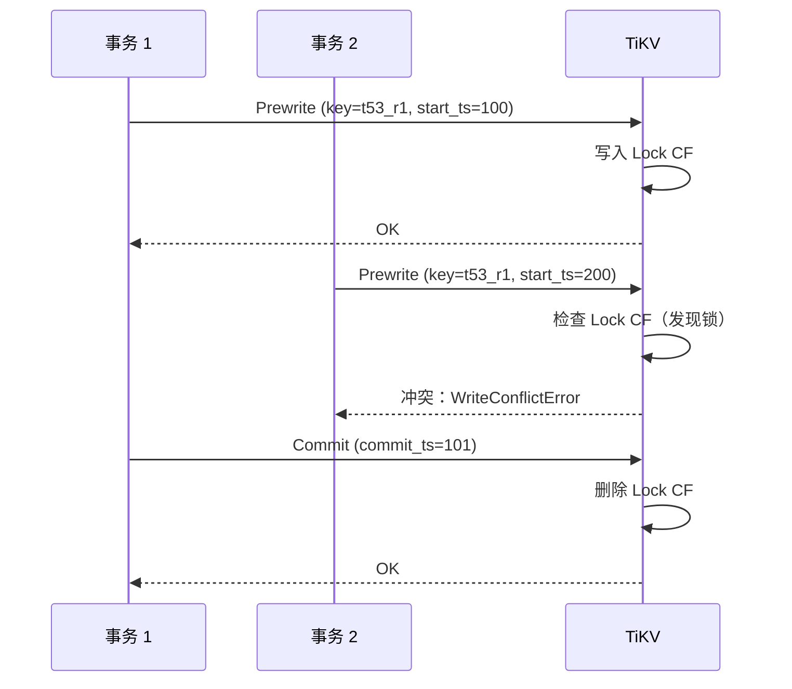
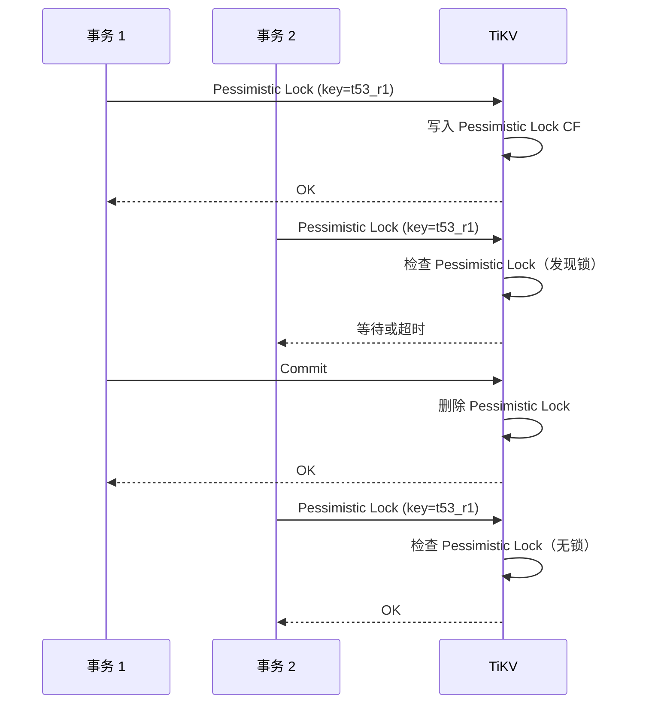

# TiDB 锁机制（Percolator 锁）

## 学习目标

- 掌握 TiDB 的 Percolator 锁机制：乐观锁和悲观锁
- 理解 Percolator 锁与 CockroachDB Write Intent 的差异
- 对比 TiDB 的锁机制与 PostgreSQL 的行级锁

## Percolator 锁机制

TiDB 使用 Percolator 锁，通过 TiKV 的 Lock CF 实现。

### 乐观锁（默认模式）



### 悲观锁（可选模式，TiDB 3.0+）

```sql
-- 开启悲观事务
BEGIN;
SELECT * FROM users WHERE id = 1 FOR UPDATE;
-- 立即获取锁（Pessimistic Lock）
UPDATE users SET age = 31 WHERE id = 1;
COMMIT;
```



## 与 CockroachDB Write Intent 对比

| 维度 | TiDB (Percolator) | CockroachDB (Write Intent) |
|------|-------------------|---------------------------|
| 锁类型 | 显式锁（Lock CF） | 隐式锁（内嵌在 Value） |
| 乐观锁 | 默认模式 | 不支持 |
| 悲观锁 | 可选（3.0+） | 默认模式 |
| 冲突检测 | Lock CF 查找 | Write Intent 检测 |
| 死锁检测 | 超时 + 回滚 | 无死锁 |
| 锁粒度 | 行级锁 | 行级锁 |

### Percolator 锁的优势

1. **乐观锁**：无冲突时性能好
2. **悲观锁可选**：冲突场景更友好
3. **Lock CF 独立**：锁管理清晰

### Write Intent 的优势

1. **无锁设计**：避免死锁
2. **分布式友好**：无需跨节点锁传播
3. **实现简单**：内嵌在 Value 中

## 与 PostgreSQL 行级锁对比

| 维度 | TiDB | PostgreSQL |
|------|------|------------|
| 锁类型 | Percolator Lock | 行级锁（2PL） |
| 乐观锁 | 支持（默认） | 不支持 |
| 悲观锁 | 支持（可选） | 默认模式 |
| 死锁检测 | 超时 + 回滚 | 超时检测 + 回滚 |
| 分布式事务 | 支持 | 不支持 |

## 要点总结

- TiDB 使用 Percolator 锁机制，默认乐观锁，支持悲观锁（3.0+）
- 乐观锁：Prewrite 阶段检测冲突，无冲突时性能好
- 悲观锁：立即获取锁，适合高冲突场景
- 与 CockroachDB 相比：Percolator 显式锁 vs Write Intent 隐式锁
- 与 PostgreSQL 相比：支持乐观锁，分布式事务

## 思考题

1. TiDB 的乐观锁在高冲突场景下（如秒杀）的性能如何？应该使用悲观锁还是乐观锁？
2. Percolator 锁的 Lock CF 相比 CockroachDB 的 Write Intent，在存储空间和写入开销上有何差异？
3. TiDB 的悲观锁如何保证与 PostgreSQL 行级锁类似的隔离性？