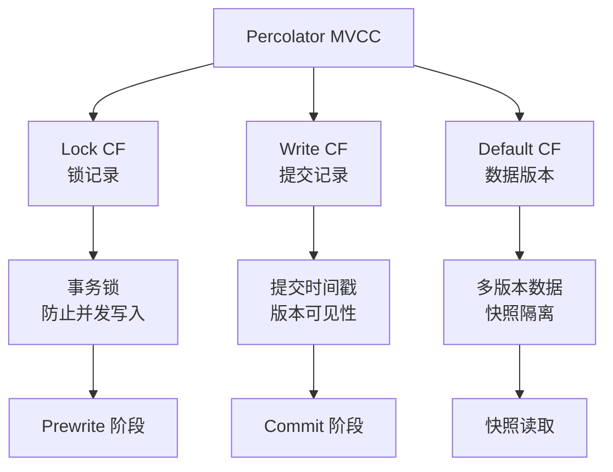
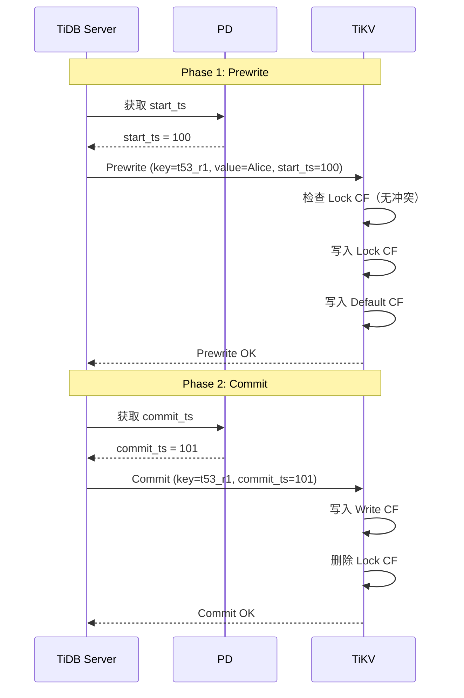

# TiDB MVCC（Percolator 事务模型）

## 学习目标

- 掌握 TiKV 的 MVCC 实现：Percolator 事务模型
- 理解 Lock + Write + Data 三组件的设计
- 对比 TiDB 的 MVCC 与 CockroachDB 的 MVCC

## Percolator MVCC 架构

TiDB 使用 Google Percolator 论文的 MVCC 设计。



## 三组件详解

### Lock CF（锁记录）

存储事务的锁信息：

```
Lock 记录结构：
Key: t53_r1
Value: {
    lock_type: PUT,
    primary: t53_r1,
    start_ts: 100,
    ttl: 60000ms
}
```

**作用**：

- 防止并发写入冲突
- 标识事务状态（PENDING）

### Write CF（提交记录）

存储事务的提交信息：

```
Write 记录结构：
Key: t53_r1@commit_ts=101
Value: {
    type: PUT,
    start_ts: 100
}
```

**作用**：

- 记录提交时间戳
- 标识版本可见性

### Default CF（数据版本）

存储实际的数据：

```
Data 记录结构：
Key: t53_r1@start_ts=100
Value: {name: "Alice", age: 30}
```

**作用**：

- 存储多版本数据
- 支持快照隔离

## 两阶段提交流程



## 与 CockroachDB MVCC 对比

| 维度 | TiDB (Percolator) | CockroachDB (Write Intent) |
|------|-------------------|---------------------------|
| 版本标识 | start_ts + commit_ts | HLC 时间戳 |
| 锁机制 | Lock CF（显式锁） | Write Intent（内嵌锁） |
| 提交记录 | Write CF（独立存储） | Intent 状态转换 |
| 数据存储 | Default CF（独立存储） | MVCC Value（内嵌数据） |
| 冲突检测 | Lock CF 检查 | Write Intent 检查 |
| 清理方式 | GC 清理旧版本 | Compaction 清理 |

## 要点总结

- TiDB 使用 Percolator 事务模型，Lock + Write + Data 三组件
- Lock CF 存储事务锁，Write CF 存储提交记录，Default CF 存储数据
- 两阶段提交：Prewrite（上锁 + 写数据）→ Commit（写提交记录 + 删除锁）
- 与 CockroachDB 相比，TiDB 使用独立的 Column Family 存储锁和提交记录
- Percolator 模型更清晰但写入开销更大

## 思考题

1. Percolator 的三组件（Lock/Write/Default）相比 CockroachDB 的单组件 MVCC，在写入性能和存储效率上有何差异？
2. TiDB 的乐观锁在高冲突场景下性能如何？悲观事务模式如何解决冲突问题？
3. 如果 Prewrite 成功但 Commit 失败，如何处理残留的 Lock 记录？