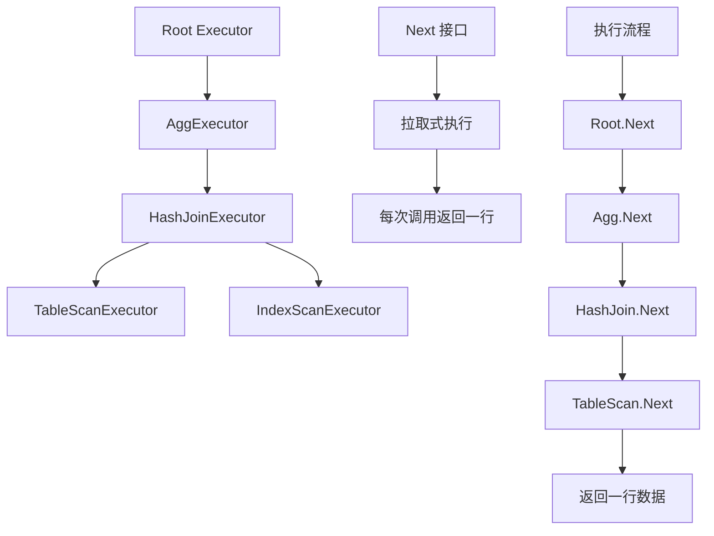
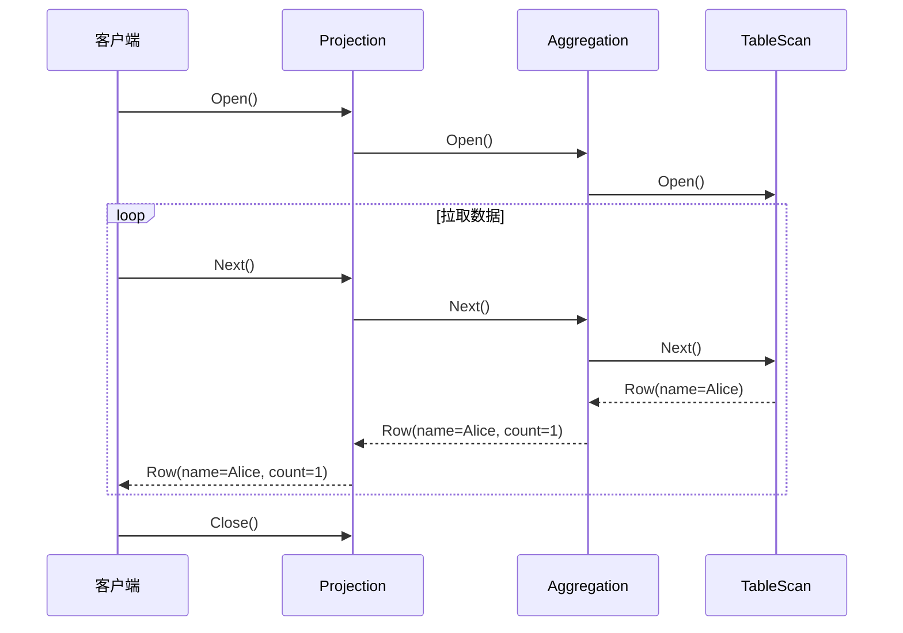
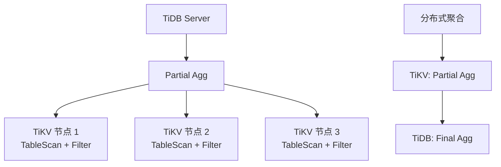

# TiDB 查询执行器（火山模型）

## 学习目标

- 掌握 TiDB 的火山模型执行器
- 理解 TiDB 的分布式执行框架
- 对比 TiDB 执行器与 CockroachDB 的差异

## 火山模型执行器

TiDB 使用经典的火山模型（Volcano Model）执行器。



### 执行器接口

```go
type Executor interface {
    Open() error
    Next() (*Row, error)
    Close() error
}
```

### 示例：SELECT 查询

```sql
SELECT name, COUNT(*) FROM users GROUP BY name;
```

**执行计划**：

```
Projection(name, COUNT(*))
└── Aggregation(GROUP BY name, COUNT(*))
    └── TableScan(users)
```

**执行流程**：



## 分布式执行

TiDB 支持分布式执行，将计算下推到 TiKV。

### 下推算子

- **TableScan**：下推到 TiKV
- **IndexScan**：下推到 TiKV
- **Selection**：部分下推
- **Aggregation**：部分下推（Partial Agg + Final Agg）



## 与 CockroachDB 执行器对比

| 维度 | TiDB | CockroachDB |
|------|------|------------|
| 执行模型 | 火山模型 | 火山模型 + 向量化 |
| 分布式执行 | 下推到 TiKV | DistSQL 下推 |
| 向量化执行 | TiFlash（列存） | 支持 |
| 并行执行 | 并行 TableScan | 并行 DistSQL |

## 与 PostgreSQL 执行器对比

| 维度 | TiDB | PostgreSQL |
|------|------|------------|
| 执行模型 | 火山模型 | 火山模型 |
| 分布式执行 | 支持（下推 TiKV） | 不支持 |
| 向量化执行 | TiFlash | 不支持 |
| JIT 编译 | 不支持 | LLVM JIT |

## 要点总结

- TiDB 使用火山模型执行器，拉取式执行
- 支持分布式执行，将计算下推到 TiKV
- TiFlash 提供向量化执行能力
- 与 CockroachDB 类似，都是火山模型 + 下推
- 与 PostgreSQL 相比，支持分布式执行

## 思考题

1. TiDB 的火山模型相比向量化执行，在 OLAP 场景下的性能瓶颈是什么？
2. TiDB 如何决定哪些算子可以下推到 TiKV？下推的代价是什么？
3. TiFlash 的向量化执行如何与 TiDB 的火山模型协同工作？