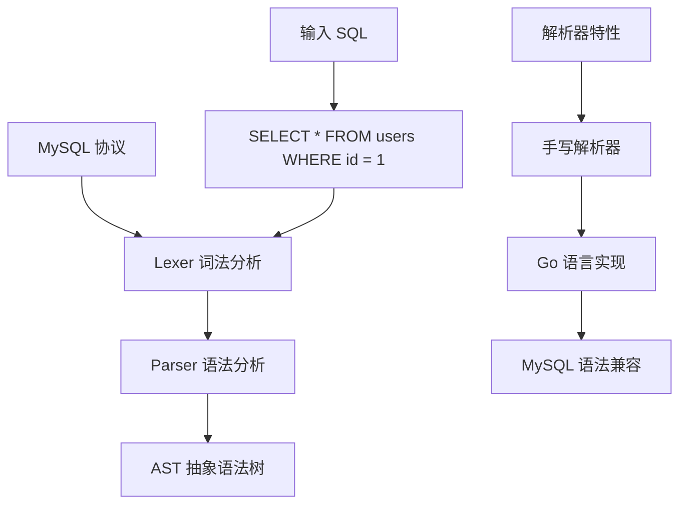
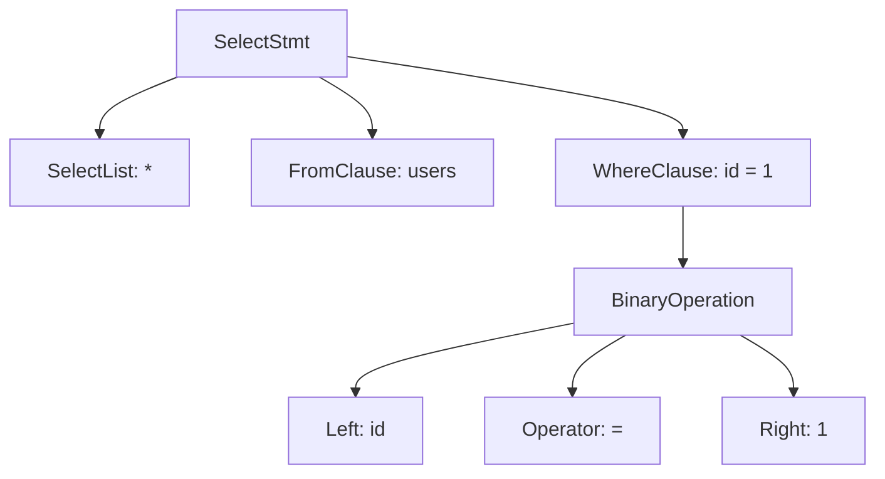

# TiDB 查询解析器（MySQL 兼容）

## 学习目标

- 掌握 TiDB 的 SQL 解析器架构
- 理解 TiDB 的 MySQL 兼容性设计
- 对比 TiDB 解析器与 CockroachDB 的差异

## 解析器架构

TiDB 使用自研的 SQL 解析器，兼容 MySQL 协议。



### 词法分析（Lexer）

将 SQL 字符串拆分为 Token 序列：

```
输入：SELECT * FROM users WHERE id = 1

Token 序列：
[SELECT] [*] [FROM] [users] [WHERE] [id] [=] [1]
```

### 语法分析（Parser）

将 Token 序列构建为 AST：



## MySQL 兼容性

TiDB 兼容 MySQL 5.7 协议和语法。

### 兼容的 MySQL 特性

- **协议兼容**：MySQL Wire Protocol
- **SQL 语法**：大部分 MySQL 语法
- **数据类型**：INT, VARCHAR, TEXT, BLOB, JSON, DATETIME 等
- **内置函数**：COUNT, SUM, AVG, MAX, MIN, NOW, DATE_FORMAT 等
- **DDL 语句**：CREATE TABLE, ALTER TABLE, DROP TABLE 等

### 不兼容的 MySQL 特性

- **存储过程**：部分支持
- **触发器**：不支持
- **外键**：不支持（TiDB 5.0+ 支持）
- **自增主键**：实现不同（无 AUTO_INCREMENT 缓存）

## 与 CockroachDB 解析器对比

| 维度 | TiDB | CockroachDB |
|------|------|------------|
| 兼容协议 | MySQL | PostgreSQL |
| 解析器实现 | 手写 Go 解析器 | 手写 Go 解析器 |
| AST 结构 | TiDB AST（MySQL 风格） | PG AST（PostgreSQL 风格） |
| 语法兼容性 | MySQL 5.7 | PostgreSQL 13+ |
| 复杂查询支持 | 较好 | 较好 |

## 与 PostgreSQL 解析器对比

| 维度 | TiDB | PostgreSQL |
|------|------|------------|
| 兼容协议 | MySQL | PostgreSQL |
| 解析器实现 | 手写解析器（Go） | Bison/Flex 生成（C） |
| AST 结构 | MySQL 风格 | PostgreSQL 风格 |
| 语法差异 | MySQL 语法 | PostgreSQL 语法 |

### 示例：SELECT 语句差异

**MySQL（TiDB）**：

```sql
SELECT * FROM users LIMIT 10 OFFSET 5;
```

**PostgreSQL（CockroachDB）**：

```sql
SELECT * FROM users LIMIT 10 OFFSET 5; -- 相同
```

## 要点总结

- TiDB 使用手写 Go 解析器，兼容 MySQL 5.7
- 支持大部分 MySQL 协议和语法
- 与 CockroachDB 相比：MySQL vs PostgreSQL 协议
- 与 PostgreSQL 相比：手写解析器 vs Bison/Flex 生成

## 思考题

1. TiDB 的手写解析器相比 PostgreSQL 的 Bison/Flex 生成，在性能和可维护性上有何差异？
2. TiDB 的 MySQL 兼容性在迁移场景下的优势是什么？有哪些需要注意的差异？
3. TiDB 的 AST 结构如何影响后续的查询优化器设计？