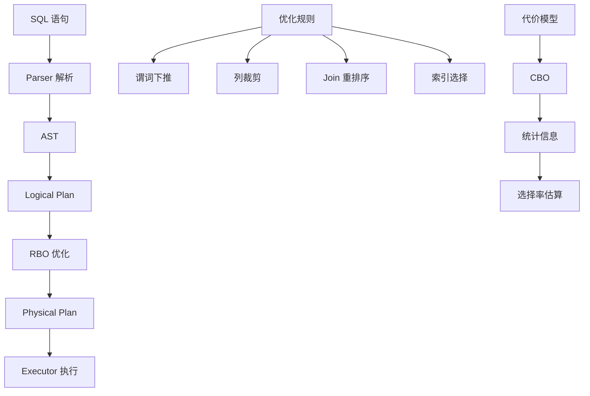

# TiDB 查询优化器（Cascades + RBO）

## 学习目标

- 掌握 TiDB 的 Cascades 优化器框架
- 理解 TiDB 的 RBO（Rule-Based Optimization）规则
- 对比 TiDB 优化器与 CockroachDB 的差异

## 优化器架构

TiDB 使用 Cascades 框架的优化器，结合 RBO 和 CBO。



## RBO 规则

TiDB 实现了多种 RBO 规则：

### 谓词下推

```sql
SELECT * FROM users WHERE age > 30;
```

**优化前**：

```
Selection(age > 30)
└── TableScan(users)
```

**优化后**：

```
TableScan(users, filter: age > 30)
```

### 列裁剪

```sql
SELECT name FROM users;
```

**优化前**：

```
Project(name)
└── TableScan(users, columns: [id, name, age, email])
```

**优化后**：

```
Project(name)
└── TableScan(users, columns: [name])
```

### Join 重排序

```sql
SELECT * FROM users JOIN orders ON users.id = orders.user_id;
```

**优化目标**：小表驱动大表

## 与 CockroachDB 优化器对比

| 维度 | TiDB | CockroachDB |
|------|------|------------|
| 优化器框架 | Cascades | Cascades |
| 优化规则 | RBO + CBO | RBO + CBO |
| 分布式优化 | 下推到 TiKV | DistSQL 下推 |
| 代价模型 | 基于 CPU/IO | 基于 CPU/IO/Network |
| 统计信息 | 柱状图 + Count-Min Sketch | 柱状图 |

## 与 PostgreSQL 优化器对比

| 维度 | TiDB | PostgreSQL |
|------|------|------------|
| 优化器框架 | Cascades | 动态规划 + GEQO |
| 优化规则 | RBO + CBO | CBO 为主 |
| Join 算法 | Hash Join / Nest Loop | Hash Join / Merge Join / Nest Loop |
| 分布式优化 | 下推到 TiKV | 不支持分布式 |

## 要点总结

- TiDB 使用 Cascades 框架的优化器，结合 RBO 和 CBO
- RBO 规则：谓词下推、列裁剪、Join 重排序
- CBO 代价模型基于统计信息估算
- 与 CockroachDB 类似，都是 Cascades 框架
- 与 PostgreSQL 相比，支持分布式查询优化

## 思考题

1. TiDB 的优化器如何决定是否下推谓词到 TiKV？下推的代价是什么？
2. TiDB 的统计信息收集机制（ANALYZE）如何影响优化器的选择？
3. 如果 TiDB 的优化器选择了错误的执行计划，如何通过 Hint 强制指定执行计划？