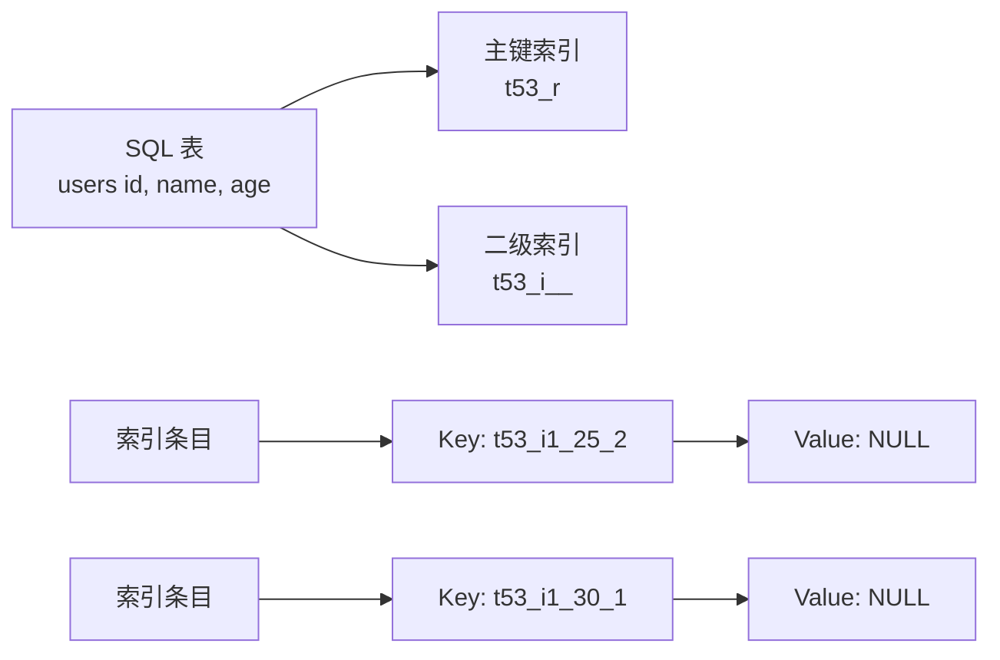
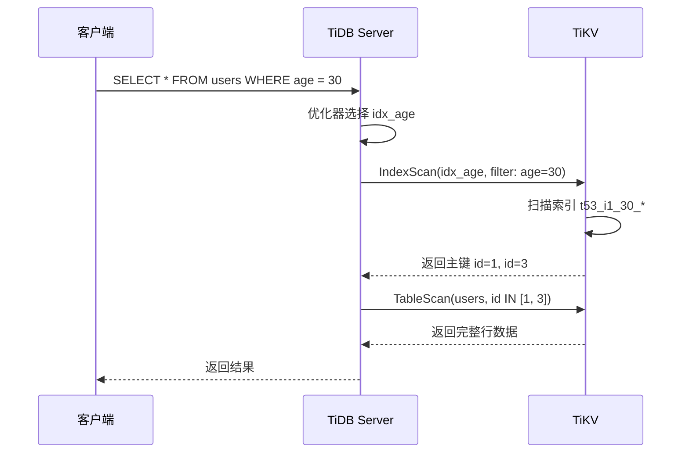

# TiDB BTree 索引（二级索引）

## 学习目标

- 掌握 TiDB 的 BTree 索引 KV 编码方案
- 理解 TiDB 的二级索引与主键索引的差异
- 对比 TiDB 索引与 CockroachDB 的索引实现

## BTree 索引结构

TiDB 使用 BTree 作为索引结构，索引数据存储在 TiKV 中。

### 索引 KV 编码



### 主键索引

如果表有主键，主键直接编码为 Key：

```sql
CREATE TABLE users (
    id INT PRIMARY KEY,
    name VARCHAR(100),
    age INT
);
```

**主键 KV 编码**：

- **Key**：`t53_r<id>`
- **Value**：`name, age`

### 二级索引

创建二级索引：

```sql
CREATE INDEX idx_age ON users (age);
```

**二级索引 KV 编码**：

- **Key**：`t53_i1_<age>_<id>`
- **Value**：`NULL`（非唯一索引）或 `<id>`（唯一索引）

**示例**：

```
表数据：
id=1, name=Alice, age=30
id=2, name=Bob, age=25
id=3, name=Carol, age=30

二级索引 idx_age：
Key: t53_i1_25_2
Value: NULL

Key: t53_i1_30_1
Value: NULL

Key: t53_i1_30_3
Value: NULL
```

## 索引扫描流程



## 与 CockroachDB 索引对比

| 维度 | TiDB | CockroachDB |
|------|------|------------|
| 索引编码 | `t53_i1_<key>_<id>` | `/table/53/idx_age/<key>/<id>` |
| 覆盖索引 | 不支持（需回表） | STORING 子句支持 |
| 唯一索引 | Value 存储主键 | Value 为空 |
| 索引存储 | TiKV Region | CockroachDB Range |

## 与 PostgreSQL 索引对比

| 维度 | TiDB | PostgreSQL |
|------|------|------------|
| 索引类型 | BTree（默认） | BTree（默认） |
| 覆盖索引 | 不支持 | 支持（Index-Only Scan） |
| 并发索引创建 | 支持 | 支持（CONCURRENTLY） |
| 部分索引 | 支持 | 支持（WHERE 子句） |

## 要点总结

- TiDB 使用 BTree 作为默认索引结构
- 二级索引编码：`t<table_id>_i<index_id>_<key>_<id>`
- 索引扫描需要回表（非覆盖索引）
- 与 CockroachDB 相比：编码格式不同，原理类似
- 与 PostgreSQL 相比：不支持覆盖索引

## 思考题

1. TiDB 的二级索引为什么不能像 CockroachDB 一样使用 STORING 子句创建覆盖索引？
2. TiDB 的索引回表操作（IndexScan + TableScan）如何优化？有哪些 Hint 可以强制使用索引？
3. TiDB 的唯一索引和非唯一索引在 KV 编码上有何差异？