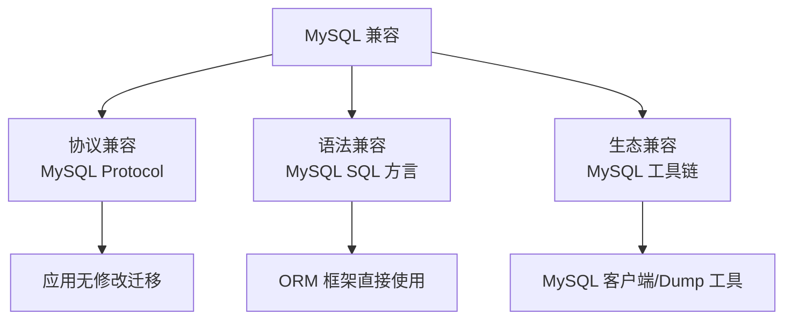
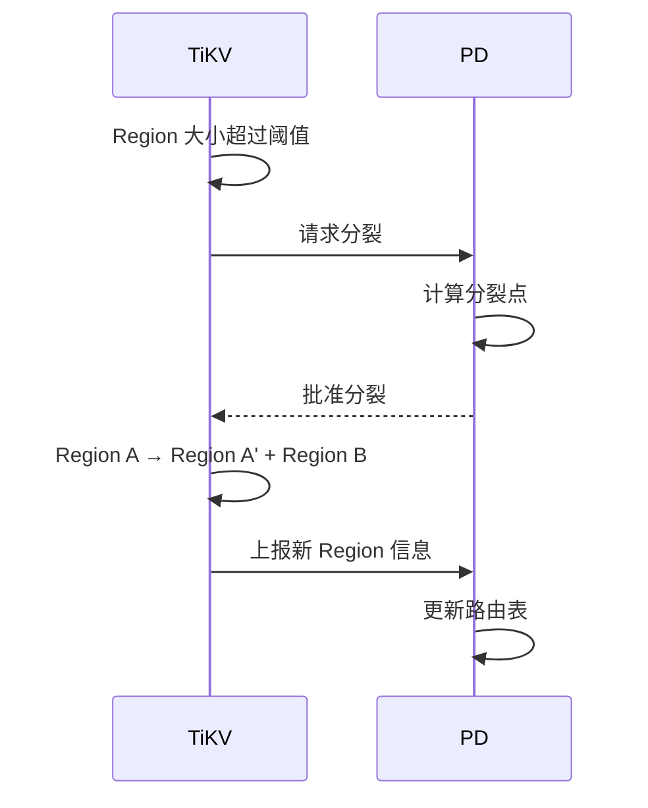
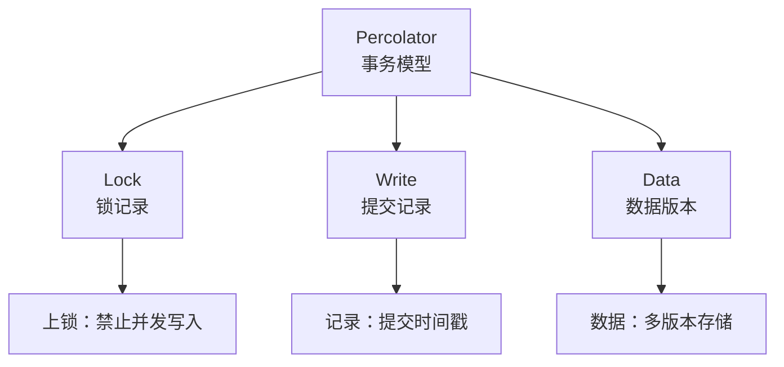
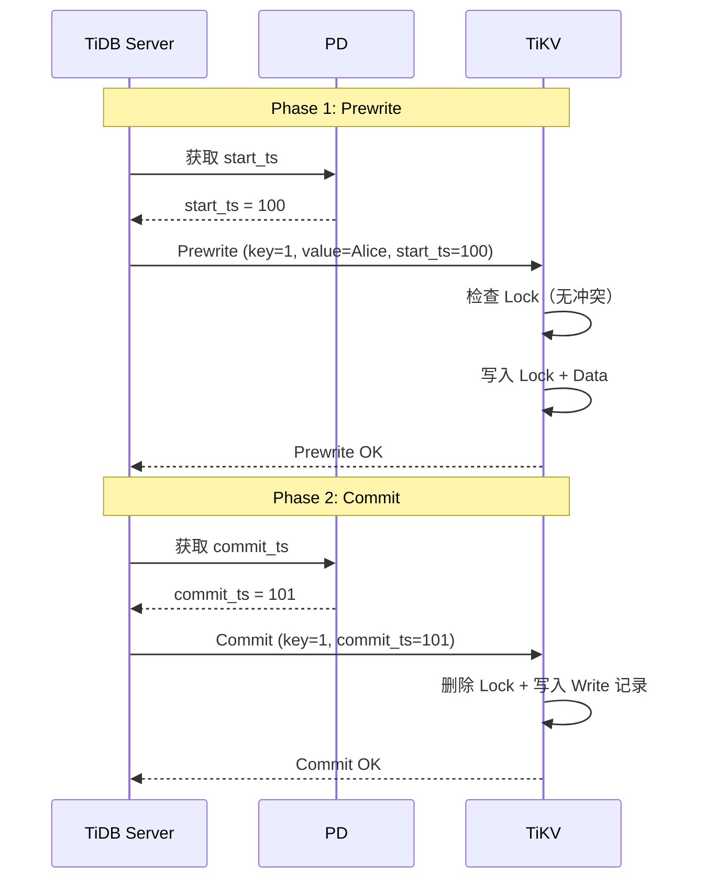
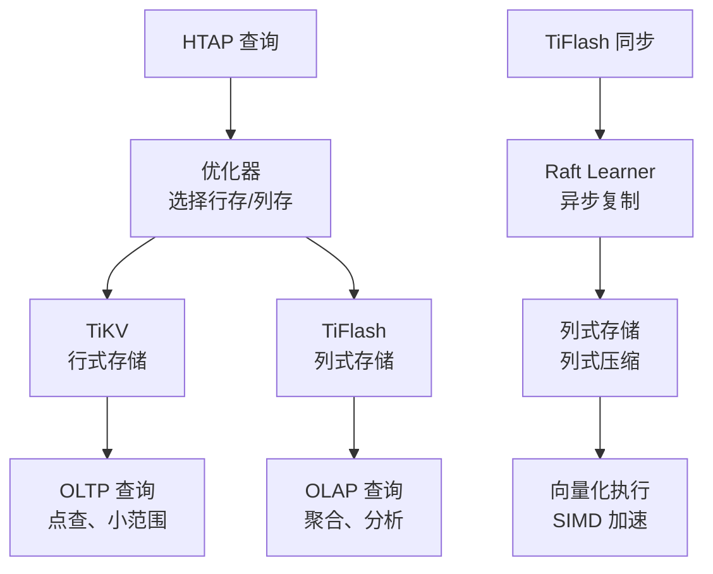

# TiDB 核心特性

## 学习目标

- 掌握 TiDB 的核心特性：MySQL 兼容、分布式事务、自动分片、HTAP
- 理解 TiDB 特性与 CockroachDB 的差异
- 掌握 TiDB 的 Region 分片和 Percolator 事务模型

## MySQL 兼容

TiDB 最大的卖点是 MySQL 兼容。



### 兼容范围

| 特性 | 兼容度 | 说明 |
|------|--------|------|
| MySQL 协议 | 100% | 连接协议、认证 |
| DDL | 95% | CREATE/ALTER/DROP |
| DML | 95% | SELECT/INSERT/UPDATE/DELETE |
| 数据类型 | 95% | INT/VARCHAR/TEXT/BLOB |
| 索引 | 90% | BTree/Unique/Expression |
| 存储过程 | 70% | 部分支持 |
| 触发器 | 不支持 | 暂不支持 |
| 外键 | 不支持 | 暂不支持 |

### 迁移路径

```sql
-- 1. 导出 MySQL 数据
mysqldump -h mysql_host -u root -p mydb > mydb.sql

-- 2. 导入 TiDB
mysql -h tidb_host -u root -p < mydb.sql

-- 3. 应用迁移（无需修改）
-- 只需修改数据库连接地址
```

## Region 分片

TiDB 的数据分片称为 Region。

### Region 结构

```mermaid
graph TB
    A[表数据<br/>全量 Key 空间] --> B[Region 1<br/>[0, 10000)]
    A --> C[Region 2<br/>[10000, 20000)]
    A --> D[Region 3<br/>[20000, 30000)]

    B --> E[Leader<br/>TiKV 节点 1]
    B --> F[Follower<br/>TiKV 节点 2]
    B --> G[Learner<br/>TiFlash]

    H[Region 大小] --> I[默认 96MB<br/>可配置]
    I --> J[自动分裂/合并]
```

**Region 特性**：

- 默认大小 96MB（比 CockroachDB 的 512MB 小）
- 自动分裂：超过阈值自动分裂
- 自动合并：空闲 Region 自动合并
- 3 副本：每个 Region 一个 Raft Group

### Region 分裂



### Region 调度

PD 负责 Region 的自动调度：

- **Leader 调度**：平衡各节点的 Leader 数量
- **Region 调度**：平衡各节点的 Region 数量
- **热点调度**：检测读写热点并迁移 Region

## Percolator 事务模型

TiDB 使用 Google Percolator 论文的事务模型。

### Percolator 三组件



### 两阶段提交



## HTAP 能力

TiDB 通过 TiFlash 实现 HTAP（混合事务/分析处理）。



### TiFlash 特性

- **列式存储**：高效压缩（1:10 压缩比）
- **Raft Learner**：异步复制 TiKV 数据
- **向量化执行**：SIMD 加速
- **透明访问**：优化器自动选择行存/列存

## 与 CockroachDB 特性对比

| 特性 | TiDB | CockroachDB |
|------|------|------------|
| SQL 兼容 | MySQL | PostgreSQL |
| 分片方式 | Region（96MB） | Range（512MB） |
| 事务模型 | Percolator（乐观/悲观） | Write Intent |
| 时钟方案 | TSO（集中式） | HLC（分布式） |
| HTAP | TiFlash 列存 | 无（依赖外部） |
| 扩展方式 | 计算/存储独立扩展 | 节点整体扩展 |
| 全局索引 | 支持 | 支持 |

## 要点总结

- TiDB 兼容 MySQL 协议和语法，应用迁移成本低
- Region 分片（96MB）自动分裂和合并
- Percolator 事务模型：Lock + Write + Data 三组件
- 两阶段提交：Prewrite → Commit
- HTAP 能力：TiFlash 列存扩展
- 与 CockroachDB 对比：MySQL 兼容、TSO 时钟、Percolator 事务

## 思考题

1. TiDB 的 Region 大小（96MB）相比 CockroachDB 的 Range（512MB）更小，这对热点处理和 Region 数量管理有何影响？
2. Percolator 的乐观事务在高冲突场景下性能如何？TiDB 的悲观事务模式如何解决冲突问题？
3. TiFlash 的 Raft Learner 异步复制如何保证 TiFlash 数据的实时性？延迟通常是多少？
4. TiDB 的 MySQL 兼容性是否完全无痛迁移？有哪些常见的 MySQL 特性在 TiDB 中不支持？