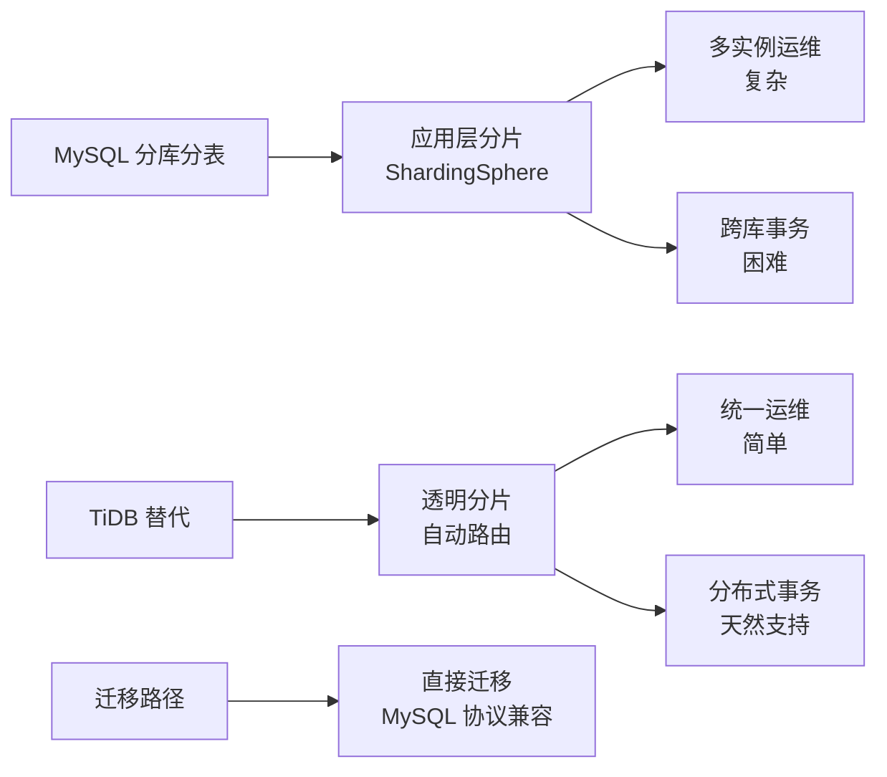
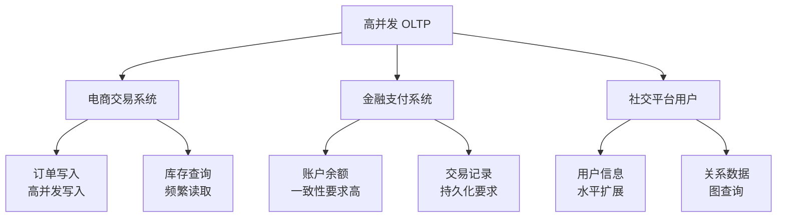
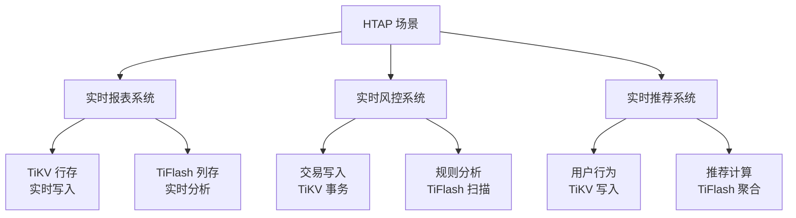
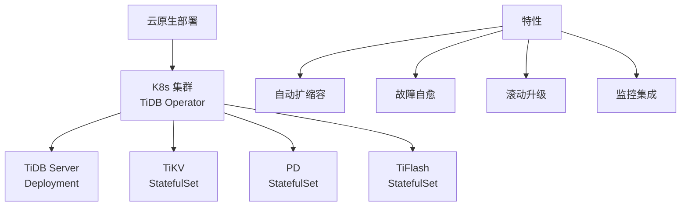
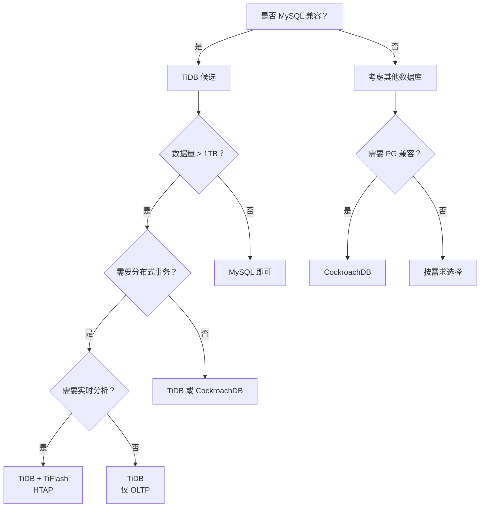

# TiDB 使用场景

## 学习目标

- 掌握 TiDB 的典型使用场景
- 理解 TiDB 在不同场景下的架构决策
- 对比 TiDB 与 CockroachDB 的场景选择

## 使用场景

### 1. 分库分表替代



**场景特点**：

- 单表数据量超过 10TB
- 需要跨分片 JOIN 查询
- 需要分布式事务支持
- 分库分表中间件运维复杂

### 2. 高并发 OLTP 业务



**场景特点**：

- 高并发写入（10K+ TPS）
- 数据一致性要求高
- 需要水平扩展能力
- 读取延迟要求低（< 10ms）

### 3. HTAP 混合负载



**场景特点**：

- 需要实时写入和实时分析
- 不想维护两套系统（OLTP + OLAP）
- 数据新鲜度要求高（秒级延迟）

### 4. 云原生部署



**场景特点**：

- 基础设施云原生（K8s）
- 需要弹性扩缩容
- 需要自动化运维

## 场景决策树



## 与 CockroachDB 场景对比

| 场景 | TiDB | CockroachDB |
|------|------|------------|
| MySQL 分库分表替代 | 首选（MySQL 兼容） | 不适用（PG 兼容） |
| 全球多活部署 | 支持（但不如 CRDB 成熟） | 首选（HLC 分布时钟） |
| HTAP 场景 | 首选（TiFlash 列存） | 不适用（无 HTAP） |
| 纯 OLTP 高并发 | 支持 | 支持 |
| 实时分析 | 支持（TiFlash） | 不适用 |
| 云原生部署 | 支持（K8s Operator） | 支持（K8s Operator） |

### 场景选择建议

**选择 TiDB 的场景**：

- 现有 MySQL 应用需要分布式扩展
- 分库分表中间件运维困难
- 需要 HTAP 能力（实时分析）
- 需要计算/存储独立扩展

**选择 CockroachDB 的场景**：

- 现有 PostgreSQL 应用需要分布式扩展
- 需要全球多活部署
- 纯 OLTP 场景，无 HTAP 需求
- 需要完全去中心化架构

## 实际案例

### 案例 1：电商平台分库分表迁移

**背景**：某电商平台 MySQL 分库分表（128 个分片），跨库 JOIN 困难。

**迁移方案**：

```sql
-- 1. 使用 TiDB Dumpling 导出数据
dumpling -h mysql_host -P 3306 -u root -p \
  -B mydb -F 256MB -o /data/dump

-- 2. 使用 TiDB Lightning 导入
tidb-lightning -config tidb-lightning.toml
```

**效果**：

- 性能提升：跨分片查询从 30s 降到 1s
- 运维简化：从 128 个实例降到 3 个节点
- 扩展灵活：按需扩容计算节点或存储节点

### 案例 2：实时报表系统

**背景**：某金融科技公司需要实时交易报表，之前用 MySQL + Elasticsearch 双写。

**迁移方案**：

```sql
-- 创建 TiFlash 副本
ALTER TABLE transactions SET TIFLASH REPLICA 1;
```

**效果**：

- 数据新鲜度：从 5 分钟降到 1 秒
- 架构简化：从双写降到单系统
- 查询性能：复杂聚合查询提升 10x

## 要点总结

- TiDB 适合 MySQL 分库分表替代、高并发 OLTP、HTAP 混合负载、云原生部署
- 场景选择：现有 MySQL 应用首选 TiDB，HTAP 需求首选 TiDB
- 与 CockroachDB 对比：MySQL vs PG 兼容，HTAP vs 不能
- 实际案例：电商分库分表迁移，金融实时报表系统

## 思考题

1. 如果现有系统使用 MySQL 且数据量在 1TB 以内，是否有必要迁移到 TiDB？迁移成本是否值得？
2. TiDB 的 HTAP 能力（TiFlash）相比传统 Lambda 架构（MySQL + ClickHouse），在数据一致性和架构复杂度上有何优势？
3. 在云原生场景下，TiDB Operator 相比 CockroachDB Operator 在部署和管理上有何差异？
4. 如果应用场景同时需要 MySQL 兼容和全球多活部署，TiDB 和 CockroachDB 哪个更适合？