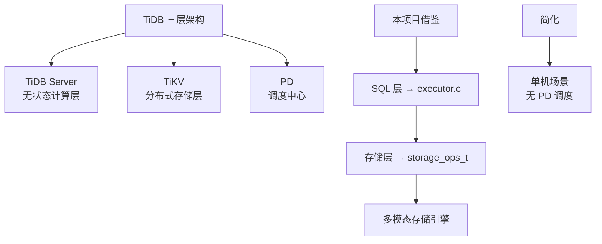

# TiDB 与本项目的关系

## 学习目标

- 理解 TiDB 的设计思想如何指导本项目的存储引擎设计
- 掌握 TiDB 中可借鉴的关键技术点
- 明确本项目在学习 TiDB 时可以简化的部分

## 可借鉴的设计思想

### 1. 计算存储分离架构

TiDB 的三层架构（TiDB Server + TiKV + PD）提供了计算存储分离的参考。



**本项目应用**：

- **SQL 层**：`sql_executor.c` 负责解析和执行
- **存储层统一接口**：`storage_ops_t` 抽象层支持 KV/Vector/TimeSeries/Document 等多模态存储
- **简化**：单机场景下无需 PD 调度中心

### 2. Region 分片设计

TiDB 的 Region 分片（~96MB）提供了动态分片的参考。

```c
// 本项目可借鉴的 Region 分片结构
typedef struct region_descriptor_t {
    uint64_t region_id;          // Region ID
    key_range_t key_range;       // [start_key, end_key)
    uint64_t generation;         // 分裂代数
    replica_set_t replicas;      // 副本分布（分布式场景）
} region_descriptor_t;
```

**本项目应用**：

- **自动分裂**：当表数据量超过阈值时，按主键范围分裂
- **两层路由**：内存中的 Region 路由表，加速 Region 定位
- **简化**：单机场景下无需 Raft 复制，Region 仅用于分片管理

### 3. Percolator 事务模型

TiDB 的 Percolator 事务提供了分布式事务的解决方案。

```c
// 本项目可借鉴的 Percolator 结构
typedef struct percolator_lock_t {
    txn_id_t txn_id;          // 事务 ID
    timestamp_t start_ts;     // 开始时间戳
    key_t key;                // 锁定的 Key
    lock_type_t type;         // PUT / DELETE
} percolator_lock_t;

typedef struct percolator_write_t {
    timestamp_t commit_ts;    // 提交时间戳
    timestamp_t start_ts;     // 开始时间戳
    write_type_t type;        // PUT / DELETE / LOCK
} percolator_write_t;
```

**本项目应用**：

- **两阶段提交**：Prewrite（上锁）→ Commit（释放锁）
- **MVCC 版本**：通过时间戳区分多版本
- **简化**：单机场景下无需 TSO 授时，使用单调递增时间戳

### 4. TSO 全局时钟

TiDB 的 TSO（Timestamp Oracle）提供了全局时钟的解决方案。

```c
// 本项目可借鉴的 TSO 实现（单机简化）
typedef struct timestamp_oracle_t {
    uint64_t physical_time;  // 物理时钟（毫秒）
    uint64_t logical_time;   // 逻辑时钟（同一毫秒内递增）
} timestamp_oracle_t;

// 获取时间戳
timestamp_t tso_get_timestamp(timestamp_oracle_t *tso) {
    struct timespec ts;
    clock_gettime(CLOCK_REALTIME, &ts);

    uint64_t now_ms = ts.tv_sec * 1000 + ts.tv_nsec / 1000000;

    if (now_ms > tso->physical_time) {
        tso->physical_time = now_ms;
        tso->logical_time = 0;
    } else {
        tso->logical_time++;
    }

    return (timestamp_t) {
        .physical = tso->physical_time,
        .logical = tso->logical_time
    };
}
```

**本项目应用**：

- **单机 TSO**：使用物理时钟 + 逻辑时钟
- **简化**：无需跨节点授时，本地生成时间戳
- **冲突检测**：通过时间戳判断事务先后顺序

## 可简化的部分

### 1. PD 调度中心

TiDB 的 PD 是全局调度中心，但单机场景无需 PD：

**本项目简化**：

```c
// 单机场景：无需 PD，本地管理 Region
typedef struct region_manager_t {
    // 分布式场景：PD 调度
    // pd_client_t pd_client;

    // 单机场景：本地 Region 管理
    hash_table_t region_map;  // region_id → region_descriptor_t
} region_manager_t;
```

### 2. Raft 共识协议

TiKV 的每个 Region 独立 Raft 组是高可用的核心，但单机场景无需 Raft：

**本项目简化**：

```c
// 单机场景：无需 Raft，直接写入本地存储
typedef struct replica_manager_t {
    // 分布式场景：Raft 状态机
    // raft_state_t raft_state;

    // 单机场景：简化为空
    void *unused;
} replica_manager_t;
```

### 3. TiFlash 列存扩展

TiDB 的 TiFlash 是列式存储扩展，用于 HTAP：

**本项目简化**：

```c
// 单机场景：可选列存扩展
typedef struct storage_engine_t {
    // HTAP 场景：TiFlash 列存
    // columnar_store_t tiflash;

    // 单机场景：仅行存
    row_store_t tikv;
} storage_engine_t;
```

## 实际应用示例

### 1. Percolator 事务实现

```c
// engineering/src/db/transaction/percolator.c

typedef struct percolator_txn_t {
    txn_id_t txn_id;
    timestamp_t start_ts;
    timestamp_t commit_ts;
    hash_table_t locks;  // key → percolator_lock_t
} percolator_txn_t;

// Prewrite 阶段
int percolator_prewrite(percolator_txn_t *txn, key_t key, value_t value) {
    // 1. 检查是否存在冲突锁
    percolator_lock_t *existing_lock = hash_table_get(&txn->locks, key);
    if (existing_lock) {
        return TXN_CONFLICT;
    }

    // 2. 写入 Lock 记录
    percolator_lock_t lock = {
        .txn_id = txn->txn_id,
        .start_ts = txn->start_ts,
        .key = key,
        .type = LOCK_PUT
    };
    hash_table_insert(&txn->locks, key, lock);

    // 3. 写入 Data 记录
    mvcc_write(key, txn->start_ts, value);

    return TXN_OK;
}

// Commit 阶段
int percolator_commit(percolator_txn_t *txn, timestamp_t commit_ts) {
    txn->commit_ts = commit_ts;

    // 1. 遍历所有锁
    for (hash_entry_t *entry = hash_table_iter(&txn->locks); entry; entry = entry->next) {
        key_t key = entry->key;
        percolator_lock_t *lock = entry->value;

        // 2. 写入 Write 记录
        percolator_write_t write = {
            .commit_ts = commit_ts,
            .start_ts = txn->start_ts,
            .type = WRITE_PUT
        };
        mvcc_write_write(key, write);

        // 3. 删除 Lock 记录
        hash_table_remove(&txn->locks, key);
    }

    return TXN_OK;
}
```

### 2. Region 自动分裂

```c
// engineering/src/db/storage/region_manager.c

void region_auto_split(region_manager_t *mgr, region_id_t region_id) {
    region_descriptor_t *region = &mgr->regions[region_id];

    // 检查是否超过阈值
    if (region->size < mgr->split_threshold) {
        return;
    }

    // 计算分裂点（中位数）
    key_t mid_key = find_median_key(region);

    // 创建新 Region
    region_descriptor_t new_region = {
        .region_id = mgr->num_regions++,
        .key_range = {mid_key, region->key_range.end},
        .generation = region->generation + 1
    };

    // 更新旧 Region
    region->key_range.end = mid_key;
    region->generation++;

    // 添加新 Region
    mgr->regions = realloc(mgr->regions, sizeof(region_descriptor_t) * mgr->num_regions);
    mgr->regions[mgr->num_regions - 1] = new_region;
}
```

## 要点总结

- **可借鉴**：计算存储分离、Region 分片、Percolator 事务、TSO 时钟
- **可简化**：PD 调度中心、Raft 共识、TiFlash 列存扩展
- **应用场景**：本项目的单机存储引擎可以复用 TiDB 的设计思想，但在分布式协调部分做简化
- **核心思想**：计算存储分离 + 动态分片 + Percolator 事务 + TSO 时钟

## 思考题

1. 如果本项目要从单机存储引擎演进到分布式存储引擎，TiDB 的哪些设计是必不可少的？哪些可以逐步引入？
2. TiDB 的 Percolator 事务模型相比 CockroachDB 的 Write Intent 机制，在冲突检测和性能上有何差异？
3. 本项目如果要实现 Percolator 事务模型，如何在现有的 MVCC 实现基础上改造？需要修改哪些模块？
4. TiDB 的 TSO 全局时钟在单机场景下是否必要？如果只用物理时钟会有什么问题？