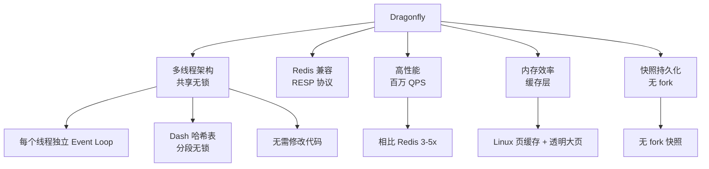

# Dragonfly 项目概览

## 学习目标

- 了解 Dragonfly 作为 Redis 兼容高性能替代品的定位
- 掌握 Dragonfly 的多线程无锁设计

## 项目定位

> Dragonfly 是一个高性能、内存数据存储系统，完全兼容 Redis 和 Memcached 协议。

**基本信息**：
- 开发方：DragonflyDB Inc.
- 首次发布：2022 年
- 开源协议：BSL 1.1
- GitHub Stars：约 27k

## 核心设计

## 性能对比

| 特性 | Redis | Dragonfly |
|------|-------|-----------|
| 线程模型 | 单线程 | 多线程（共享无锁） |
| 100K QPS | ✅ | ✅ |
| 1M QPS | ❌ | ✅ |
| 协议兼容 | 原生 | RESP + Memcached |
| 快照 | fork + COW | 无 fork |

## 要点总结

- 多线程架构突破 Redis 单线程瓶颈
- 完全兼容 Redis 协议，零迁移成本
- 无 fork 快照避免内存翻倍
- 适合高并发、大内存场景

## 思考题

1. Dragonfly 的共享无锁架构是如何实现的？
2. 无 fork 快照相比 Redis 的 BGSAVE 有什么优势？
3. Dragonfly 的 BSL 许可证对商业使用有何限制？