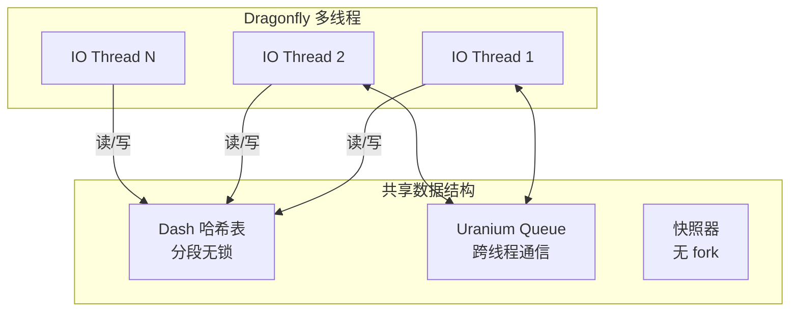

# Dragonfly 多线程架构

## 学习目标

- 理解 Dragonfly 的共享无锁多线程架构
- 掌握 Dash 哈希表的分段设计

## 架构总览



## 共享无锁设计

```c
// Dragonfly 核心设计原则
// 1. 每个线程有自己的 Event Loop
// 2. 共享数据结构设计为无锁
// 3. 通过 Dash 哈希表实现分段
// 4. 跨线程通信使用 Uranium Queue

// 对比 Redis
// Redis: 单线程 → 无需锁
// Dragonfly: 多线程 → 共享无锁

// 共享无锁的关键
// 1. 原子操作（CAS）
// 2. 内存屏障
// 3. 分段设计减小冲突
```

## Dash 哈希表

```c
// Dash 哈希表是 Dragonfly 的核心数据结构
// 替代 Redis 的 dict（链式哈希表）

// 特点
// 1. 分段：将哈希表分为多个段
// 2. 无锁：每个段独立操作
// 3. 高性能：支持并发读写

// 段结构
// 每个段类似一个独立的哈希表
// 段之间互不干扰
// 段内使用 CAS 操作

// 优势
// 1. 高并发：多个线程同时操作不同段
// 2. 无锁：避免锁竞争
// 3. 可扩展：随着线程数增加性能线性提升
```

## 无 fork 快照

```c
// Redis BGSAVE
// 1. fork() 子进程
// 2. 子进程写快照
// 3. COW 导致内存翻倍

// Dragonfly 快照
// 1. 无 fork
// 2. 使用多线程写快照
// 3. 写时复制只在内存页级别
// 4. 内存效率更高

// 快照流程
// 1. 冻结写操作（短暂暂停）
// 2. 记录当前状态
// 3. 多线程并行写入磁盘
// 4. 恢复写操作
```

## 要点总结

- 多线程架构，每个线程独立 Event Loop
- Dash 哈希表实现分段无锁并发
- 无 fork 快照避免内存翻倍
- 完全兼容 Redis 协议

## 思考题

1. Dragonfly 的共享无锁架构相比 Redis 的单线程，在实现复杂度上有何代价？
2. Dash 哈希表相比 Redis 的 dict，空间利用率如何？
3. 无 fork 快照的冻结时间对性能有何影响？