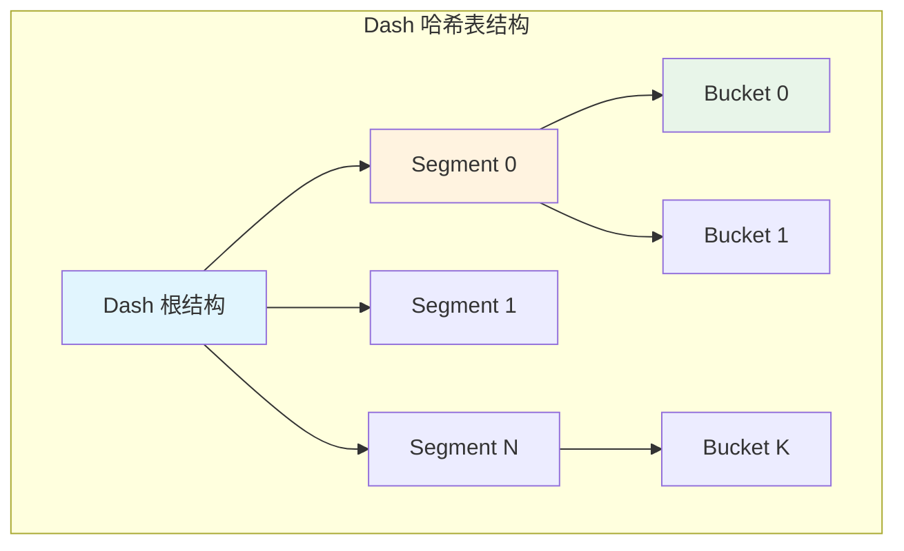
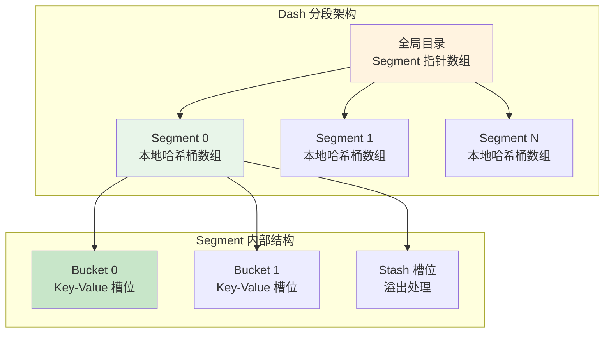
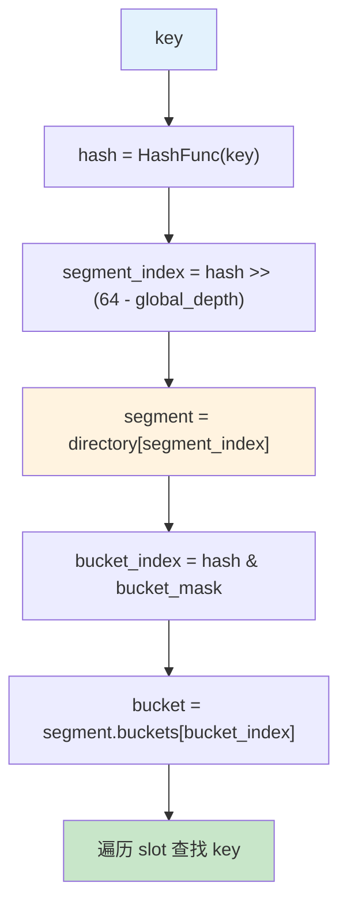
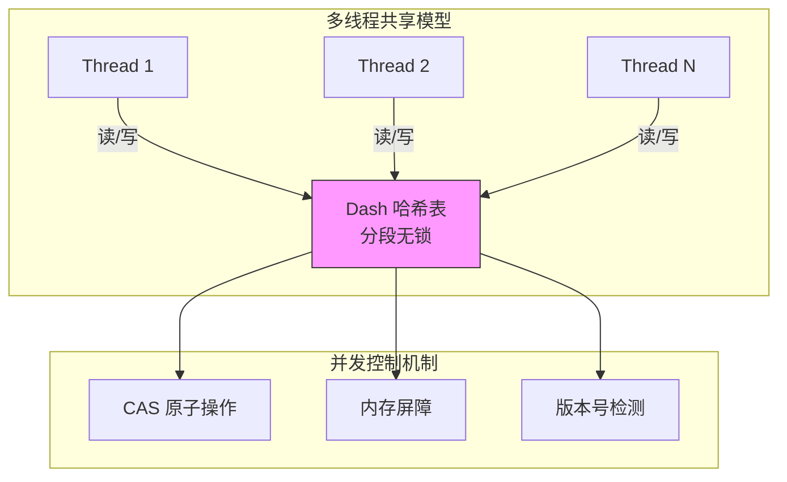
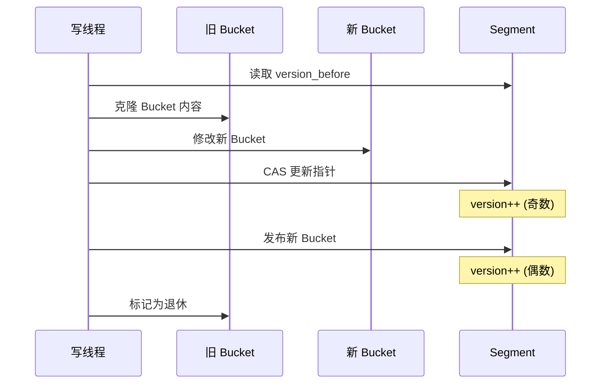
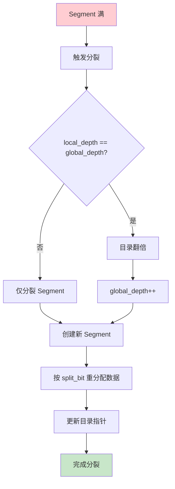
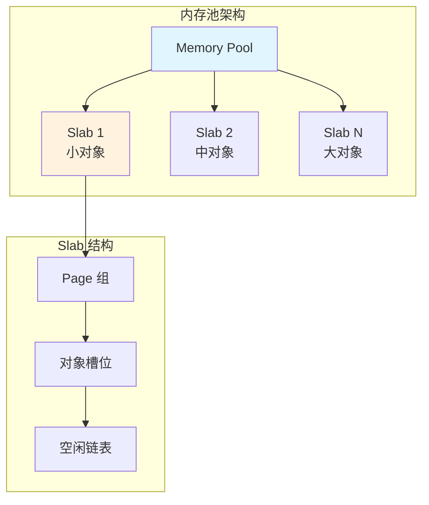
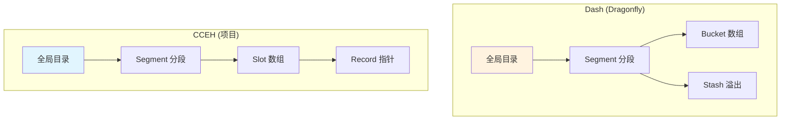
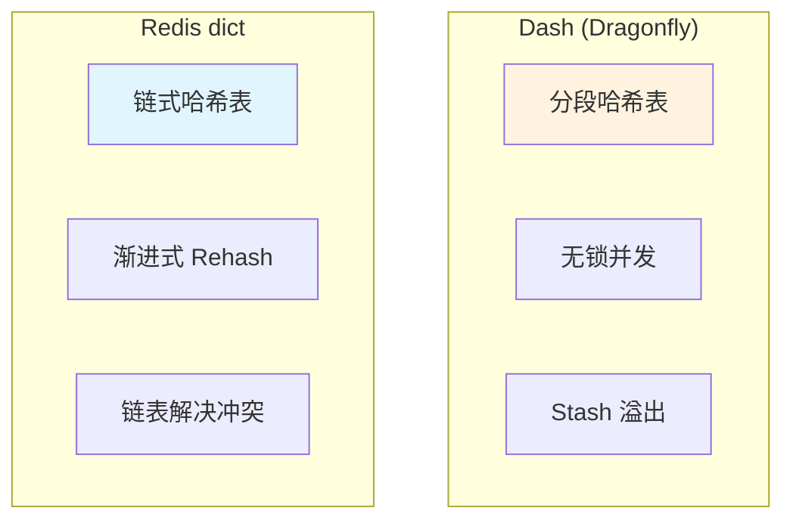
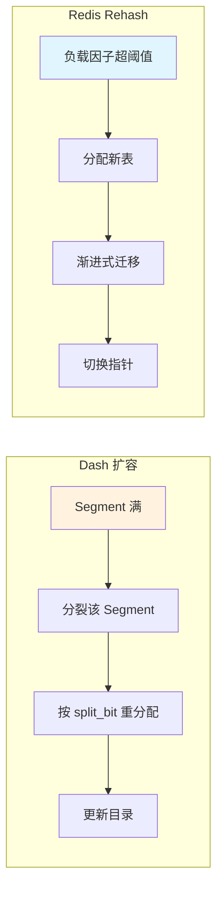

# Dragonfly 数据结构和存储引擎

## 学习目标

- 理解 Dash 哈希表的分段无锁设计原理
- 掌握 Dragonfly 多线程共享内存模型
- 了解内存管理策略（内存池、THP 配置）
- 对比 Dash 与 CCEH、Redis dict 的设计差异

## Dash 哈希表概述

Dash（Dynamic Adaptive Sharding Hash Table）是 Dragonfly 的核心数据结构，替代 Redis 的 dict，实现高并发无锁哈希表。



## 分段无锁哈希表设计

### 整体架构



### 核心数据结构

```c
// Dash 哈希表的核心设计思想

// 1. 分段设计
// - 将整个哈希空间划分为多个 Segment
// - 每个 Segment 独立操作，减小锁竞争
// - 类似于分片（Sharding）思想

// 2. 段内结构
typedef struct dash_segment {
    // 本地哈希桶数组
    bucket_t buckets[SEGMENT_BUCKETS];

    // 溢出处理（Stash）
    bucket_t stash[STASH_SIZE];

    // 段级元数据
    uint32_t local_depth;    // 局部深度
    uint32_t size;           // 元素计数

    // 并发控制
    atomic_uint version;     // 版本号（用于无锁读）
    atomic_bool splitting;   // 是否正在分裂
} dash_segment_t;

// 3. 哈希桶结构
typedef struct dash_bucket {
    // 槽位数组（Cache Line 对齐）
    struct {
        uint8_t  fingerprint;  // 指纹快速过滤
        uint8_t  state;        // EMPTY/LIVE/DELETED
        void    *key;
        void    *value;
    } slots[BUCKET_SLOTS];

    // 并发标记
    atomic_uint epoch;        // 用于版本检测
} dash_bucket_t;

// 4. 全局目录
typedef struct dash_directory {
    dash_segment_t **segments;  // Segment 指针数组
    uint32_t global_depth;      // 全局深度
    uint32_t size;              // 目录大小 = 2^global_depth
} dash_directory_t;
```

### 哈希计算与路由



```c
// 哈希路由计算

// 1. Segment 定位
uint64_t segment_index = hash >> (64 - global_depth);
dash_segment_t *segment = directory->segments[segment_index];

// 2. Bucket 定位（Segment 内）
uint32_t bucket_mask = SEGMENT_BUCKETS - 1;
uint32_t bucket_index = hash & bucket_mask;
dash_bucket_t *bucket = &segment->buckets[bucket_index];

// 3. 指纹快速过滤
uint8_t fingerprint = hash & 0xFF;  // 取低 8 位

// 4. 槽位查找
for (int i = 0; i < BUCKET_SLOTS; i++) {
    if (bucket->slots[i].fingerprint == fingerprint &&
        bucket->slots[i].state == LIVE) {
        // 比较完整 key
        if (key_equal(bucket->slots[i].key, key)) {
            return bucket->slots[i].value;
        }
    }
}

// 5. 检查 Stash（溢出处理）
for (int i = 0; i < STASH_SIZE; i++) {
    // ... 同样的查找逻辑
}
```

## 多线程共享内存模型

### 并发架构



### 无锁读操作

```c
// Dash 无锁读的核心思想

// 1. 版本号机制
// - 每个 Segment 有一个 version 字段
// - 写操作：version++（奇数表示正在写）
// - 读操作：检测 version 变化

int dash_lookup(dash_segment_t *seg, void *key, void **value_out) {
    uint32_t version_before, version_after;

    do {
        // 读取版本号（奇数表示正在写）
        version_before = atomic_load(&seg->version);
        if (version_before & 1) {
            // 正在写入，重试
            cpu_pause();
            continue;
        }

        // 执行查找（无锁读）
        int result = dash_segment_find(seg, key, value_out);

        // 验证版本号未变化
        version_after = atomic_load(&seg->version);

        if (version_before == version_after) {
            return result;  // 读成功
        }
        // 版本变化，重试
    } while (1);
}

// 2. 关键点
// - 读者不获取锁，只检测版本号
// - 写者递增版本号（偶数→奇数→偶数）
// - 读者可能需要重试，但不会被阻塞
```

### 写操作的 Copy-On-Write



```c
// Dash 写操作的 Copy-On-Write 流程

int dash_insert(dash_segment_t *seg, void *key, void *value) {
    // 1. 定位 bucket
    dash_bucket_t *old_bucket = locate_bucket(seg, key);

    // 2. 克隆 bucket（Copy-On-Write）
    dash_bucket_t *new_bucket = clone_bucket(old_bucket);

    // 3. 在新 bucket 上执行插入
    int slot = find_empty_slot(new_bucket);
    new_bucket->slots[slot] = (slot_t){
        .fingerprint = compute_fingerprint(key),
        .state = LIVE,
        .key = key,
        .value = value
    };

    // 4. 版本号递增（开始写入）
    atomic_fetch_add(&seg->version, 1);  // 奇数

    // 5. 原子替换 bucket 指针
    if (!atomic_compare_exchange_strong(&seg->bucket_ptr,
                                         &old_bucket, new_bucket)) {
        // CAS 失败，重试
        free(new_bucket);
        return dash_insert(seg, key, value);  // 递归重试
    }

    // 6. 版本号递增（写入完成）
    atomic_fetch_add(&seg->version, 1);  // 偶数

    // 7. 延迟回收旧 bucket
    dash_retire_bucket(old_bucket);

    return 0;
}
```

### 段分裂与扩容



```c
// Dash 段分裂流程

void dash_split_segment(dash_directory_t *dir, uint32_t seg_index) {
    dash_segment_t *old_seg = dir->segments[seg_index];

    // 1. 检查是否需要扩容目录
    if (old_seg->local_depth == dir->global_depth) {
        // 目录翻倍
        dash_directory_double(dir);
        dir->global_depth++;
    }

    // 2. 创建左右新 Segment
    uint32_t new_depth = old_seg->local_depth + 1;
    dash_segment_t *left = dash_segment_create(new_depth);
    dash_segment_t *right = dash_segment_create(new_depth);

    // 3. 按 split_bit 重分配数据
    uint64_t split_bit = 1ULL << (64 - new_depth);

    for (each bucket in old_seg) {
        for (each slot in bucket) {
            uint64_t hash = hash_func(slot.key);
            if (hash & split_bit) {
                dash_segment_insert(right, slot.key, slot.value);
            } else {
                dash_segment_insert(left, slot.key, slot.value);
            }
        }
    }

    // 4. 更新目录指针
    uint32_t stride = 1ULL << (dir->global_depth - new_depth);
    for (uint32_t i = seg_index; i < dir->size; i += stride) {
        if ((i >> (dir->global_depth - new_depth)) & 1) {
            dir->segments[i] = right;
        } else {
            dir->segments[i] = left;
        }
    }

    // 5. 延迟回收旧 Segment
    dash_retire_segment(old_seg);
}
```

## 内存管理

### 内存池设计



```c
// Dragonfly 内存池设计

// 1. Slab 分配器
typedef struct memory_pool {
    // 不同大小的 Slab 类
    slab_t slabs[NUM_SLAB_CLASSES];

    // 大对象直接分配
    size_t large_alloc_threshold;

    // 统计信息
    atomic_size_t total_allocated;
    atomic_size_t total_freed;
} memory_pool_t;

// 2. Slab 结构
typedef struct slab {
    size_t object_size;      // 对象大小
    size_t objects_per_page; // 每页对象数

    page_t *pages;           // 页链表
    void  *free_list;        // 空闲链表

    // 并发保护
    atomic_flag lock;
} slab_t;

// 3. 分配流程
void *memory_pool_alloc(memory_pool_t *pool, size_t size) {
    // 小对象：从 Slab 分配
    if (size <= pool->large_alloc_threshold) {
        int class = slab_class_for_size(size);
        return slab_alloc(&pool->slabs[class]);
    }

    // 大对象：直接 malloc
    return malloc(size);
}
```

### 透明大页（THP）配置

```c
// THP 配置与优化

// 1. 启用 THP
// Linux 内核特性，减少页表开销
// 适合大内存场景

// 配置方式
// echo always > /sys/kernel/mm/transparent_hugepage/enabled

// 2. THP 优势
// | 特性 | 4KB 页 | 2MB 大页 |
// |------|---------|----------|
// | 页表项数 | 多 | 少 |
// | TLB 覆盖 | 小 | 大 |
// | 缺页次数 | 多 | 少 |
// | 内存碎片 | 少 | 可能多 |

// 3. Dragonfly 的 THP 使用
// - 大段（Segment）使用大页分配
// - 减少页表遍历开销
// - 提高 TLB 命中率

// 4. 代码示例
void *alloc_huge_pages(size_t size) {
    // 使用 mmap 分配大页
    void *ptr = mmap(NULL, size,
                      PROT_READ | PROT_WRITE,
                      MAP_PRIVATE | MAP_ANONYMOUS |
                      MAP_HUGETLB,  // 大页标志
                      -1, 0);
    return ptr == MAP_FAILED ? NULL : ptr;
}
```

### Cache Line 对齐

```c
// Cache Line 对齐设计

#define CACHE_LINE_SIZE 64

// 1. 避免 False Sharing
typedef struct dash_bucket {
    // 确保 bucket 独占 Cache Line
    alignas(CACHE_LINE_SIZE)

    uint8_t  fingerprint[BUCKET_SLOTS];
    uint8_t  state[BUCKET_SLOTS];
    void    *keys[BUCKET_SLOTS];
    void    *values[BUCKET_SLOTS];

    // 版本号单独一行
    alignas(CACHE_LINE_SIZE)
    atomic_uint version;

} dash_bucket_t;

// 2. 内存布局优化
// ┌─────────────────────────────────────────┐
// │ Bucket (64B aligned)                    │
// │ ┌─────────────────────────────────────┐ │
// │ │ fingerprint | state | keys | values │ │
// │ └─────────────────────────────────────┘ │
// │ ┌─────────────────────────────────────┐ │
// │ │ version (独立 Cache Line)           │ │
// │ └─────────────────────────────────────┘ │
// └─────────────────────────────────────────┘

// 3. 好处
// - 减少伪共享（False Sharing）
// - 提高多核并行效率
// - 降低缓存一致性开销
```

## 与 CCEH 哈希表对比

### 结构对比



### 核心差异对比

| 特性 | Dash (Dragonfly) | CCEH (项目) |
|------|------------------|-------------|
| **分段方式** | Segment + Bucket | Segment + Slot |
| **溢出处理** | Stash 区域 | 目录扩容 |
| **并发模型** | 完全无锁 | 读写锁 + 版本检测 |
| **版本机制** | Segment 级版本 | Segment 级版本 |
| **Copy-On-Write** | Bucket 级别 | Segment 级别 |
| **内存管理** | 内存池 + THP | 常规 malloc |
| **缓存优化** | Cache Line 对齐 | 部分对齐 |

### 性能特性对比

```c
// Dash vs CCEH 性能特性

// 1. 并发读
// Dash:  完全无锁，仅版本检测
// CCEH:  需要 pin + version 检测

// 2. 并发写
// Dash:  Bucket 级 CAS，低竞争
// CCEH:  Segment 级锁，竞争较高

// 3. 扩容
// Dash:  渐进式段分裂
// CCEH:  目录翻倍 + 段分裂

// 4. 内存效率
// Dash:  内存池 + 大页，高效率
// CCEH:  常规分配，有碎片

// 5. 缓存友好性
// Dash:  Cache Line 对齐，低失效
// CCEH:  部分对齐，有伪共享
```

### API 对比

```c
// Dash API (概念性)
dash_table_t *dash_create(size_t num_segments);
void          dash_destroy(dash_table_t *table);
int           dash_insert(dash_table_t *t, void *key, void *val);
int           dash_lookup(dash_table_t *t, void *key, void **val);
int           dash_delete(dash_table_t *t, void *key);
int           dash_upsert(dash_table_t *t, void *key, void *val);

// CCEH API (项目实现)
cceh_index_t *cceh_index_create(uint32_t seg_cap, uint32_t init_gd);
void          cceh_index_drop(cceh_index_t *index);
int           cceh_index_insert(cceh_index_t *idx, void *k, void *v);
int           cceh_index_lookup(const cceh_index_t *idx, void *k, void **v);
int           cceh_index_delete(cceh_index_t *idx, void *k);
int           cceh_index_upsert(cceh_index_t *idx, void *k, void *v);
```

## 与 Redis dict 对比

### 结构对比



### 核心差异对比

| 特性 | Dash (Dragonfly) | Redis dict |
|------|------------------|------------|
| **哈希方式** | 分段哈希 | 链式哈希 |
| **冲突解决** | Stash + 分裂 | 链表 |
| **并发模型** | 无锁多线程 | 单线程 + 锁 |
| **扩容方式** | 段分裂 | 渐进式 Rehash |
| **负载因子** | 动态调整 | 固定阈值 |
| **内存布局** | Cache Line 对齐 | 指针密集 |

### 扩容策略对比



```c
// 扩容策略详细对比

// Dash 扩容
// 1. 触发条件：单个 Segment 满
// 2. 扩容粒度：仅分裂该 Segment
// 3. 数据迁移：按 split_bit 分配到左右子段
// 4. 目录更新：仅更新相关目录项
// 5. 影响：仅影响该 Segment 的访问

// Redis Rehash
// 1. 触发条件：整体负载因子超阈值
// 2. 扩容粒度：整个哈希表翻倍
// 3. 数据迁移：渐进式（每请求迁移 N 个桶）
// 4. 表切换：全部迁移后切换
// 5. 影响：影响所有访问（需检查两个表）

// 性能对比
// | 维度 | Dash | Redis Rehash |
// |------|------|---------------|
// | 扩容延迟 | 低（单段） | 高（全表） |
// | 内存峰值 | 低（增量） | 高（双倍） |
// | 访问影响 | 小（局部） | 大（全局） |
// | 实现复杂度 | 高 | 中 |
```

## 要点总结

### Dash 哈希表核心特性

| 特性 | 说明 | 优势 |
|------|------|------|
| **分段设计** | Segment 独立操作 | 降低锁竞争 |
| **无锁读** | 版本号检测 | 读不被阻塞 |
| **Copy-On-Write** | 写时克隆 | 原子性保证 |
| **Stash 溢出** | 本地溢出区 | 减少扩容频率 |
| **渐进式分裂** | 单段分裂 | 平滑扩容 |

### 内存管理特点

| 技术 | 作用 | 效果 |
|------|------|------|
| **内存池** | 减少 malloc 开销 | 提高分配效率 |
| **THP 大页** | 减少页表项 | 提高 TLB 命中 |
| **Cache Line 对齐** | 避免伪共享 | 提高并发性能 |

### 与项目 CCEH 的借鉴方向

```c
// 可借鉴的设计点

// 1. 无锁读优化
// - CCEH 已有版本检测机制
// - 可进一步优化为完全无锁

// 2. Bucket 级 Copy-On-Write
// - 当前 CCEH 是 Segment 级克隆
// - 可缩小粒度，减少拷贝开销

// 3. Stash 溢出处理
// - 当前 CCEH 直接触发分裂
// - 可增加本地溢出区，延迟分裂

// 4. 内存池集成
// - 当前 CCEH 使用 malloc
// - 可集成项目的内存池模块

// 5. Cache Line 优化
// - 已有部分对齐
// - 可进一步优化 bucket 布局
```

## 思考题

1. **并发模型选择**：Dash 的完全无锁设计与 CCEH 的锁 + 版本检测，各适合什么场景？权衡是什么？

2. **溢出处理策略**：Dash 的 Stash 与 CCEH 的直接分裂，对性能和内存利用率有何不同影响？

3. **扩容策略**：Dash 的单段分裂与 Redis 的全表 Rehash，在什么场景下各有优势？

4. **内存管理**：THP 大页在什么内存规模下收益明显？对小内存场景是否适用？

5. **Copy-On-Write 粒度**：Bucket 级与 Segment 级 Copy-On-Write，在写放大和实现复杂度上如何权衡？

---

**参考资料**：
- [Dragonfly GitHub](https://github.com/dragonflydb/dragonfly)
- [Dash 哈希表论文](https://arxiv.org/abs/2204.11679)
- 项目 CCEH 设计文档：`docs/db/index/hash/cceh-design.md`
- Redis dict 源码：`src/dict.h`、`src/dict.c`