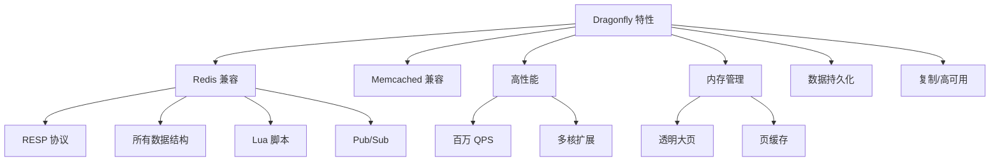

# Dragonfly 关键特性

## 学习目标

- 掌握 Dragonfly 的核心特性
- 理解 Dragonfly 与 Redis 的兼容性和差异

## 特性总览



## Redis 命令兼容性

| 命令类别 | 支持状态 | 说明 |
|---------|---------|------|
| String | ✅ 完全兼容 | GET/SET/INCR 等 |
| Hash | ✅ 完全兼容 | HSET/HGET 等 |
| List | ✅ 完全兼容 | LPUSH/LPOP 等 |
| Set | ✅ 完全兼容 | SADD/SMEMBERS 等 |
| ZSet | ✅ 完全兼容 | ZADD/ZRANGE 等 |
| Stream | ✅ 兼容 | XADD/XREAD 等 |
| Lua | ✅ 兼容 | EVAL/EVALSHA |
| Pub/Sub | ✅ 兼容 | PUBLISH/SUBSCRIBE |
| 事务 | ✅ 兼容 | MULTI/EXEC |
| 模块 | ❌ 不支持 | Redis Modules |

## Memcached 兼容

```bash
# Dragonfly 同时支持 RESP 和 Memcached 协议
# 同一端口自动检测协议

# Memcached 命令
set key 0 3600 5
hello
STORED

get key
VALUE key 0 5
hello
END
```

## 内存管理

```c
// Dragonfly 的内存优化
// 1. 使用 Linux 透明大页（THP）
// 2. 利用页缓存（Page Cache）
// 3. 减少内存碎片

// 内存限制配置
// --cache_mode=true
// --maxmemory=4gb
// --eviction_policy=allkeys-lru

// 相比 Redis 的优势
// 1. 多线程共享内存，减少复制
// 2. 大内存场景性能更好
// 3. 内存利用率更高
```

## 要点总结

- 完全兼容 Redis 命令和数据结构
- 同时支持 Memcached 协议
- 多线程内存管理更高效
- 不支持 Redis Modules

## 思考题

1. Dragonfly 不支持 Redis Modules，对迁移有何影响？
2. 透明大页（THP）对 Dragonfly 的性能提升原理是什么？
3. 在同等内存条件下，Dragonfly 比 Redis 能多存储多少数据？