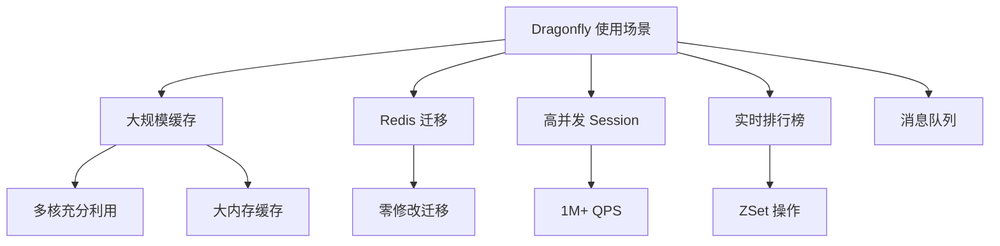

# Dragonfly 使用场景与实验

## 学习目标

- 掌握 Dragonfly 的典型使用场景
- 通过实验对比 Dragonfly 与 Redis 的性能

## 使用场景



## 场景 1：Redis 迁移

```bash
# Dragonfly 完全兼容 Redis 协议
# 迁移步骤

# 1. 部署 Dragonfly
docker run -d --name dragonfly \
  -p 6379:6379 \
  docker.dragonflydb.io/dragonflydb/dragonfly \
  --cache_mode=true

# 2. 修改应用配置
# 将 Redis 连接地址改为 Dragonfly
# redis_conn = Redis(host='old-redis', port=6379)
# 改为:
# redis_conn = Redis(host='dragonfly', port=6379)

# 3. 数据迁移
# 使用 redis-cli 从 Redis 导出
redis-cli --rdb dump.rdb
# 重启 Dragonfly，加载 RDB 文件
```

## 场景 2：高性能缓存

```python
import redis.asyncio as aioredis

# 使用 Dragonfly 作为缓存后端
# 利用多线程优势处理高并发

class DragonflyCache:
    def __init__(self):
        self.redis = aioredis.Redis(
            host='localhost',
            port=6379,
            max_connections=100  # 多线程并发连接
        )

    async def get_or_compute(self, key, compute_func, ttl=300):
        # 尝试从缓存获取
        value = await self.redis.get(key)
        if value is not None:
            return value

        # 缓存未命中，执行计算
        value = await compute_func()
        await self.redis.setex(key, ttl, value)
        return value

    async def batch_get(self, keys):
        # 批量获取，利用多线程
        return await self.redis.mget(keys)
```

## 实验：性能对比

```bash
# 使用 redis-benchmark 对比
# 原始 Redis
redis-benchmark -h localhost -p 6379 -t set,get -n 1000000 -c 50

# Dragonfly
redis-benchmark -h localhost -p 6379 -t set,get -n 1000000 -c 50

# 预期结果
# Dragonfly 在多核机器上 3-5x 于 Redis
# 单核场景差异不大
```

## 实验结果记录

| 测试项 | Redis QPS | Dragonfly QPS | 提升 |
|--------|-----------|---------------|------|
| SET (单线程) | | | |
| GET (单线程) | | | |
| SET (50 连接) | | | |
| GET (50 连接) | | | |
| PIPELINE | | | |

## 要点总结

- 迁移零成本，修改连接地址即可
- 多线程优势在高并发场景明显
- 适合大规模缓存和 Session 管理
- 性能测试建议使用多连接

## 思考题

1. Dragonfly 在多核机器上的性能提升是否线性？
2. 迁移到 Dragonfly 后，需要注意哪些配置差异？
3. Dragonfly 的缓存模式（cache_mode）与传统 Redis 有何不同？