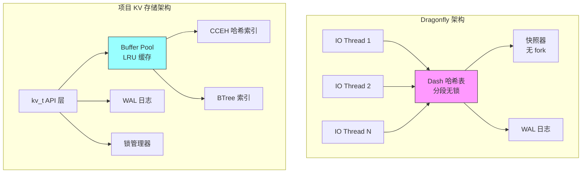
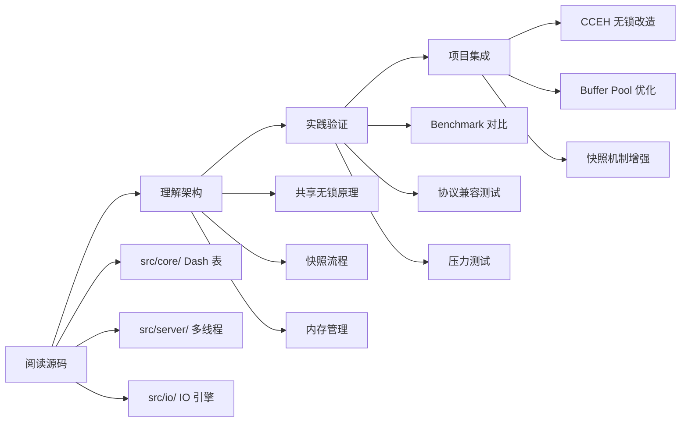

# Dragonfly 项目关联

## 学习目标

- 对比 Dragonfly 与本书项目 KV 存储引擎的架构差异
- 分析 Dragonfly 设计对项目 `kv_engine`、`index`、`storage` 模块的启发
- 明确可借鉴的设计要点和学习路径

## 架构对比总览



## 模块对应关系

| 层级 | Dragonfly | 项目对应模块 | 状态 |
|------|-----------|-------------|------|
| **接口层** | RESP 协议 | `kv.h` API | ✅ 已实现 |
| **并发模型** | 多线程共享无锁 | 单线程 + 锁管理器 | 📝 可优化 |
| **内存索引** | Dash 哈希表 | CCEH / BTree | ✅ 已实现 |
| **缓存层** | 页缓存 + THP | Buffer Pool (LRU) | ✅ 已实现 |
| **持久化** | 无 fork 快照 + WAL | WAL + 页面刷盘 | ✅ 已实现 |
| **数据结构** | String/Hash/List/Set/ZSet | 基础 KV + 扩展 | 部分 |

## 核心设计对比

### 1. 并发模型

```c
// Dragonfly: 共享无锁多线程
// ┌─────────────────────────────────────────┐
// │  Thread 1    Thread 2    Thread N       │
// │     │           │           │           │
// │     └───────────┼───────────┘           │
// │                 ▼                       │
// │         ┌──────────────┐               │
// │         │  Dash 哈希表  │  (分段无锁)   │
// │         └──────────────┘               │
// └─────────────────────────────────────────┘

// 项目: 单线程 + 锁管理器
// kv.h 中的锁管理
typedef struct kv_s {
    // ...
    lock_manager_t *lock_mgr;      // 锁管理器
} kv_t;

// 对比
// Dragonfly: 多线程并发，Dash 分段无锁
// 项目:     单线程或锁保护，可借鉴分段思想
```

### 2. 哈希索引设计

```c
// Dragonfly Dash 哈希表
// - 分段设计：每个段独立操作
// - 无锁并发：CAS + 内存屏障
// - 动态扩容：段级别分裂

// 项目 CCEH 哈希索引 (engineering/include/db/index/hash/cceh.h)
// - 同样采用分段设计
// - 可扩展哈希（Extendible Hashing）
// - 支持 insert/lookup/delete/upsert

// CCEH API
cceh_index_t *cceh_index_create(uint32_t segment_capacity, 
                                 uint32_t initial_global_depth);
int cceh_index_insert(cceh_index_t *index,
                      const void *key, uint32_t keylen,
                      const void *value, uint32_t valuelen);
int cceh_index_lookup(const cceh_index_t *index,
                      const void *key, uint32_t keylen,
                      void **value_out, uint32_t *valuelen_out);

// 相似之处
// 1. 分段哈希结构
// 2. 动态扩容机制
// 3. 高并发支持潜力

// 差异
// Dragonfly Dash: 原生无锁设计
// 项目 CCEH:      目前需要外层锁保护
```

### 3. Buffer Pool 对比

```c
// Dragonfly 内存管理
// - 利用 Linux 透明大页（THP）
// - 页缓存直接映射
// - 减少内存碎片

// 项目 Buffer Pool (engineering/include/db/buffer.h)
typedef struct buffer_pool_s {
    db_file_t   *file;          // 关联的数据库文件
    size_t       page_size;     // 页面大小
    size_t       pool_size;     // 缓存池大小（帧数）
    
    buffer_frame_t *frames;     // 帧数组
    buffer_frame_t *free_list;  // 空闲帧链表
    
    // LRU 链表（双向循环链表）
    buffer_frame_t *lru_head;   // 最久未使用
    buffer_frame_t *lru_tail;   // 最近使用
    
    // 哈希表（快速查找）
    buffer_frame_t **hash_table;
    
    // 统计信息
    uint64_t hit_count;
    uint64_t miss_count;
    uint64_t evict_count;
} buffer_pool_t;

// 对比
// | 特性 | Dragonfly | 项目 Buffer Pool |
// |------|-----------|-----------------|
// | 淘汰策略 | 页缓存 | LRU |
// | 内存优化 | THP | 常规页 |
// | 并发 | 无锁 | 锁保护 |
```

### 4. 快照持久化

```c
// Dragonfly 无 fork 快照
// 优点：
// 1. 避免 fork 导致内存翻倍
// 2. 多线程并行写入
// 3. 写时复制在内存页级别

// 项目 WAL 持久化 (engineering/include/db/wal.h)
// - 写前日志机制
// - 检查点支持
// - 崩溃恢复

// 可借鉴
// 1. 无 fork 快照的冻结 - 记录 - 写入流程
// 2. 多线程并行刷盘
// 3. 增量快照减少 IO
```

## 可借鉴的设计要点

### 内存模型优化

```c
// Dragonfly 的内存优化策略
// 1. 透明大页（THP）
//    - 减少页表开销
//    - 提高 TLB 命中率
//    - 适合大内存场景

// 项目可借鉴
// - 大页配置选项
// - 内存池预分配
// - 减少内存碎片

// 2. 页缓存利用
//    - 直接使用 OS 页缓存
//    - 减少用户态缓存开销

// 项目 Buffer Pool 优化方向
// - 混合缓存策略（部分依赖 OS）
// - 热点页面锁定
```

### 扩容策略

```c
// Dragonfly Dash 扩容
// 1. 段级别分裂
// 2. 渐进式扩容
// 3. 最小化锁竞争

// 项目 CCEH 扩容
// 1. 目录翻倍
// 2. 段分裂
// 3. 可借鉴渐进式迁移

// 扩容策略对比表
// | 策略 | Dragonfly | 项目 CCEH |
// |------|-----------|----------|
// | 触发条件 | 段满 | 段满 |
// | 扩容粒度 | 单段 | 目录 + 段 |
// | 数据迁移 | 渐进 | 批量 |
// | 锁竞争 | 低 | 中 |
```

### 持久化机制

```c
// Dragonfly 持久化流程
// 1. 冻结写操作（短暂）
// 2. 记录一致性点
// 3. 多线程并行写快照
// 4. 恢复写操作

// 项目可借鉴的持久化增强
// 1. 增量快照（仅写变更）
// 2. 并行刷盘（多线程）
// 3. 后台异步快照
// 4. 快照压缩

// 建议实现
int kv_snapshot_async(kv_t *db, const char *path);
int kv_snapshot_status(kv_t *db, snapshot_status_t *status);
```

## 项目模块关联分析

### kv_engine 模块

```
engineering/src/db/core/kv_engine.c
engineering/include/db/kv_engine.h

与 Dragonfly 的对应：
- kv_engine_open/close ↔ Dragonfly 数据库连接
- kv_engine_insert/get/delete ↔ Redis SET/GET/DEL
- kv_engine_stats ↔ INFO 命令

可增强：
- 多线程并发支持
- 连接池管理
- 异步操作 API
```

### index 模块

```
engineering/src/db/index/hash/cceh/
engineering/include/db/index/hash/cceh.h

与 Dragonfly Dash 的对应：
- 分段哈希结构 ✅ 已有
- 无锁并发 📝 待实现
- 动态扩容 ✅ 已有

可借鉴：
- 段级别锁（减小锁粒度）
- 原子操作替代全局锁
- 内存屏障优化
```

### storage 模块

```
engineering/src/db/storage/
├── buffer/          # Buffer Pool
├── access/          # Heap/BTree AM
├── disk/            # 磁盘管理

与 Dragonfly 的对应：
- Buffer Pool ↔ 页缓存
- WAL ↔ AOF/RDB
- BTree ↔ 无直接对应

可借鉴：
- THP 大页支持
- 异步刷盘
- 快照优化
```

## 学习与实践路径



### 阶段 1：源码阅读

| 目标 | 文件 | 关键点 |
|------|------|--------|
| Dash 哈希表 | `src/core/dash.h` | 分段结构、无锁实现 |
| 多线程架构 | `src/server/main_service.cc` | 线程模型、任务调度 |
| 快照机制 | `src/server/snapshot.cc` | 无 fork 流程 |
| IO 引擎 | `src/io/` | 异步 IO、批量处理 |

### 阶段 2：实践验证

```bash
# 1. 编译 Dragonfly
git clone https://github.com/dragonflydb/dragonfly
cd dragonfly
./helio/blaze.sh -release

# 2. 启动并测试
./dragonfly --cache_mode=true --maxmemory=4gb

# 3. 性能对比
redis-benchmark -h localhost -p 6379 -t set,get -n 1000000 -c 50
```

### 阶段 3：项目集成

| 改造项 | 影响模块 | 优先级 |
|--------|---------|--------|
| CCEH 无锁改造 | `index/hash/cceh` | 高 |
| Buffer Pool THP | `storage/buffer` | 中 |
| 异步快照 | `kv_engine` | 中 |
| 多线程 API | `kv.h` | 低 |

## 要点总结

| 对比维度 | Dragonfly | 项目现状 | 借鉴方向 |
|----------|-----------|---------|---------|
| **并发模型** | 多线程共享无锁 | 单线程 + 锁 | 分段锁、无锁改造 |
| **哈希索引** | Dash 分段无锁 | CCEH 分段（需锁） | 原子操作优化 |
| **内存管理** | THP + 页缓存 | Buffer Pool LRU | 大页支持选项 |
| **持久化** | 无 fork 快照 | WAL + 页面刷盘 | 异步快照机制 |
| **协议兼容** | RESP + Memcached | 基础 KV API | 可扩展协议层 |

## 思考题

1. **并发模型选择**：项目的 CCEH 是否需要改造为完全无锁？什么场景下分段锁更合适？

2. **内存管理权衡**：Buffer Pool 自管理 vs 依赖 OS 页缓存，各有什么优劣？大内存场景应如何选择？

3. **快照机制设计**：无 fork 快照的"冻结-记录-写入"流程，如何最小化对在线业务的影响？

4. **扩容策略演进**：CCEH 的目录翻倍扩容与 Dragonfly 的渐进式扩容，在什么场景下各有优势？

5. **协议层扩展**：如果项目需要支持 RESP 协议以兼容 Redis 客户端，应该在哪一层实现？

---

**参考资料**：
- [Dragonfly GitHub](https://github.com/dragonflydb/dragonfly)
- [Dragonfly 官方文档](https://www.dragonflydb.io/docs)
- 项目源码：`engineering/src/db/index/hash/cceh/`、`engineering/src/db/storage/buffer/`