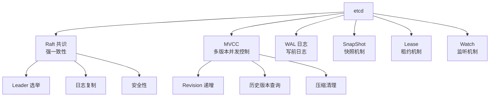

# etcd 项目概览

## 学习目标

- 了解 etcd 作为分布式一致性 KV 存储的定位
- 掌握 etcd 基于 Raft 的一致性设计

## 项目定位

> etcd 是一个分布式、可靠的键值存储系统，用于分布式系统的关键数据存储。

**基本信息**：
- 开发方：CNCF（原 CoreOS 孵化）
- 首次发布：2014 年
- 开源协议：Apache 2.0
- GitHub Stars：约 48k

## 核心设计



## 典型应用

```bash
# Kubernetes 使用 etcd 存储所有集群状态
# 服务发现、配置中心、分布式锁

# 基本操作
etcdctl put /config/database "host=localhost"
etcdctl get /config/database
etcdctl del /config/database

# Watch 监听变化
etcdctl watch /config/ --prefix

# 租约
etcdctl lease grant 60
etcdctl put --lease=LEASE_ID /key value
```

## 要点总结

- 基于 Raft 实现强一致性
- MVCC + WAL + SnapShot 保证数据可靠
- Watch 机制支持事件驱动
- Kubernetes 最核心的依赖组件

## 思考题

1. etcd 和 ZooKeeper 在一致性实现上有何异同？
2. etcd 的 Raft 实现与标准 Raft 协议有哪些差异？
3. etcd 的存储容量限制主要来自哪里？