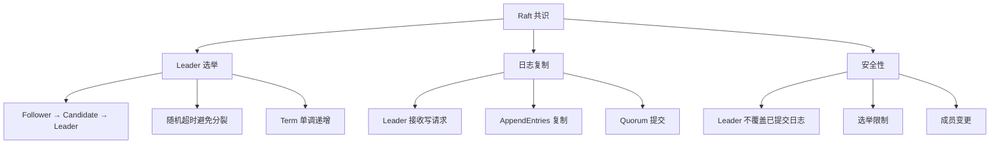
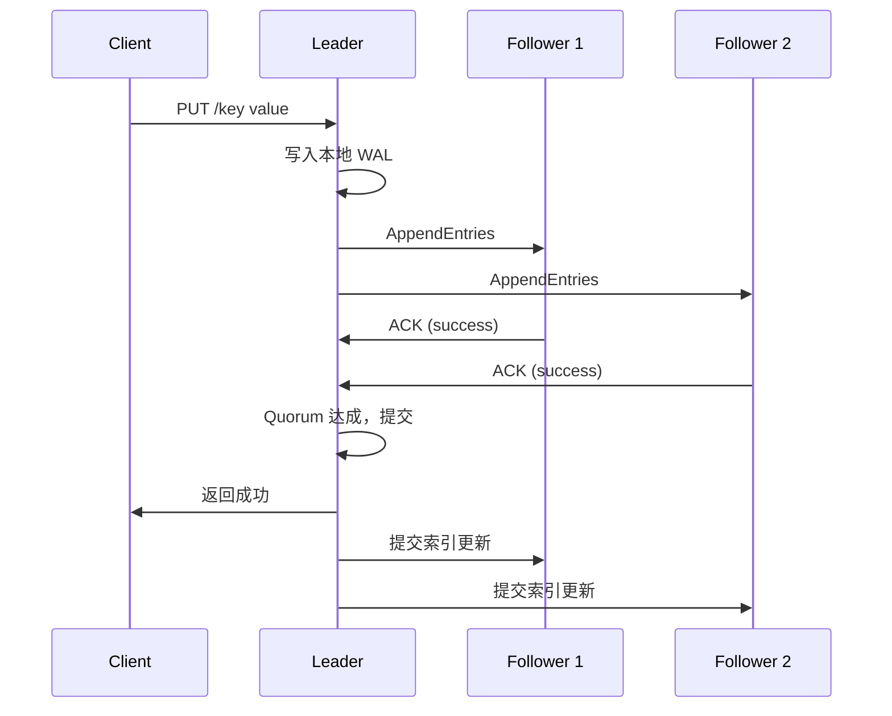

# etcd Raft 共识算法

## 学习目标

- 掌握 etcd 的 Raft 实现
- 理解 Leader 选举、日志复制、安全性保障

## Raft 核心



## 关键结构

```go
// etcd/raft/raft.go
type raft struct {
    id uint64
    Term uint64
    Vote uint64

    // 状态
    state StateType  // Follower/Candidate/Leader

    // 日志
    raftLog *raftLog

    // 节点进度追踪
    prs tracker.ProgressTracker

    // 消息
    msgs []pb.Message
}

// 消息类型
type MessageType int32
const (
    MsgHup            // 发起选举
    MsgBeat           // 心跳
    MsgProp           // 提议
    MsgApp            // 追加日志
    MsgAppResp        // 追加响应
    MsgVote           // 投票请求
    MsgVoteResp       // 投票响应
    MsgSnap           // 快照
)
```

## 日志复制流程



## etcd Raft 优化

| 优化项 | 说明 |
|--------|------|
| PreVote | 防止网络分区的 Term 递增 |
| CheckQuorum | Leader 定期检查是否仍有 Quorum |
| Leader Transfer | 无中断 Leader 切换 |
| 异步 Apply | 提交和应用的解耦 |

## 要点总结

- 使用 Raft 而非 Paxos，更易理解
- PreVote 防止分区节点破坏集群
- 异步 Apply 提升性能
- 支持 Leader Transfer 优雅切换

## 思考题

1. etcd 的 PreVote 机制如何防止脑裂？
2. 日志复制的 pipeline 模式相比同步模式有什么优势？
3. etcd 支持的最大集群规模是多少？为什么？