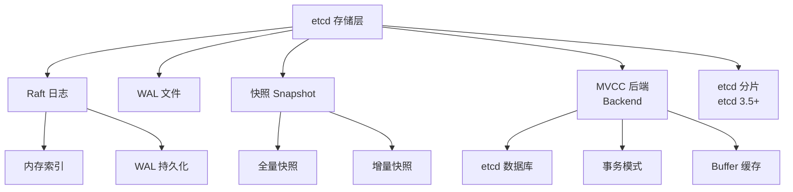

# etcd 存储与 MVCC

## 学习目标

- 理解 etcd 的 MVCC 多版本并发控制
- 掌握 etcd 的 BoltDB/etcd 分片架构

## 存储架构



## MVCC 实现

```go
// mvcc/kvstore.go

type store struct {
    // 读 View
    ReadView
    // 写 View
    WriteView

    // 当前版本号
    currentRev revision
    // 存储后端
    backend backend.Backend
    // 索引
    index index

    // 压缩
    mu sync.RWMutex
    // 压缩 Revision
    compactRevision int64
}

// Revision 结构
type revision struct {
    // 主版本，单调递增
    main int64
    // 子版本，处理同一事务内多个写操作
    sub int64
}
```

## 写操作流程

```go
// 写入流程
// 1. 分配 Revision（main = currentRev + 1, sub = 0）
// 2. 写入后端存储
//    key = revision → value
//    key = user_key → latest_revision
// 3. 更新内存索引
// 4. 返回

// 键值编码
// 用户键 → backendKey
// key = user_key + revision
// value = user_value + flags
```

## 压缩机制

```go
// mvcc/kvstore.go

// 自动压缩
// 按时间间隔: auto-compaction-retention = 1h
// 按版本数: auto-compaction-retention = 1000

// 压缩过程
// 1. 设置 compactRevision
// 2. 删除历史版本数据
// 3. 压缩索引（树删除）
// 4. 释放磁盘空间

// 压缩触发
// 每 5 分钟检查一次
// 也可手动触发:
// etcdctl compaction 1000
```

## 存储限制

| 限制项 | 值 | 说明 |
|--------|-----|------|
| 默认存储大小 | 2GB | etcd 警告阈值 |
| 最大存储大小 | 8GB | 建议不超过 8GB |
| 键大小 | 1MB | 单键最大值 |
| 事务大小 | 128KB | 单事务总大小 |
| 客户端请求 | 1.5MB | 单请求大小 |

## 要点总结

- MVCC 通过 Revision 实现多版本
- 后端存储基于 etcd 实现
- 定期压缩历史版本，控制存储空间
- 默认存储上限 2GB，适合元数据存储

## 思考题

1. etcd 的存储限制如此严格，其设计理念是什么？
2. 压缩后磁盘空间是否立即释放？为什么？
3. 如何监控 etcd 存储容量，超过阈值时的处理策略？