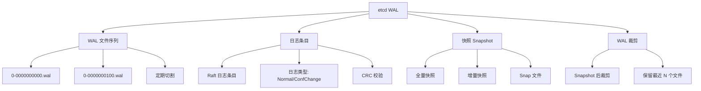
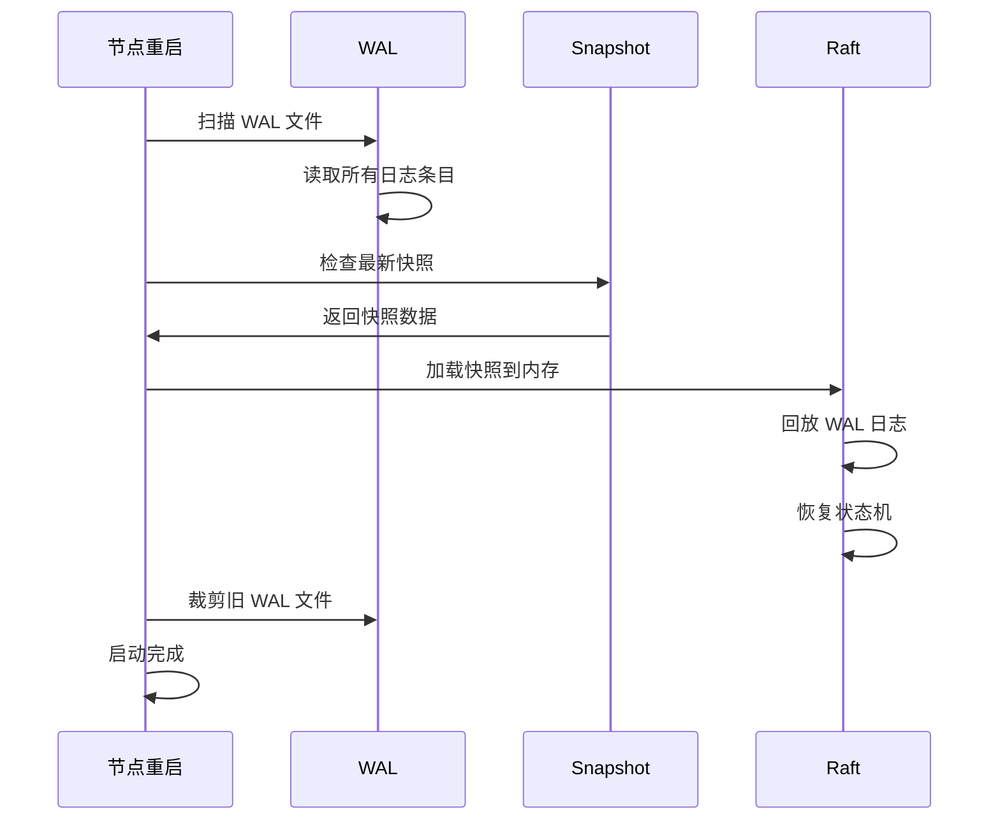

# etcd WAL 与快照

## 学习目标

- 理解 etcd 的 WAL 写前日志
- 掌握快照机制和 WAL 裁剪

## WAL 架构



## WAL 文件结构

```go
// wal/wal.go

type WAL struct {
    // 日志文件
    dir string
    // 当前文件
    f *os.File
    // 编码器
    encoder *encoder
    // 解码器
    decoder *decoder

    // 元数据
    metadata []byte

    // 日志状态
    state raftpb.HardState
    // 快照
    snapshot *raftpb.Snapshot

    // CRC 校验
    mu sync.Mutex
    // 当前 CRC
    curCrc uint32
    // 上次 CRC
    lastCrc uint32
}
```

## 写入流程

```go
// WAL 写入
// 1. 序列化 Raft 日志条目
// 2. 计算 CRC 校验
// 3. 追加到当前 WAL 文件
// 4. 调用 fsync 确保写入磁盘
// 5. 文件超过阈值（64MB）时切割

// 保存
func (w *WAL) Save(st raftpb.HardState, ents []raftpb.Entry) error {
    // 1. 写入日志条目
    // 2. 写入 HardState
    // 3. 更新 CRC
    // 4. 调用 Sync()
    return nil
}

// 切割条件
// 文件大小 > 64MB
// 文件序号递增
// 从前一个文件中断处开始
```

## 快照机制

```go
// 快照创建
// 当 Raft 日志条数 > 10000 时触发
// 或者手动触发

// 快照内容
// 1. 当前所有键值对
// 2. 最后一个包含的索引
// 3. 元数据（集群 ID、成员 ID）

// 快照加载
// 1. 检查快照文件
// 2. 加载到内存
// 3. 设置 Raft 日志状态
// 4. 裁剪 WAL 文件
```

## 故障恢复流程



## 要点总结

- WAL 是 Raft 日志的持久化载体
- 每个日志条目有 CRC 校验
- 快照触发后裁剪旧 WAL 文件
- 故障恢复时先加载快照再回放 WAL

## 思考题

1. WAL 中为什么需要保存 HardState？包含哪些信息？
2. 快照和 WAL 裁剪的配合策略是什么？
3. 如果 WAL 文件损坏，如何恢复？