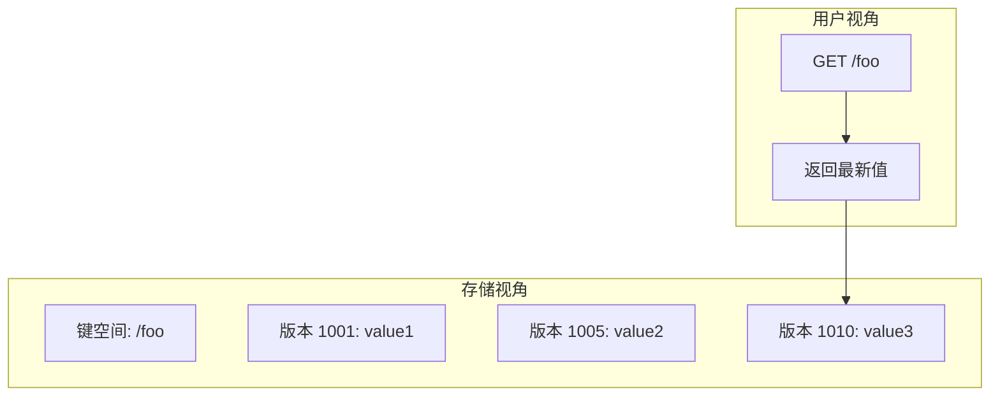
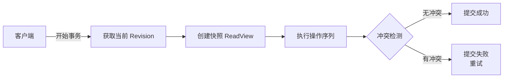
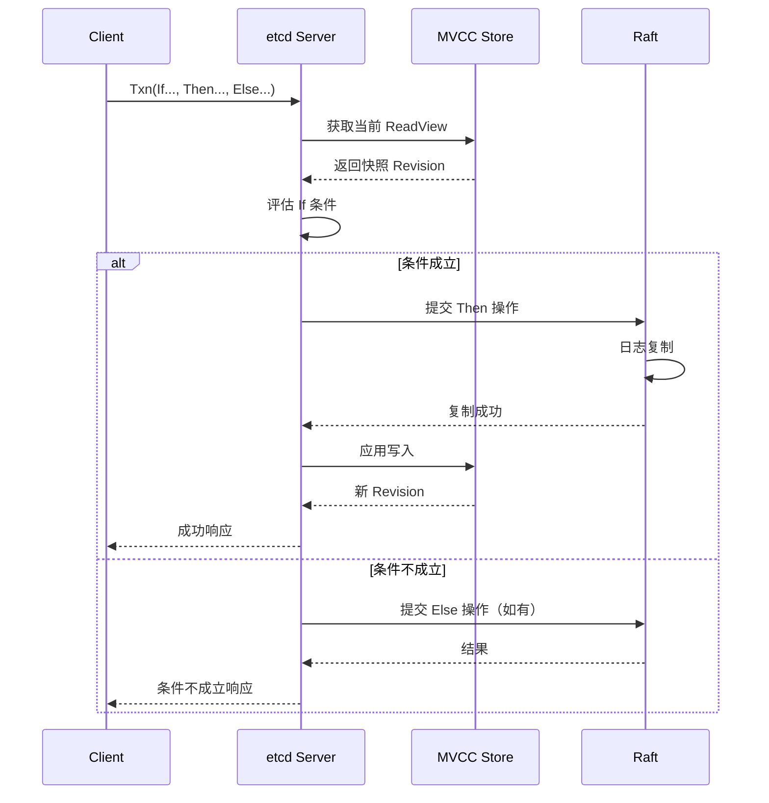
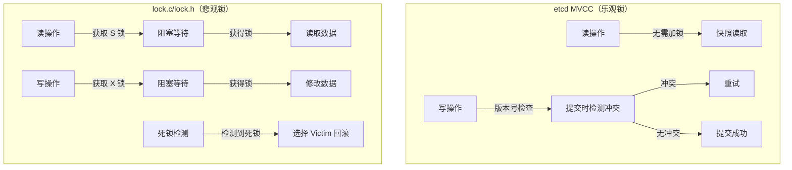
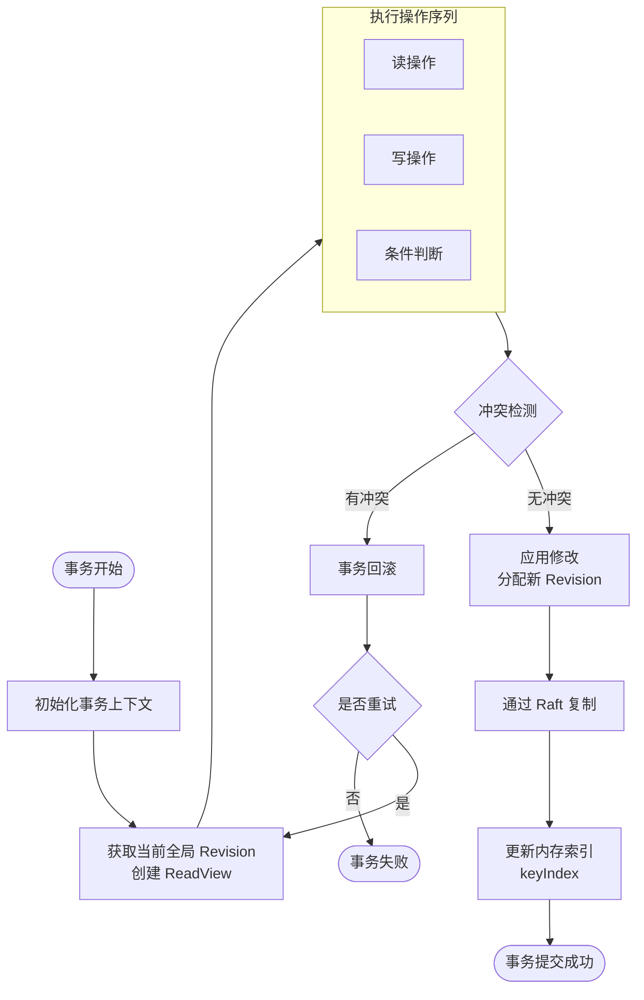

# etcd 事务与 MVCC

## 学习目标

- 理解 etcd 的 MVCC 版本号机制（Revision）
- 掌握多版本键值存储的实现原理
- 了解 etcd 的事务隔离级别（Serializable Snapshot Isolation）
- 分析 etcd 事务机制与项目 lock.c/lock.h 模块的关联

## 核心概念

### 1. MVCC 版本号机制（Revision）

etcd 使用 **Revision（版本号）** 作为 MVCC 的核心概念，每个写操作都会分配一个全局单调递增的版本号。

```go
// etcd mvcc/revision.go

type revision struct {
    // 主版本号：全局单调递增，每次事务提交 +1
    main int64
    
    // 子版本号：同一事务内多个写操作的区分
    // 同一事务内第一个写操作 sub = 0，后续写操作 sub 递增
    sub int64
}
```

**版本号生成规则**：

| 场景 | main | sub | 说明 |
|------|------|-----|------|
| 事务 T1 第一次写入 | 1001 | 0 | 新事务，main 递增 |
| 事务 T1 第二次写入 | 1001 | 1 | 同事务，sub 递增 |
| 事务 T2 第一次写入 | 1002 | 0 | 新事务，main 递增 |

**版本号作用**：
- 实现多版本存储：同一键可存在多个版本
- 支持历史查询：可按版本号读取历史值
- 事务隔离：基于版本号实现快照隔离

### 2. 多版本键值存储

etcd 的后端存储基于 **BoltDB（嵌入式 KV 数据库）**，采用多版本存储模式：



**存储结构**：

```go
// etcd mvcc/kvstore.go

// 后端存储的键格式
// key = encodeRevision(revision)
// 格式: {main(8bytes)}{sub(8bytes)}{userKey}
//
// 例如: 用户键 "/foo"，revision = {main: 1001, sub: 0}
// 存储键 = "\x00\x00\x00\x00\x00\x00\x03\xE9\x00\x00\x00\x00\x00\x00\x00\x00/foo"

// 后端存储的值格式
type mvccpb.KeyValue struct {
    Key            []byte `protobuf:"bytes,1,opt,name=key,proto3" json:"key,omitempty"`
    Value          []byte `protobuf:"bytes,2,opt,name=value,proto3" json:"value,omitempty"`
    CreateRevision int64  `protobuf:"varint,3,opt,name=create_revision,json=createRevision,proto3" json:"create_revision,omitempty"`
    ModRevision    int64  `protobuf:"varint,4,opt,name=mod_revision,json=modRevision,proto3" json:"mod_revision,omitempty"`
    Version        int64  `protobuf:"varint,5,opt,name=version,proto3" json:"version,omitempty"`
    Lease          int64  `protobuf:"varint,6,opt,name=lease,proto3" json:"lease,omitempty"`
}
```

**内存索引（keyIndex）**：

```go
// etcd mvcc/key_index.go

type keyIndex struct {
    key         []byte      // 用户键
    modified    revision    // 最后修改版本
    generations []generation // 代列表（删除后新建产生新代）
}

type generation struct {
    ver     int64        // 版本计数（同一代内）
    created revision     // 创建版本
    revs    []revision   // 该代所有版本列表
}
```

**示例：键的生命周期**：

```
时间线:
T1: PUT /foo "value1"  -> revision {main: 1001, sub: 0}
T2: PUT /foo "value2"  -> revision {main: 1005, sub: 0}
T3: DELETE /foo        -> revision {main: 1010, sub: 0} (墓碑标记)
T4: PUT /foo "value3"  -> revision {main: 1015, sub: 0} (新代)

keyIndex 状态:
key = "/foo"
modified = {main: 1015, sub: 0}
generations = [
    generation {
        created = {main: 1001, sub: 0}
        revs = [{1001, 0}, {1005, 0}, {1010, 0}] // 墓碑在末尾
    },
    generation {
        created = {main: 1015, sub: 0}
        revs = [{1015, 0}]
    }
]
```

### 3. 事务隔离级别

etcd 实现了 **Serializable Snapshot Isolation（可串行化快照隔离）**：



**隔离级别特性**：

| 特性 | 说明 |
|------|------|
| 快照读 | 读取事务开始时的数据快照 |
| 写不阻塞读 | 读操作无需获取锁 |
| 写写冲突检测 | 通过 Revision 检测并发写冲突 |
| 可串行化 | 事务执行结果等价于某种串行执行顺序 |

**事务 API**：

```go
// etcd clientv3/txn.go

// 事务模式
txn := client.Txn(ctx)
resp, err := txn.
    If(cmp1, cmp2, ...).      // 条件判断（基于 Revision）
    Then(op1, op2, ...).      // 条件成立时执行
    Else(op1, op2, ...).      // 条件不成立时执行
    Commit()

// 比较条件
type Cmp struct {
    Key         string
    Target      CompareTarget   // VERSION / CREATE / MOD / VALUE
    Result      CompareResult   // EQUAL / NOT_EQUAL / GREATER / ...
    TargetValue interface{}
}

// 示例：乐观锁实现
txn := client.Txn(ctx)
resp, err := txn.If(
    clientv3.Compare(clientv3.ModRevision("/foo"), "=", currentRev),
).Then(
    clientv3.OpPut("/foo", "newValue"),
).Commit()
```

### 4. 事务执行流程



## 与项目 lock.c/lock.h 模块的关联

### 对比分析

| 维度 | etcd 事务 | 项目 lock.c/lock.h |
|------|-----------|--------------------|
| 并发控制模式 | MVCC（乐观锁） | 两阶段锁（悲观锁） |
| 冲突检测时机 | 提交时检测 | 获取锁时检测 |
| 读操作 | 无需加锁，读取快照 | 需要获取共享锁 |
| 写操作 | 基于版本号检测冲突 | 需要获取排他锁 |
| 死锁 | 无死锁（乐观锁） | 可能死锁，需检测机制 |
| 适用场景 | 读多写少 | 读写均衡 |

### lock.c/lock.h 架构回顾

```c
// engineering/include/db/lock.h

// 锁模式
typedef enum lock_mode_e {
    LOCK_MODE_S = 0,     // 共享锁 (Shared) - 读操作
    LOCK_MODE_X,         // 排他锁 (Exclusive) - 写操作
    LOCK_MODE_IS,        // 意向共享锁
    LOCK_MODE_IX,        // 意向排他锁
    LOCK_MODE_SIX        // 共享意向排他锁
} lock_mode_t;

// 锁对象类型（多粒度锁）
typedef enum lock_object_type_e {
    LOCK_DATABASE = 0,   // 数据库级别锁
    LOCK_TABLE,          // 表锁
    LOCK_PAGE,           // 页锁
    LOCK_ROW             // 行锁
} lock_object_type_t;
```

### 两者的设计取舍



### 借鉴价值

**从 etcd 可学习的点**：

1. **版本号机制**：可在项目中引入 txn_id 或 commit_id，用于冲突检测
2. **快照隔离**：读操作不加锁，提高并发性能
3. **条件写入**：If-Then-Else 模式可简化乐观锁实现

**lock.c/lock.h 的优势**：

1. **强一致性保证**：获取锁后数据不会被其他事务修改
2. **死锁检测**：已有完善的死锁检测和解决机制
3. **多粒度锁**：支持数据库/表/页/行多级锁，灵活性高

### 潜在融合方案

```c
// 假设的混合锁管理器接口
typedef enum isolation_level_e {
    ISOLATION_READ_COMMITTED,     // 读已提交（悲观锁）
    ISOLATION_REPEATABLE_READ,    // 可重复读（悲观锁）
    ISOLATION_SNAPSHOT,           // 快照隔离（MVCC）
    ISOLATION_SERIALIZABLE        // 可串行化（MVCC + 谓词锁）
} isolation_level_t;

// 事务可选择的并发控制策略
typedef struct txn_config_s {
    isolation_level_t level;
    bool              use_mvcc;       // 是否启用 MVCC
    bool              use_optimistic; // 是否使用乐观锁
} txn_config_t;
```

## 事务完整流程图



## 要点总结

1. **Revision 是核心**：etcd 通过 Revision 实现多版本存储，main 递增保证全局顺序，sub 区分同事务内多次写入
2. **快照隔离无锁读**：读操作基于快照，不阻塞写操作，适合读多写少场景
3. **条件事务灵活**：If-Then-Else 模式支持复杂的乐观锁逻辑
4. **与悲观锁互补**：MVCC 适合低冲突场景，lock.c/lock.h 的两阶段锁适合高冲突场景
5. **压缩控制空间**：定期压缩历史版本，避免存储无限增长

## 思考题

1. etcd 的 MVCC 实现为什么选择 Revision 而非时间戳？两者各有什么优劣？
2. 如果项目中要实现 MVCC，需要修改 lock.c/lock.h 的哪些接口？
3. etcd 的事务为什么不支持跨键的原子性（如跨键外键约束）？这与 lock.c/lock.h 的设计有何关联？
4. 压缩（Compaction）操作在 MVCC 中的代价是什么？如何设计压缩策略平衡空间与性能？

## 参考资料

- etcd 源码：mvcc/kvstore.go, mvcc/revision.go, mvcc/key_index.go
- etcd 文档：Concurrency Control (https://etcd.io/docs/v3.5/learning/concurrency_control/)
- 项目源码：engineering/include/db/lock.h