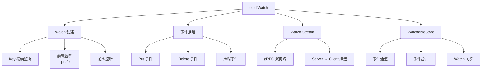

# etcd Watch 与 Lease

## 学习目标

- 理解 etcd 的 Watch 机制实现
- 掌握 Lease 租约机制及在服务发现中的应用

## Watch 机制



## 核心实现

```go
// mvcc/watchable_store.go

type watchableStore struct {
    *store

    // 观察者管理
    mu sync.RWMutex
    // 观察者列表
    victims watchBatch
    // 待处理事件
    eventMap map[watchKey]*eventBatch

    // 同步通道
    syncCh chan struct{}
}

// 观察者结构
type watcher struct {
    // 监听 key
    key []byte
    // 结束 key（范围监听）
    end []byte
    // 起始 revision
    startRev int64
    // 事件通道
    ch chan<- WatchResponse
    // 是否已移除
    removed bool
}
```

## Watch 事件推送

```go
// 写操作触发 Watch 事件
// 流程:
// 1. 写入键值对
// 2. 生成事件（Event）
// 3. 通知匹配的 Watch
// 4. 通过通道推送

// 事件类型
type EventType int
const (
    PUT    EventType = 0
    DELETE EventType = 1
)

// 事件合并
// 同一 key 的多个事件合并为最新状态
// 防止 Watch 过载
```

## Lease 租约

```go
// lease/lessor.go

type Lessor interface {
    // 申请租约
    Grant(id LeaseID, ttl int64) (*Lease, error)
    // 撤销租约
    Revoke(id LeaseID) error
    // 续约
    KeepAlive(id LeaseID) (<-chan *LeaseKeepAliveResponse, error)
    // 关联键
    Attach(id LeaseID, keys []string) error
    // 查询租约
    Lookup(id LeaseID) *Lease
}

type Lease struct {
    ID           LeaseID
    TTL          int64         // 存活时间（秒）
    RemainingTTL int64         // 剩余时间
    expiry       time.Time     // 到期时间
    mu           sync.RWMutex
    itemSet      map[string]struct{}  // 关联的键
    // 续约通道
    expireCh     chan struct{}
    // 续约时间
    // 当 TTL/3 时自动续约
}
```

## 服务发现场景

```go
// 服务注册
// 服务端
lease := etcd.Grant(ctx, 10)  // TTL = 10s
etcd.Put(ctx, "/services/myapp/192.168.1.1:8080", "alive", grpc.WithLease(lease.ID))
// 自动续约
etcd.KeepAlive(ctx, lease.ID)

// 服务发现
// 客户端
watchChan := etcd.Watch(ctx, "/services/myapp/", WithPrefix())
for resp := range watchChan {
    for _, ev := range resp.Events {
        switch ev.Type {
        case mvccpb.PUT:
            log.Printf("服务上线: %s", ev.Kv.Key)
        case mvccpb.DELETE:
            log.Printf("服务下线: %s", ev.Kv.Key)
        }
    }
}
```

## 要点总结

- Watch 基于 gRPC 双向流推送
- 支持 Key/前缀/范围三种监听方式
- Lease 通过定期续约实现存活检测
- 服务发现是 Watch + Lease 的经典组合

## 思考题

1. Watch 事件的顺序如何保证？与 Revision 的关系是什么？
2. Lease 的续约时间是 TTL/3，为什么是这个值？
3. 大规模 Watch 场景下，etcd 的性能瓶颈在哪里？