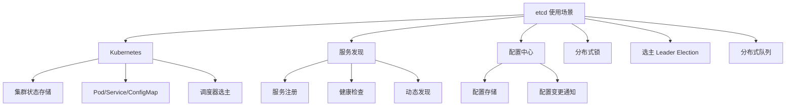

# etcd 使用场景

## 学习目标

- 掌握 etcd 的典型应用场景
- 理解 etcd 在 Kubernetes 中的核心作用

## 使用场景总览



## Kubernetes 中的 etcd

```go
// Kubernetes 使用 etcd 存储所有 API 对象
// 资源示例:
// /registry/pods/default/my-pod
// /registry/services/default/my-service
// /registry/configmaps/default/my-config
// /registry/secrets/default/my-secret

// 使用 Watch 实现控制器模式
// Informer 监听资源变化
// 事件驱动而非轮询

// 特点:
// 1. 存储对象元数据，非大规模数据
// 2. 强一致性保证
// 3. Watch 机制实现实时感知
// 4. Lease 实现节点心跳
```

## 分布式锁

```go
// etcd 分布式锁实现
// 使用 etcd 的乐观锁和 Revision 机制

// 锁创建
// 1. 创建租约
// 2. 在锁目录下创建 key（带租约）
// 3. 获取锁目录下所有 key 排序
// 4. 自己的 key 是最小的 → 获得锁
// 5. 否则 Watch 前一个 key 的删除事件

// 锁释放
// 1. 删除 key
// 2. 租约到期自动删除

// 示例
func (m *Mutex) Lock(ctx context.Context) error {
    // 1. 创建租约
    resp, err := m.client.Grant(ctx, m.ttl)
    // 2. 创建 key
    myKey := fmt.Sprintf("%s/%x", m.prefix, resp.ID)
    _, err = m.client.Put(ctx, myKey, "", grpc.WithLease(resp.ID))
    // 3. 获取所有 key
    // 4. 判断是否最小 → 获得锁
    // 5. Watch 前一个 key
    return nil
}
```

## 选主（Leader Election）

```go
// Leader Election 实现
// 使用 etcd 的竞选机制

// 候选者流程
// 1. 创建竞选 key（带租约）
// 2. 尝试使用事务写入
// 3. 成功 → 成为 Leader
// 4. 失败 → Watch 该 key
// 5. 当 key 被删除 → 重新竞选

// 保持 Leader 地位
// 定期续约（KeepAlive）
// 主动让位（Revoke）

// 应用场景
// 1. Kubernetes Controller Manager 选主
// 2. 调度器高可用
// 3. 配置中心主备切换
```

## 配置中心

```python
import etcd3

# 连接 etcd
etcd = etcd3.client(host='localhost', port=2379)

# 配置存储
put_config("/config/database/host", "localhost")
put_config("/config/database/port", "5432")

# 配置监听
def watch_config():
    # 监听所有配置变更
    events = etcd.watch_prefix("/config/")
    for event in events:
        print(f"配置变更: {event.key} = {event.value}")

# 配置管理
# 1. 版本管理（通过 Revision）
# 2. 回滚（历史版本查询）
# 3. 灰度发布（前缀隔离）
```

## 要点总结

- Kubernetes 是 etcd 最核心的用户
- Watch 机制实现实时配置变更
- Lease + Revision 实现分布式锁
- 竞选机制实现 Leader Election

## 思考题

1. Kubernetes 直接将 etcd 暴露给用户是否合适？有什么替代方案？
2. etcd 做配置中心相比 Consul 有什么优缺点？
3. 在大规模集群中，etcd 的 Watch 压力如何分担？