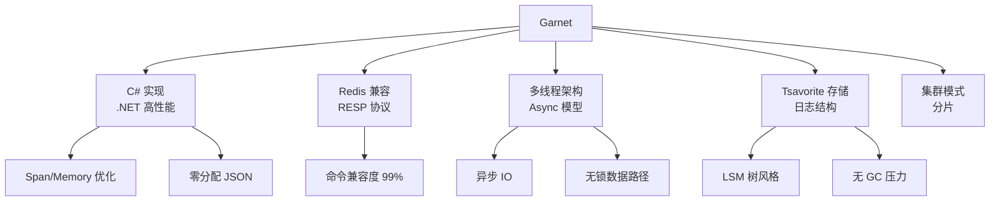

# Garnet 项目概览

## 学习目标

- 了解 Garnet 作为微软 Redis 兼容替代品的定位
- 掌握 Garnet 基于 C# 的高性能设计

## 项目定位

> Garnet 是微软研究院开源的远程缓存存储系统，兼容 Redis 协议，使用 C# 实现。

**基本信息**：
- 开发方：Microsoft Research
- 首次发布：2024 年
- 开源协议：MIT
- GitHub Stars：约 10k

## 核心设计

## 性能对比

| 特性 | Redis | Garnet |
|------|-------|--------|
| 语言 | C | C# |
| 协议 | RESP | RESP |
| 多线程 | 6.0+ IO 线程 | 原生多线程 |
| 存储引擎 | 纯内存 + 持久化 | Tsavorite |
| 延迟 | 微秒级 | 微秒级 |
| 集群 | 原生 | 支持分片 |

## 要点总结

- 微软研究院出品，C# 实现
- 完全兼容 Redis 协议
- Tsavorite 存储引擎使用日志结构设计
- .NET 的高性能特性（Span/Async/无 GC）

## 思考题

1. Garnet 使用 C# 实现，相比 C 实现的 Redis 性能差距如何？
2. Tsavorite 存储引擎与 Redis 的纯内存设计有何不同？
3. Garnet 的集群模式与 Redis Cluster 有何异同？