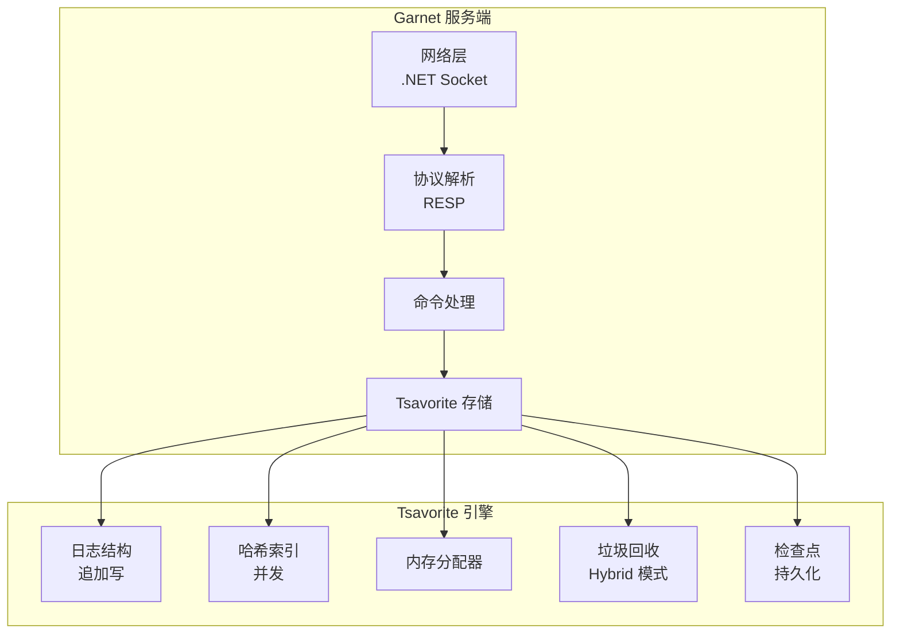

# Garnet 架构与 Tsavorite 引擎

## 学习目标

- 理解 Garnet 的架构设计
- 掌握 Tsavorite 存储引擎的原理

## 架构总览



## Tsavorite 存储引擎

```csharp
// Tsavorite 是 Garnet 的存储引擎核心
// 设计理念：日志结构合并（LSM 风格）

// 核心概念
// 1. 追加写：所有写入追加到日志末尾
// 2. 哈希索引：主键索引
// 3. 并发控制：无锁读

// 日志结构
// [Record Header][Key][Value]
// Record Header 包含:
// - 记录类型: 插入/更新/删除
// - 记录大小
// - 校验和

// 读取流程
// 1. 计算 key 的哈希
// 2. 在哈希索引中查找
// 3. 从日志中读取记录
// 4. 返回 value
```

## 并发控制

```csharp
// Garnet 的并发模型
// 1. 多线程异步 IO
// 2. 无锁读路径
// 3. 写操作使用 CAS

// 异步 IO
// 使用 .NET 的 async/await
// 非阻塞 IO 处理

// 无锁数据结构
// 1. 哈希表使用 CAS 操作
// 2. 无锁队列
// 3. 减少上下文切换

// 内存管理
// 1. 使用 Span<T> 避免分配
// 2. 内存池复用
// 3. 零分配 JSON 解析
```

## 要点总结

- Tsavorite 是日志结构存储引擎
- 追加写 + 哈希索引的经典组合
- 无锁读路径实现高并发
- .NET 的 Span 和 Async 优化

## 思考题

1. Tsavorite 的日志结构与 LevelDB 的 LSM-Tree 有何区别？
2. Garnet 的检查点（Checkpoint）机制如何保证一致性？
3. 使用 C# 实现高性能缓存存储，最大的挑战是什么？