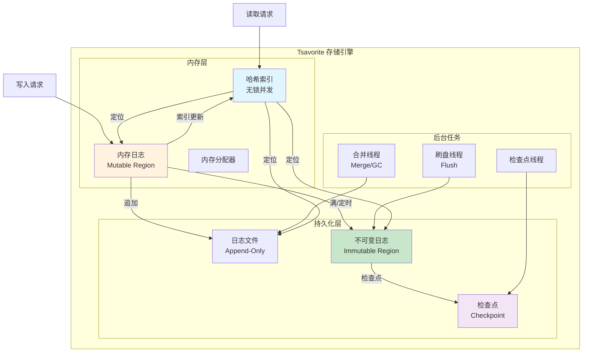
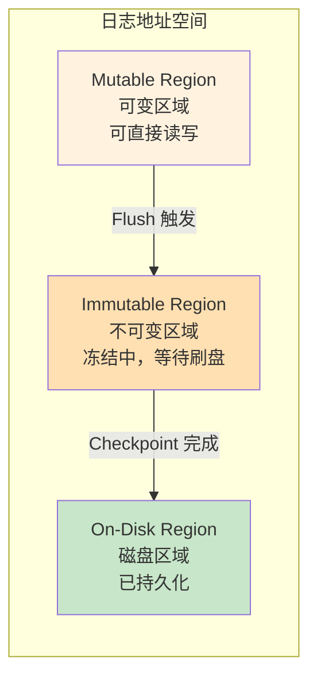
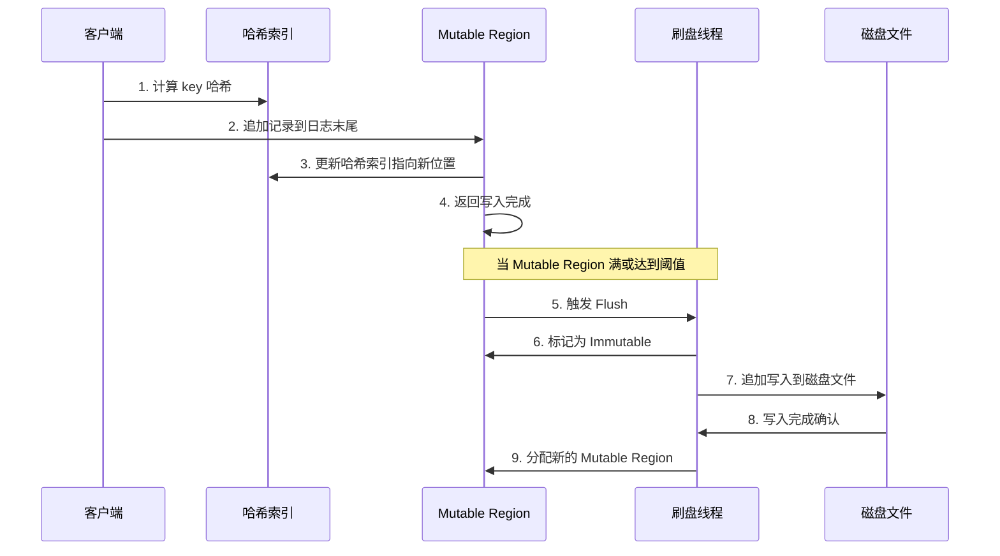
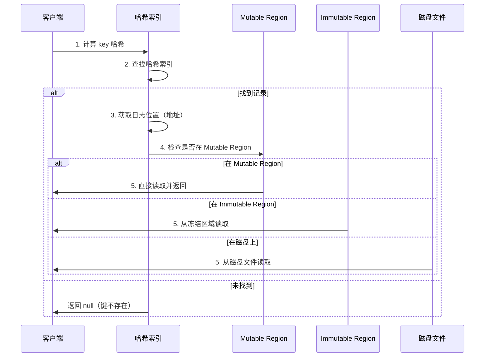
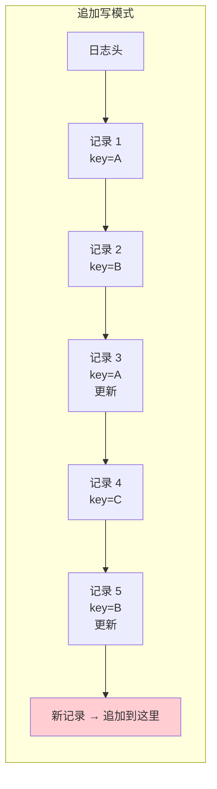
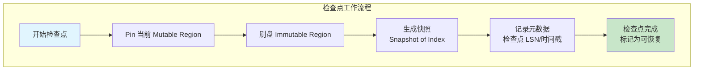
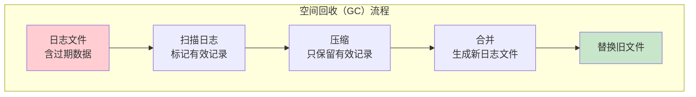
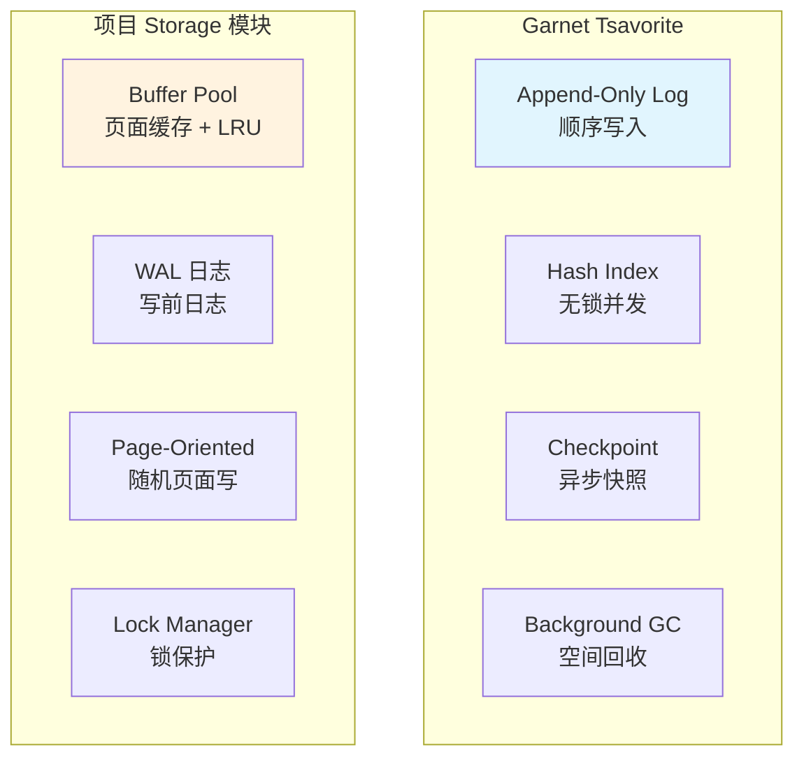

# Garnet 数据结构和存储引擎

## 学习目标

- 理解 Tsavorite 日志结构存储引擎的核心设计
- 掌握内存哈希表的无锁并发实现
- 了解追加写（append-only log）模式的优势与挑战
- 理解检查点（checkpoint）机制的一致性保证
- 对比 Garnet 与项目 kv_engine/storage 模块的架构差异

## Tsavorite 日志结构存储引擎

Tsavorite 是 Garnet 的核心存储引擎，采用日志结构合并（LSM 风格）设计。与传统的页面式存储不同，Tsavorite 将所有写入操作追加到日志末尾，配合内存哈希索引实现快速的键值查找。

### 核心设计理念

```
Tsavorite 设计哲学：
1. 写操作 = 顺序追加（顺序 IO 最大化）
2. 读操作 = 哈希索引 + 日志定位
3. 持久化 = 检查点快照 + 增量日志
4. 空间回收 = 后台合并（GC）
```

### 架构总览



### 日志结构

Tsavorite 的日志由一系列记录组成，每条记录包含元数据头和键值数据：

```csharp
// Tsavorite 日志记录格式（概念描述）

// 记录头 (Record Header)
// ┌──────────────────────────────────────────────┐
// | RecordType (1 byte)  | 记录类型              |
// |   - INSERT: 0x01     | 插入操作              |
// |   - UPDATE: 0x02     | 更新操作              |
// |   - DELETE: 0x03     | 删除操作              |
// |   - UPSERT: 0x04     | 存在则更新，否则插入   |
// ├──────────────────────────────────────────────┤
// | KeySize (4 bytes)    | 键长度                |
// | ValueSize (4 bytes)  | 值长度                |
// | Checksum (4 bytes)   | 校验和                |
// ├──────────────────────────────────────────────┤
// | Key (variable)       | 键数据                |
// | Value (variable)     | 值数据                |
// └──────────────────────────────────────────────┘

// 每条记录的大小 = HeaderSize + KeySize + ValueSize
// 记录按写入顺序连续排列在日志中
```

### 日志区域划分

Tsavorite 将日志空间划分为三个区域，分别承担不同的角色：



**区域说明**：

| 区域 | 状态 | 读写能力 | 持久化状态 | 用途 |
|------|------|---------|-----------|------|
| Mutable Region | 活跃 | 可读可写 | 未持久化 | 接收新写入 |
| Immutable Region | 冻结 | 只读 | 未持久化 | 等待刷盘 |
| On-Disk Region | 持久化 | 只读 | 已持久化 | 磁盘上的日志 |

### 写入路径



**写入路径的关键步骤**：

1. 计算 key 的哈希值，定位哈希索引中的桶
2. 将记录追加到 Mutable Region 的日志末尾
3. 更新哈希索引，使键指向新记录的日志位置
4. 返回写入完成（无需等待刷盘，异步持久化）
5. 当 Mutable Region 满或达到条件时，触发 Flush 操作
6. 当前 Mutable Region 被冻结为 Immutable Region
7. 后台线程将 Immutable Region 写入磁盘
8. 分配新的 Mutable Region 继续接收写入

### 读取路径



**读取路径的关键步骤**：

1. 计算 key 的哈希值，定位哈希索引中的桶
2. 在哈希索引中查找键，获取对应的日志位置（地址）
3. 根据日志位置判断记录在哪个区域
4. 从对应区域读取记录数据
5. 校验记录头（校验和验证）
6. 返回键对应的值

### 无锁并发哈希表

Tsavorite 的哈希索引采用无锁并发设计，读操作完全无锁，写操作通过 CAS 原子指令保证安全。

```csharp
// Tsavorite 哈希索引（概念描述）

// 哈希表结构
// ┌──────────────────────────────────────────────┐
// | HashTable                                    |
// | ├── Bucket[0]  ── Cache Line (64B)          |
// | ├── Bucket[1]  ── Cache Line (64B)          |
// | ├── ...                                     |
// | └── Bucket[N]  ── Cache Line (64B)          |
// └──────────────────────────────────────────────┘

// 每个 Bucket 包含：
// ┌──────────────────────────────────────────────┐
// | Slot 0: Tag(2B) | Pending(1B) | Address(8B) |
// | Slot 1: Tag(2B) | Pending(1B) | Address(8B) |
// | Slot 2: Tag(2B) | Pending(1B) | Address(8B) |
// | Slot 3: Tag(2B) | Pending(1B) | Address(8B) |
// | Slot 4: Tag(2B) | Pending(1B) | Address(8B) |
// | Slot 5: Tag(2B) | Pending(1B) | Address(8B) |
// | Slot 6: Tag(2B) | Pending(1B) | Address(8B) |
// | Slot 7: Tag(2B) | Pending(1B) | Address(8B) |
// └──────────────────────────────────────────────┘
// 每个 Slot 可以指向一个日志位置
// Tag 用于快速过滤（哈希值的高位部分）
// Pending 标志用于并发控制
// Address 指向日志中的记录位置
```

**无锁并发机制**：

```csharp
// 无锁读操作
// 1. 计算 key 的哈希值
// 2. 定位到对应的 Bucket
// 3. 遍历 Slot 比对 Tag
// 4. 匹配 Tag 后读取 Address 指向的日志记录
// 5. 验证记录的一致性（校验和）
// 整个过程不获取锁，只依赖原子读取

// 无锁写操作（CAS）
// 1. 找到空闲 Slot 或替换旧 Slot
// 2. 构造新的 Slot 值（Tag + Address）
// 3. 使用 CAS 原子替换
//    atomic_compare_exchange_strong(&slot, &old_value, new_value)
// 4. CAS 失败则重试

// 内存屏障
// 写操作后插入 Release 屏障
// 读操作前插入 Acquire 屏障
// 保证多核可见性
```

**无锁设计的优势**：

| 特性 | 无锁设计 | 传统锁设计 |
|------|---------|-----------|
| 读路径 | 无阻塞，零等待 | 可能被锁阻塞 |
| 写路径 | CAS 重试，不阻塞 | 互斥锁，排他 |
| 死锁风险 | 无 | 有 |
| 优先级反转 | 无 | 有 |
| 多核扩展性 | 高 | 受锁争用限制 |
| 实现复杂度 | 高 | 低 |

### 追加写模式

Tsavorite 采用追加写（append-only log）模式，所有写入操作都在日志末尾追加新记录，而不是在原地覆盖旧记录。



**追加写 vs 原地更新**：

| 特性 | 追加写 | 原地更新 |
|------|--------|---------|
| **写入模式** | 顺序 IO（性能高） | 随机 IO（性能低） |
| **旧数据** | 存在（历史版本） | 被覆盖 |
| **崩溃恢复** | 简单（重放日志） | 复杂（需要 WAL） |
| **空间回收** | 需要 GC/合并 | 直接覆盖 |
| **写放大** | 低（仅追加） | 中（页面级） |
| **读放大** | 低（哈希索引直接定位） | 无 |
| **原子性** | 记录级原子追加 | 页面级原子写入 |

**追加写的优势**：

1. **顺序 IO 最大化**：磁盘顺序写入速度远快于随机写入（HDD 可差 100 倍，SSD 差 10 倍）
2. **写操作简单**：无需查找旧数据位置，直接追加到末尾
3. **崩溃恢复可靠**：只需重放未完成的日志，不会出现部分写入
4. **多版本支持**：自然保留数据的历史版本

**追加写的挑战**：

1. **空间回收**：过期数据需要后台合并/GC 清理
2. **读放大**：旧数据未被清理前占用磁盘空间
3. **索引维护**：哈希索引必须始终指向最新的记录位置

### 检查点机制

检查点是 Tsavorite 的持久化核心，负责将内存中的最新数据写入磁盘，保证崩溃后能恢复到一致状态。



**检查点类型**：

```csharp
// 检查点类型
// 1. 全量检查点 (Full Checkpoint)
//    - 将所有内存数据写入磁盘
//    - 生成完整的快照
//    - 恢复速度快
//    - 开销大

// 2. 增量检查点 (Incremental Checkpoint)
//    - 仅写入上次检查点后的变更
//    - 恢复时需要合并多个增量
//    - 开销小
//    - 恢复速度慢

// 3. 混合检查点 (Hybrid Checkpoint)
//    - 定期全量 + 增量混合
//    - 平衡恢复速度和运行时开销
//    - 默认策略
```

**检查点触发条件**：

| 条件 | 说明 | 配置参数 |
|------|------|---------|
| 定时触发 | 每隔固定时间执行 | CheckpointInterval |
| 日志大小 | 日志达到阈值 | CheckpointSizeThreshold |
| 手动触发 | 用户主动调用 | CHECKPOINT 命令 |
| 关闭时 | 优雅关闭 | 自动执行 |

**检查点一致性保证**：

```csharp
// 检查点的一致性保证

// 1. 写入屏障
// 在检查点开始前，确保所有正在进行的写入完成

// 2. 冻结 Mutable Region
// 将当前活跃区域标记为不可变，防止新写入干扰

// 3. 原子快照
// 记录检查点开始时的 LSN（日志序列号）
// 只持久化该 LSN 之前的数据

// 4. 元数据持久化
// 检查点完成后，将检查点元数据写入磁盘
// 包括：检查点 LSN、时间戳、数据文件列表

// 5. 崩溃恢复
// 启动时读取最新的检查点元数据
// 重放检查点之后的增量日志
// 恢复到崩溃前的状态
```

### 空间回收

追加写模式产生的大量过期数据需要后台清理：



```csharp
// 空间回收策略

// 1. 后台扫描
// 从日志末尾向前扫描
// 记录每个键的最新位置

// 2. 有效记录提取
// 只保留每个键的最新版本
// 标记旧版本为可回收

// 3. 压缩合并
// 将有效记录写入新文件
// 更新哈希索引指向新位置

// 4. 文件替换
// 原子替换旧文件
// 释放旧文件占用的空间
```

### 与项目 kv_engine/storage 模块的对比

#### 架构对比



#### 核心差异对比

| 维度 | Garnet Tsavorite | 项目 kv_engine/storage |
|------|-----------------|----------------------|
| **写入模式** | 追加写，顺序 IO | 页面覆盖写，随机 IO |
| **索引结构** | 无锁哈希索引 | CCEH / BTree |
| **缓存机制** | 日志即缓存（Mutable Region） | Buffer Pool LRU 缓存 |
| **持久化** | 检查点快照 + 增量日志 | WAL + 脏页刷盘 |
| **并发控制** | 无锁读 + CAS 写 | 锁管理器保护 |
| **空间回收** | 后台 GC / 合并 | 覆盖写，无需回收 |
| **写放大** | 低（仅追加） | 中（页面级） |
| **崩溃恢复** | 检查点 + 日志重放 | WAL Redo/Undo |
| **多版本** | 自然保留历史版本 | 需要显式 MVCC |

#### 数据模型对比

| 维度 | Garnet | 项目 kv_engine |
|------|--------|---------------|
| **数据类型** | String / Hash / List / Set / ZSet | 基础 KV |
| **键编码** | RESP 二进制安全 | 二进制 KV |
| **值格式** | 二进制 | 二进制 |
| **过期时间** | TTL 支持 | 需额外实现 |
| **事务** | MULTI/EXEC | WAL 事务支持 |
| **扫描** | SCAN / SSCAN / HSCAN | 全量迭代 |

#### 性能特性对比

| 指标 | Garnet Tsavorite | 项目 Buffer Pool |
|------|-----------------|-----------------|
| **写入吞吐** | 高（顺序 IO） | 中（页面随机 IO） |
| **读取延迟** | 低（哈希索引直接定位） | 低（页面缓存命中） |
| **持久化开销** | 低（异步检查点） | 中（同步 WAL） |
| **内存效率** | 高（日志即缓存） | 中（LRU 管理） |
| **并发扩展** | 好（无锁设计） | 受限（单线程 + 锁） |

### 要点总结

**Tsavorite 存储引擎核心设计**：

```
1. 日志结构（Log-Structured）
   - 所有写入追加到日志末尾
   - 顺序 IO 最大化写入性能
   - 哈希索引实现快速定位

2. 无锁并发（Lock-Free Concurrency）
   - 读操作完全无锁
   - 写操作使用 CAS 原子操作
   - 内存屏障保证多核可见性

3. 异步持久化（Asynchronous Persistence）
   - 检查点快照 + 增量日志
   - 不阻塞前台读写
   - 崩溃恢复保证一致性

4. 空间回收（Space Reclamation）
   - 后台 GC 合并
   - 只保留有效记录
   - 原子文件替换
```

**与项目对比的关键差异**：

| 对比项 | 结论 |
|--------|------|
| **写入策略** | Garnet 的追加写更适合写密集型场景，项目的页面覆盖写更适合读密集型场景 |
| **并发模型** | Garnet 的无锁模式在多核上有天然优势，项目的单线程 + 锁模型实现简单但扩展性受限 |
| **持久化机制** | Garnet 的检查点异步化程度更高，项目的 WAL 事务语义更完整 |
| **空间管理** | Garnet 的日志 GC 需要额外开销，项目的页面覆盖写无需回收 |
| **功能丰富度** | Garnet 支持多种数据结构，项目目前仅基础 KV |

### 思考题

1. **追加写 vs 页面覆盖写**：在 SSD 上，随机 IO 的性能已经大幅提升，追加写的优势是否仍然显著？在什么场景下页面覆盖写更适合？

2. **无锁哈希表**：Tsavorite 的无锁哈希表在写冲突严重时 CAS 重试可能带来性能退化，如何优化此场景？项目 CCEH 是否值得改造成无锁版本？

3. **检查点时机**：频繁的检查点会增加持久化开销，过少的检查点会延长崩溃恢复时间，如何平衡这两个因素？

4. **空间回收策略**：Tsavorite 的后台 GC 需要扫描大量日志，在写密集场景下可能跟不上写入速度，有哪些优化策略？

5. **多数据结构支持**：Garnet 支持 Hash / List / Set / ZSet 等多种数据结构，这些数据结构在日志结构存储中如何实现？与项目现有的数据类型系统如何对应？

6. **崩溃恢复**：Tsavorite 的检查点 + 日志重放恢复机制，与项目的 WAL Redo/Undo 相比，在恢复速度和一致性保证上各有什么优劣？

---

**参考资料**：
- Garnet GitHub: https://github.com/microsoft/garnet
- Tsavorite 论文: https://www.microsoft.com/en-us/research/publication/tsavorite/
- 项目 Buffer Pool 文档: `docs/db/storage/buffer-pool-design.md`
- 项目 WAL 文档: `docs/db/wal-design.md`
- 项目 CCEH 文档: `docs/db/index/hash/cceh-design.md`