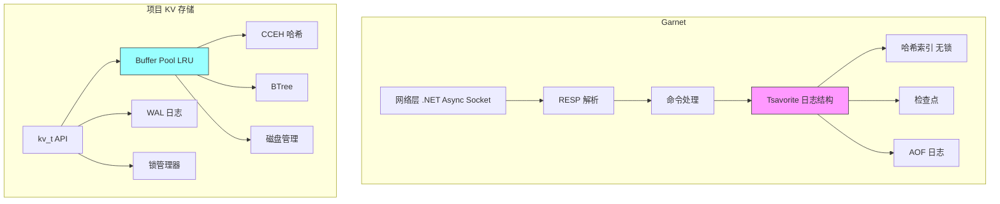
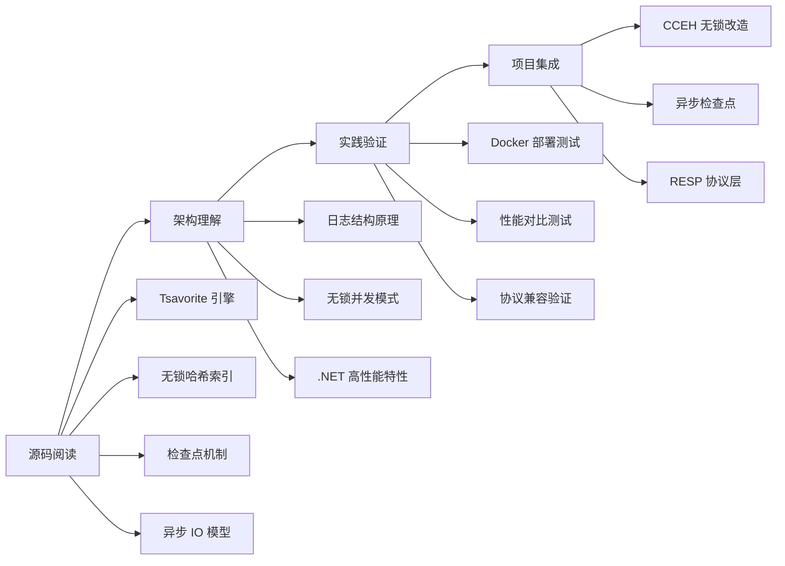

# Garnet 项目关联

## 学习目标

- 对比 Garnet 与本书项目 KV 存储引擎的架构差异
- 分析 Garnet 设计对项目 kv_engine、index、storage 模块的启发
- 明确可借鉴的设计要点和学习路径

## 架构对比总览



## 模块对应关系

| 层级 | Garnet | 项目对应模块 | 状态 |
|------|--------|-------------|------|
| **接口层** | RESP 协议 | kv.h API | 已实现 |
| **并发模型** | 多线程异步 + 无锁读 | 单线程 + 锁管理器 | 可优化 |
| **存储引擎** | Tsavorite（日志结构） | Buffer Pool + WAL | 已实现 |
| **内存索引** | 哈希索引（无锁） | CCEH / BTree | 已实现 |
| **持久化** | 检查点 + AOF | WAL + 页面刷盘 | 已实现 |
| **数据结构** | String/Hash/List/Set/ZSet | 基础 KV | 部分 |
| **集群** | 分片集群 | 单机 | 待规划 |

## 核心设计对比

### 1. 存储引擎架构

Garnet 的 Tsavorite 引擎采用日志结构合并（LSM 风格）设计：所有写入追加到日志末尾，哈希索引维护键到日志位置的映射，后台检查点负责持久化。项目的存储引擎采用传统的页面式设计：Buffer Pool 管理内存中的页面缓存，WAL 记录操作日志，定期将脏页刷回磁盘。

```c
// Tsavorite 写入流程
// 1. 追加记录到日志末尾
// 2. 更新哈希索引指向新位置
// 3. 后台检查点将日志写入磁盘

// 项目 Buffer Pool (engineering/include/db/buffer.h)
typedef struct buffer_pool_s {
    db_file_t   *file;          // 磁盘文件
    size_t       page_size;     // 页面大小
    size_t       pool_size;     // 缓存池大小
    buffer_frame_t *frames;     // 帧数组
    buffer_frame_t *lru_head;   // LRU 链表头
    buffer_frame_t **hash_table;// 哈希表
    uint64_t hit_count;         // 命中次数
    uint64_t miss_count;        // 未命中次数
} buffer_pool_t;
```

**对比总结**：

| 特性 | Garnet Tsavorite | 项目 Buffer Pool |
|------|------------------|------------------|
| 写入模式 | 追加写（顺序 IO） | 随机写（页面覆盖） |
| 索引结构 | 哈希索引 | 哈希 + BTree |
| 缓存机制 | 日志即缓存 | LRU 页面缓存 |
| 持久化方式 | 检查点快照 | WAL + 页面刷盘 |
| 空间回收 | 后台合并（GC） | 无（覆盖写） |
| 写放大 | 低（仅追加） | 中（页面级） |

### 2. 哈希索引设计

Garnet 的哈希索引采用无锁并发设计，读操作完全无锁，写操作通过 CAS 原子指令保证安全。项目的 CCEH 索引同样采用分段可扩展哈希，但目前需要外层锁保护。

```c
// Garnet 哈希索引特点
// - 无锁读路径
// - 写操作使用 CAS
// - 分段设计减少热点竞争

// 项目 CCEH (engineering/include/db/index/hash/cceh.h)
cceh_index_t *cceh_index_create(uint32_t segment_capacity,
                                 uint32_t initial_global_depth);
int cceh_index_insert(cceh_index_t *index,
                      const void *key, uint32_t keylen,
                      const void *value, uint32_t valuelen);
int cceh_index_lookup(const cceh_index_t *index,
                      const void *key, uint32_t keylen,
                      void **value_out, uint32_t *valuelen_out);
```

**相同点**：
- 均采用分段哈希结构
- 均支持动态扩容
- 均有高并发支持潜力

**差异**：
- Garnet：原生无锁，CAS 操作 + 内存屏障
- 项目 CCEH：需外层锁保护，当前为线程安全但不无锁

### 3. 并发控制对比

Garnet 基于 .NET 的 async/await 异步模型构建多线程并发架构，读操作路径无锁。项目采用单线程加锁管理器的传统模式。

```c
// 项目锁管理 (engineering/include/db/kv.h)
struct kv_s {
    // ...
    lock_manager_t *lock_mgr;   // 锁管理器
};

// | 维度 | Garnet | 项目 |
// |------|--------|------|
// | 读操作 | 无锁 | 需锁保护 |
// | 写操作 | CAS | 锁保护 |
// | IO 模型 | 异步非阻塞 | 同步阻塞 |
// | 线程模型 | 多线程 | 单线程 |
// | 并发粒度 | 记录级 | 页面级 |
```

### 4. 持久化机制对比

Garnet 的持久化由检查点（全量快照）和 AOF（增量日志）组成。项目的持久化基于 WAL 写前日志，支持完整的 Redo/Undo 语义。

```c
// 项目 WAL (engineering/include/db/wal.h)
typedef enum wal_log_type_e {
    WAL_LOG_UPDATE = 1,   // 更新
    WAL_LOG_INSERT = 2,   // 插入
    WAL_LOG_DELETE = 3,   // 删除
    WAL_LOG_COMMIT = 4,   // 事务提交
    WAL_LOG_ABORT = 5,    // 事务回滚
    WAL_LOG_CHECKPOINT = 6, // 检查点
} wal_log_type_t;

// WAL 恢复 API
int wal_redo(const char *path, uint64_t start_lsn,
             wal_apply_fn apply_fn, void *ctx);
int wal_undo(const char *path, uint32_t txn_id, uint64_t start_lsn,
             wal_apply_fn apply_fn, void *ctx);
```

| 特性 | Garnet | 项目 WAL |
|------|--------|---------|
| 日志格式 | AOF 文本协议 | WAL 二进制 |
| 检查点 | 全量快照 | 脏页列表 |
| 恢复机制 | 重放 AOF | Redo + Undo |
| 事务支持 | 通过 AOF | 完整事务语义 |
| 并发恢复 | 支持 | 单线程 |

## 可借鉴的设计要点

### 1. 内存模型优化

Garnet 利用 .NET 的 Span/Memory 实现零分配操作，Tsavorite 使用非托管内存避免 GC 扫描。项目可借鉴类似的内存管理优化：

```c
// 内存池设计建议
typedef struct memory_pool_s {
    void **free_blocks;      // 空闲块列表
    size_t block_size;       // 块大小
    size_t capacity;         // 容量
    size_t used;             // 已用数量
    pthread_mutex_t lock;    // 并发保护
} memory_pool_t;

void *memory_pool_alloc(memory_pool_t *pool);
void memory_pool_free(memory_pool_t *pool, void *block);
```

**可借鉴点**：
- 预分配内存池，减少运行时分配开销
- 固定块大小，减少内存碎片
- 页面缓存锁定，避免被 OS 换出

### 2. 扩容策略

Garnet 的 Tsavorite 在日志段满时触发后台扩容，数据迁移对前台透明。项目的 CCEH 在段满时进行目录翻倍和段分裂，目前为同步操作。

| 策略 | Garnet | 项目 CCEH |
|------|--------|----------|
| 触发条件 | 日志段满 | 段满 |
| 扩容粒度 | 日志段 | 目录 + 段 |
| 数据迁移 | 后台线程 | 同步批量 |
| 锁竞争 | 低 | 中 |

**建议优化**：为 CCEH 添加异步段迁移接口，减少扩容时写操作的暂停时间。

```c
// 建议新增的异步接口
int cceh_index_migrate_segment_async(cceh_index_t *index, uint32_t segment_idx);
```

### 3. 无锁读路径

Garnet 的无锁读基于原子操作和版本号校验。项目可以在 CCEH 和 Buffer Pool 中引入类似机制。

```c
// 可借鉴的无锁读取模式
#include <stdatomic.h>

typedef struct lockfree_entry_s {
    atomic_uintptr_t value_ptr;   // 原子值指针
    atomic_uint64_t version;      // 版本号
} lockfree_entry_t;

void *lockfree_read(lockfree_entry_t *entry) {
    uint64_t v1, v2;
    void *ptr;
    do {
        v1 = atomic_load(&entry->version);
        ptr = (void *)atomic_load(&entry->value_ptr);
        v2 = atomic_load(&entry->version);
        // 版本号一致说明读取过程中没有写入
    } while (v1 != v2 || (v1 & 1));  // 奇数表示正在写入
    return ptr;
}
```

**实现要点**：
- 原子指针读取保证可见性
- 内存屏障（Acquire/Release 语义）
- 版本号校验防止读到中间状态

### 4. 异步持久化

Garnet 的检查点在后台线程执行，不阻塞前台读写。项目可以将检查点操作异步化。

```c
// 异步检查点任务
typedef struct checkpoint_task_s {
    wal_t *wal;
    buffer_pool_t *pool;
    uint64_t start_lsn;
    int status;             // 0: 待执行, 1: 执行中, 2: 完成, -1: 失败
    pthread_t thread;
} checkpoint_task_t;

// 建议 API
checkpoint_task_t *checkpoint_start_async(buffer_pool_t *pool, wal_t *wal);
int checkpoint_wait(checkpoint_task_t *task);
int checkpoint_status(checkpoint_task_t *task);
```

## 项目模块关联分析

### kv_engine 模块

```
engineering/src/db/core/kv_engine.c
engineering/include/db/kv_engine.h

对应关系：
- kv_engine_open/close   -> Garnet 服务器连接管理
- kv_engine_insert/get/delete -> Garnet SET/GET/DEL
- kv_engine_stats        -> Garnet INFO 命令

可增强方向：
1. 多线程并发支持：引入工作线程池
2. 连接池管理：复用数据库连接
3. 异步操作 API：支持非阻塞读写
4. RESP 协议兼容层：允许 Redis 客户端直接连接
```

### index 模块

```
engineering/src/db/index/hash/cceh/
engineering/include/db/index/hash/cceh.h

与 Garnet Hash Index 的对应：
- 分段哈希结构 已有
- 动态扩容 已有
- 无锁并发 待实现

可借鉴设计：
1. 段级别锁：减小锁粒度，替代全局锁
2. 原子操作：用 CAS 替代互斥锁
3. 内存屏障：优化多核可见性
4. 版本号校验：无锁读取的正确性保证
```

### storage 模块

```
engineering/src/db/storage/
├── buffer/          # Buffer Pool
├── access/          # Heap/BTree AM
├── disk/            # 磁盘管理

对应关系：
- Buffer Pool <-> Tsavorite 内存日志
- WAL <-> AOF 日志
- BTree <-> 无直接对应

可借鉴设计：
1. 追加写优化：将随机页面写改为顺序追加
2. 异步刷盘：后台线程写入，不阻塞前台
3. 检查点增强：全量快照 + 增量日志
4. 内存池优化：减少分配碎片
```

### wal 模块

```
engineering/src/db/core/wal.c
engineering/include/db/wal.h

与 Garnet AOF 的对应：
- 日志追加 已有
- 检查点机制 已有
- 崩溃恢复 已有

可借鉴设计：
1. 后台异步持久化：WAL 刷盘异步化
2. 日志压缩：合并旧日志减少恢复时间
3. 增量检查点：只记录差异变更
```

## 学习与实践路径



### 阶段 1：源码阅读

| 目标 | 目录 | 关键点 |
|------|------|--------|
| Tsavorite 引擎 | libs/storage/Tsavorite/ | 日志结构、哈希索引、检查点 |
| 无锁哈希 | Tsavorite/core/ | CAS 操作、内存屏障 |
| 网络层 | libs/server/ | 异步 IO、连接管理 |
| 命令处理 | libs/host/ | RESP 解析、命令分发 |
| 集群模式 | libs/cluster/ | 分片、路由 |

### 阶段 2：实践验证

```bash
# 1. Docker 部署 Garnet
docker run -d --name garnet-test \
  -p 6379:6379 \
  ghcr.io/microsoft/garnet

# 2. Redis 兼容性测试
redis-cli -h localhost -p 6379
> SET key "hello"
> GET key
> INCR counter

# 3. 性能测试
redis-benchmark -h localhost -p 6379 \
  -t set,get -n 1000000 -c 50 -P 10

# 4. 与原生 Redis 对比
# 在相同硬件上运行相同的 benchmark 进行比较
```

### 阶段 3：项目集成

| 改造项 | 影响模块 | 优先级 | 难度 |
|--------|---------|--------|------|
| CCEH 无锁改造 | index/hash/cceh | 高 | 高 |
| 异步检查点 | wal, buffer | 中 | 中 |
| 内存池优化 | storage/buffer | 中 | 中 |
| RESP 协议层 | kv_engine | 低 | 低 |
| 多线程 API | kv.h | 低 | 高 |

## 要点总结

| 对比维度 | Garnet | 项目现状 | 借鉴方向 |
|----------|--------|---------|---------|
| **存储引擎** | Tsavorite 日志结构 | Buffer Pool + WAL | 追加写优化 |
| **并发模型** | 多线程异步 + 无锁读 | 单线程 + 锁 | 无锁读路径 |
| **哈希索引** | 无锁并发 | CCEH 分段（需锁） | 原子操作优化 |
| **持久化** | 检查点 + AOF | WAL + 页面刷盘 | 异步检查点 |
| **内存管理** | Span/零分配 | Buffer Pool LRU | 内存池复用 |
| **协议兼容** | RESP 协议 | 基础 KV API | 协议扩展层 |

## 思考题

1. **存储引擎选择**：Garnet 的日志结构存储与项目的页面式存储，各适合什么场景？追加写在写密集型场景的优势有多大？

2. **无锁并发权衡**：项目的 CCEH 是否需要改造为完全无锁？在单线程模式下无锁的收益是否显著？

3. **检查点机制设计**：Garnet 的全量快照检查点与项目的脏页列表检查点，在恢复速度和运行时开销上如何权衡？

4. **异步 IO 模型**：项目的同步 IO 是否限制了吞吐量上限？引入异步 IO 需要改动哪些模块？

5. **协议层扩展**：如果要支持 RESP 协议兼容 Redis 客户端，应在 kv_engine 层还是单独实现协议适配层？

---

**参考资料**：
- Garnet GitHub: https://github.com/microsoft/garnet
- Garnet 官方 Wiki: https://github.com/microsoft/garnet/wiki
- Tsavorite 论文: https://www.microsoft.com/en-us/research/publication/tsavorite/
- 项目源码：engineering/src/db/index/hash/cceh/、engineering/src/db/storage/buffer/、engineering/include/db/wal.h