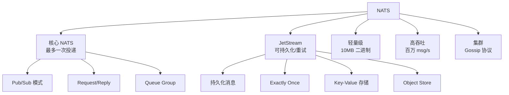

# NATS 项目概览

## 学习目标

- 了解 NATS 作为高性能消息队列的定位
- 掌握 NATS 的轻量级设计理念

## 项目定位

> NATS 是一个高性能、云原生的消息队列系统，强调简单、安全和快速。

**基本信息**：
- 开发方：Synadia（Derek Collison 创建）
- 首次发布：2015 年
- 开源协议：Apache 2.0
- GitHub Stars：约 16k

## 核心设计



## 消息模型

```go
// NATS 的消息模型
// 1. Publish/Subscribe
// 2. Request/Reply
// 3. Queue Groups（负载均衡）

// 主题层级
// 使用 "." 分隔
// order.created  — 精确匹配
// order.*       — 单级通配符
// order.>       — 多级通配符

// 示例
// 主题: orders.europe.created
// 订阅: orders.*.created  → 匹配
// 订阅: orders.>          → 匹配
// 订阅: orders.europe.*   → 匹配
```

## 要点总结

- 核心 NATS 最多一次投递，极致性能
- JetStream 扩展支持持久化和重试
- 10MB 二进制，极轻量级
- 支持百万级消息/秒

## 思考题

1. NATS 的"最多一次投递"相比 Kafka 的"至少一次"有何优劣？
2. JetStream 的持久化机制与 Kafka 的日志存储有何异同？
3. NATS 的集群模式使用 Gossip 协议，与 Raft 有何不同？