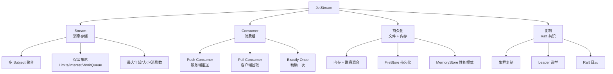

# NATS JetStream 持久化

## 学习目标

- 理解 NATS JetStream 的持久化消息机制
- 掌握 JetStream 的已确认消费模式

## JetStream 架构



## Stream 配置

```bash
# 创建 Stream
nats stream add ORDERS \
  --subjects "orders.>" \
  --storage file \
  --retention limits \
  --max-age 24h \
  --max-msgs 1000000 \
  --replicas 3

# 创建 Consumer
nats consumer add ORDERS PROCESSOR \
  --ack explicit \
  --max-deliver 10 \
  --ack-wait 30s \
  --deliver all

# 发布消息
nats pub orders.created '{"order_id": 123}'

# 拉取消息
nats consumer next ORDERS PROCESSOR
```

## 保留策略

| 策略 | 说明 | 适用场景 |
|------|------|---------|
| Limits | 保留 N 条或 T 时间 | 一般消息队列 |
| Interest | 只要有 Consumer 就保留 | 低频消费 |
| WorkQueue | 每条消息只消费一次 | 任务队列 |

## Go 客户端示例

```go
// Go NATS 客户端
import "github.com/nats-io/nats.go"

// 连接
nc, _ := nats.Connect("nats://localhost:4222")
defer nc.Close()

// JetStream 上下文
js, _ := nc.JetStream()

// 简单 Pub/Sub
nc.Subscribe("orders.>", func(msg *nats.Msg) {
    fmt.Printf("Received: %s\n", string(msg.Data))
    msg.Ack()  // 确认消费
})

// JetStream Publish
js.Publish("orders.created", []byte(`{"id": 123}`))

// JetStream Subscribe
sub, _ := js.SubscribeSync("orders.created")
msg, _ := sub.NextMsg(10 * time.Second)
msg.Ack()
```

## 要点总结

- JetStream 基于 Stream + Consumer 模型
- 支持 Push 和 Pull 两种消费模式
- Raft 实现集群复制
- 三种保留策略覆盖不同场景

## 思考题

1. JetStream 的 Raft 复制与 etcd 的 Raft 复制有何异同？
2. Stream 的保留策略如何选择？
3. Exactly Once 语义在 JetStream 中如何实现？