# NATS JetStream 存储引擎

## 学习目标

- 理解 JetStream 的日志结构存储设计与 Raft 日志的关系
- 掌握文件存储（FileStore）的内存映射实现原理
- 了解内存存储（MemoryStore）的设计权衡
- 理解消息流和消费者偏移管理机制
- 对比 JetStream 存储与项目 `kv_engine`/`storage` 模块的架构差异

## 核心概念

### JetStream 存储架构总览

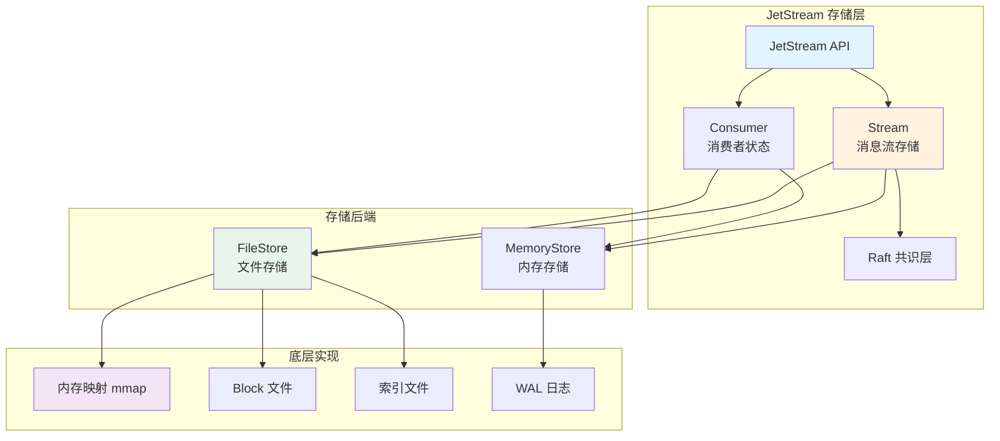

### 核心组件说明

| 组件 | 职责 | 持久化方式 |
|------|------|-----------|
| **Stream** | 消息流存储主体 | FileStore / MemoryStore |
| **Consumer** | 消费者状态管理 | 偏移量持久化 |
| **FileStore** | 文件存储后端 | mmap + Block 文件 |
| **MemoryStore** | 内存存储后端 | 纯内存 + 可选快照 |
| **Raft** | 集群复制一致性 | Raft 日志 |

## 日志结构存储设计

### 追加写日志模型

JetStream 采用追加写日志（Append-Only Log）作为核心存储模型，与 Kafka、Pulsar 的设计理念一致。

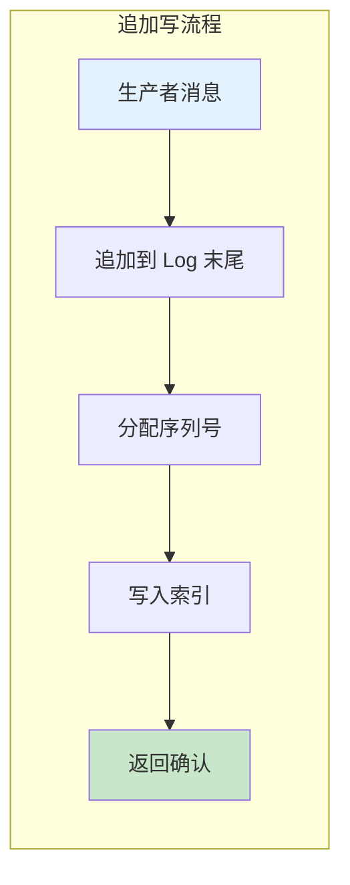

```go
// JetStream 消息存储模型（概念性）

// 消息格式
type StreamMessage struct {
    // 元数据
    Sequence    uint64      // 单调递增序列号
    Timestamp   int64       // 纳秒级时间戳
    Subject     string      // 主题
    // 消息头
    Headers     map[string]string
    // 消息体
    Data        []byte
    // 确认状态
    Ack        bool
}

// 追加写流程
func (s *Stream) Store(msg *Message) error {
    // 1. 分配序列号（原子递增）
    seq := atomic.AddUint64(&s.lastSeq, 1)

    // 2. 追加到日志末尾
    entry := &StreamMessage{
        Sequence:  seq,
        Timestamp: time.Now().UnixNano(),
        Subject:   msg.Subject,
        Data:      msg.Data,
    }

    // 3. 写入存储后端
    return s.store.Store(seq, entry)
}
```

### 消息流结构

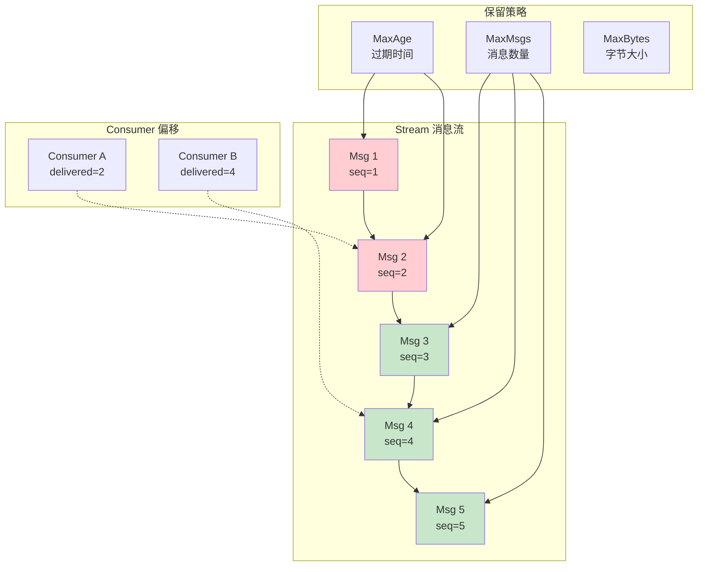

### 与 Raft 日志的关系

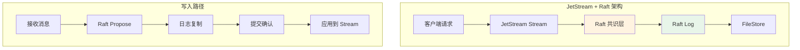

```go
// Raft 日志与 JetStream 的关系

// 1. Raft 日志作为复制载体
// - 每个 JetStream 消息被封装为 Raft 日志条目
// - 通过 Raft 复制到多数节点后提交
// - 提交后应用到本地 Stream 存储

// 2. 日志条目格式
type RaftEntry struct {
    Type    uint8       // EntryNormal / EntryConfChange
    Term    uint64      // 任期
    Index   uint64      // 日志索引
    Data    []byte      // JetStream 消息序列化
}

// 3. 写入流程
func (n *NATSNode) Propose(msg *StreamMessage) error {
    // 1. 序列化消息
    data := marshal(msg)

    // 2. 通过 Raft 提议
    return n.raft.Propose(data)
}

// 4. Apply 回调
func (n *NATSNode) Apply(entry *RaftEntry) {
    // 1. 反序列化消息
    msg := unmarshal(entry.Data)

    // 2. 应用到 Stream 存储
    n.stream.Append(msg)
}
```

**Raft 日志的作用**：

| 功能 | 说明 |
|------|------|
| **复制** | 确保消息在多数节点持久化 |
| **顺序** | 全局一致的序列号 |
| **恢复** | 崩溃后重放日志恢复状态 |
| **成员变更** | 集群扩缩容协调 |

## FileStore 文件存储

### 文件存储架构

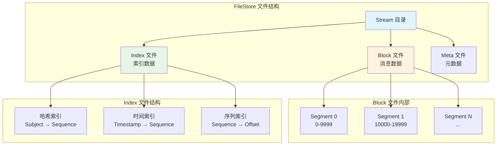

### 内存映射（mmap）设计

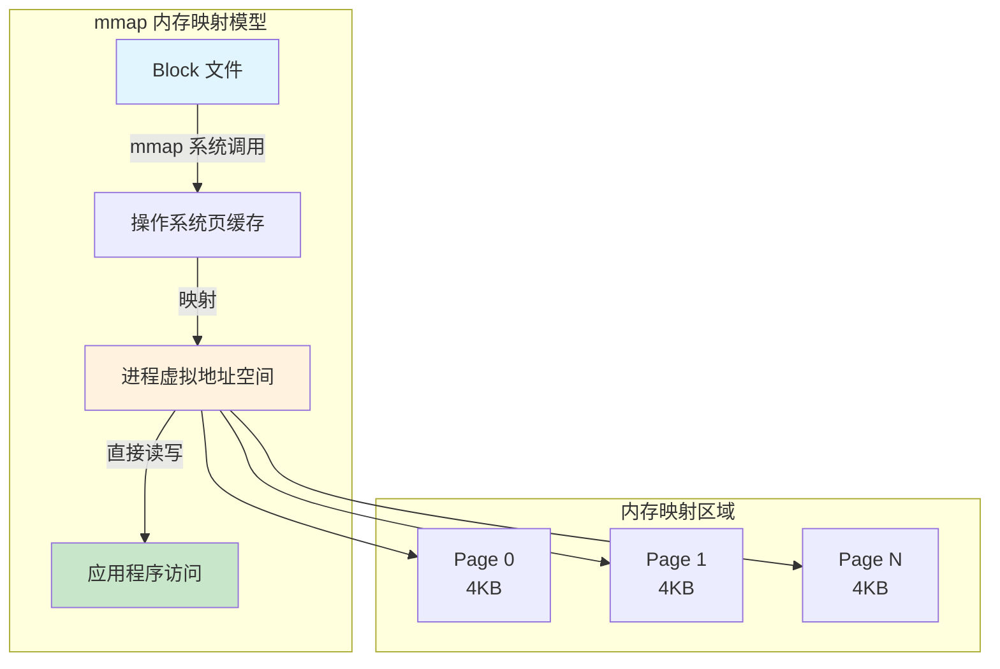

```go
// FileStore 内存映射实现（概念性）

// Block 文件结构
type BlockFile struct {
    fd       int           // 文件描述符
    path     string        // 文件路径
    size     int64         // 文件大小
    data     []byte        // mmap 映射区域
    readOnly bool          // 是否只读
}

// 创建 Block 文件并 mmap
func CreateBlockFile(path string, size int64) (*BlockFile, error) {
    // 1. 创建文件
    fd, err := syscall.Open(path, syscall.O_RDWR|syscall.O_CREAT, 0644)
    if err != nil {
        return nil, err
    }

    // 2. 设置文件大小（预分配）
    if err := syscall.Ftruncate(fd, size); err != nil {
        return nil, err
    }

    // 3. mmap 映射
    data, err := syscall.Mmap(fd, 0, int(size),
        syscall.PROT_READ|syscall.PROT_WRITE,
        syscall.MAP_SHARED)
    if err != nil {
        return nil, err
    }

    return &BlockFile{
        fd:   fd,
        path: path,
        size: size,
        data: data,
    }, nil
}

// 写入消息到 Block
func (bf *BlockFile) WriteMsg(offset int64, msg *StreamMessage) error {
    // 1. 序列化消息
    buf := marshal(msg)

    // 2. 直接写入 mmap 区域（操作系统负责刷盘）
    if offset+int64(len(buf)) > bf.size {
        // 扩容或新建 Block
        return bf.expand(offset + int64(len(buf)))
    }

    // 3. 写入内存映射区域
    copy(bf.data[offset:], buf)

    // 4. 可选：主动刷盘
    // return syscall.Msync(bf.data, syscall.MS_SYNC)

    return nil
}

// 读取消息
func (bf *BlockFile) ReadMsg(offset int64) (*StreamMessage, error) {
    // 直接从 mmap 区域读取
    // 操作系统负责将数据从磁盘加载到页缓存
    return unmarshal(bf.data[offset:])
}

// 关闭文件
func (bf *BlockFile) Close() error {
    // 1. 解除映射
    if err := syscall.Munmap(bf.data); err != nil {
        return err
    }

    // 2. 关闭文件
    return syscall.Close(bf.fd)
}
```

### mmap 优势与权衡

| 特性 | 优势 | 劣势 |
|------|------|------|
| **零拷贝** | 数据直接在页缓存和用户空间共享 | 无 |
| **延迟刷盘** | 由操作系统决定刷盘时机 | 数据可能丢失（需显式 msync） |
| **虚拟内存** | 可映射超大文件（仅加载使用的部分） | 地址空间受限（32 位系统） |
| **随机访问** | 像访问内存一样随机访问 | 无 |
| **并发** | 多线程安全（只读场景） | 写入需要同步 |

### Block 文件分段策略

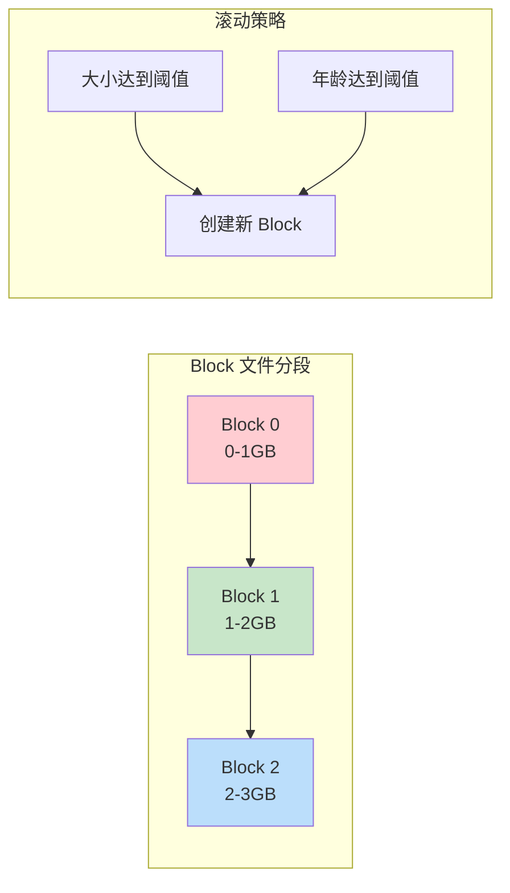

```go
// Block 滚动策略

const (
    DefaultBlockSize    = 1 * GB   // 默认 Block 大小
    DefaultBlockAge      = 24 * time.Hour // 默认 Block 年龄
)

// Block 选择逻辑
func (fs *FileStore) selectBlock() *BlockFile {
    current := fs.currentBlock

    // 1. 检查大小
    if current.size >= DefaultBlockSize {
        return fs.createNewBlock()
    }

    // 2. 检查年龄
    if time.Since(current.createTime) >= DefaultBlockAge {
        return fs.createNewBlock()
    }

    return current
}

// Block 压缩（旧 Block 合并）
func (fs *FileStore) compact() {
    // 1. 识别已消费完全的 Block
    // 2. 合并小 Block 为大 Block
    // 3. 删除空 Block
}
```

### 索引结构

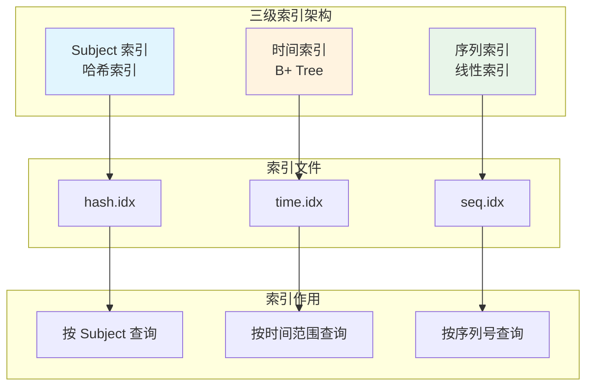

```go
// 索引实现

// 1. Subject 索引（哈希）
type SubjectIndex struct {
    // Subject → [序列号列表]
    index map[string][]uint64
}

// 添加消息时更新
func (si *SubjectIndex) Add(subject string, seq uint64) {
    si.index[subject] = append(si.index[subject], seq)
}

// 按 Subject 查询
func (si *SubjectIndex) Lookup(subject string) []uint64 {
    return si.index[subject]
}

// 2. 时间索引（B+ Tree）
type TimeIndex struct {
    // 时间戳 → 序列号
    tree *btree.BTree
}

// 按时间范围查询
func (ti *TimeIndex) Range(start, end int64) []uint64 {
    // B+ Tree 范围查询
    var results []uint64
    ti.tree.AscendRange(start, end, func(key, val interface{}) bool {
        results = append(results, val.(uint64))
        return true
    })
    return results
}

// 3. 序列索引（线性）
type SeqIndex struct {
    // 序列号 → Block 偏移
    offsets []int64
}

// 按序列号定位
func (si *SeqIndex) Locate(seq uint64) int64 {
    if seq >= uint64(len(si.offsets)) {
        return -1
    }
    return si.offsets[seq]
}
```

## MemoryStore 内存存储

### 内存存储架构

```mermaid
graph TB
    subgraph "MemoryStore 结构"
        MS[MemoryStore]
        SLICE[消息切片<br/>[]Message]
        INDEX[内存索引<br/>map]
    end

    MS --> SLICE
    MS --> INDEX

    subgraph "消息切片"
        M1[Msg 1]
        M2[Msg 2]
        M3[Msg 3]
        MN[Msg N]
    end

    SLICE --> M1 --> M2 --> M3 --> MN

    subgraph "内存索引"
        SUB[Subject Index]
        TIME[Time Index]
        SEQ[Seq Index]
    end

    INDEX --> SUB
    INDEX --> TIME
    INDEX --> SEQ

    style MS fill:#e1f5fe
    style SLICE fill:#fff3e0
    style INDEX fill:#e8f5e9
```

```go
// MemoryStore 实现

type MemoryStore struct {
    // 消息存储
    msgs     []*StreamMessage  // 消息数组
    firstSeq uint64            // 起始序列号
    lastSeq  uint64            // 最新序列号

    // 索引
    subjectIdx map[string][]uint64  // Subject → 序列号
    timeIdx    *btree.BTree         // 时间 → 序列号

    // 配置
    maxMsgs    int64  // 最大消息数
    maxBytes   int64  // 最大字节数
    maxAge     time.Duration  // 最大年龄

    // 锁
    mu sync.RWMutex
}

// 存储消息
func (ms *MemoryStore) Store(msg *StreamMessage) error {
    ms.mu.Lock()
    defer ms.mu.Unlock()

    // 1. 追加到切片
    ms.msgs = append(ms.msgs, msg)
    ms.lastSeq = msg.Sequence

    // 2. 更新索引
    ms.subjectIdx[msg.Subject] = append(ms.subjectIdx[msg.Subject], msg.Sequence)
    ms.timeIdx.ReplaceOrInsert(msg.Timestamp, msg.Sequence)

    // 3. 检查保留策略
    ms.enforceLimits()

    return nil
}

// 读取消息
func (ms *MemoryStore) Read(seq uint64) (*StreamMessage, error) {
    ms.mu.RLock()
    defer ms.mu.RUnlock()

    // 计算索引位置
    idx := int(seq - ms.firstSeq)
    if idx < 0 || idx >= len(ms.msgs) {
        return nil, ErrNotFound
    }

    return ms.msgs[idx], nil
}

// 执行保留策略
func (ms *MemoryStore) enforceLimits() {
    // 1. 检查消息数
    for int64(len(ms.msgs)) > ms.maxMsgs {
        ms.removeFirst()
    }

    // 2. 检查字节数
    // ...

    // 3. 检查年龄
    // ...
}
```

### FileStore vs MemoryStore 对比

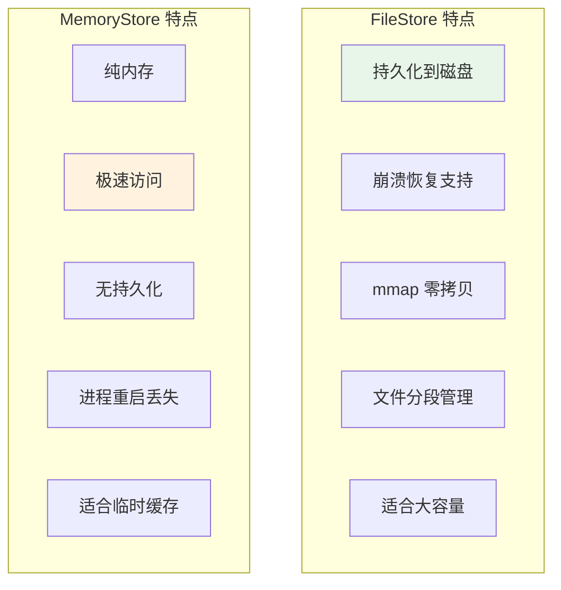

| 特性 | FileStore | MemoryStore |
|------|-----------|-------------|
| **持久化** | 是（文件） | 否（纯内存） |
| **崩溃恢复** | 支持 | 不支持 |
| **读延迟** | 低（mmap） | 极低（内存） |
| **写延迟** | 低（追加写） | 极低（内存追加） |
| **容量** | 受磁盘限制 | 受内存限制 |
| **重启行为** | 恢复数据 | 数据丢失 |
| **适用场景** | 生产环境 | 测试/临时 |

## 消费者偏移管理

### Consumer 状态模型

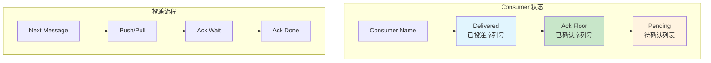

```go
// Consumer 偏移管理

type Consumer struct {
    name      string
    stream    *Stream

    // 状态
    delivered uint64        // 已投递的最新序列号
    ackFloor  uint64        // 已确认的连续序列号
    pending   map[uint64]pendingInfo  // 待确认消息

    // 配置
    ackWait      time.Duration  // 确认超时
    maxDeliver   int            // 最大重投递次数
    deliverPolicy DeliverPolicy  // 投递策略

    // 锁
    mu sync.Mutex
}

// 投递消息
func (c *Consumer) Next() (*StreamMessage, error) {
    c.mu.Lock()
    defer c.mu.Unlock()

    // 1. 计算下一个序列号
    nextSeq := c.delivered + 1

    // 2. 检查是否有可用消息
    if nextSeq > c.stream.lastSeq {
        return nil, ErrNoMessages
    }

    // 3. 读取消息
    msg, err := c.stream.Read(nextSeq)
    if err != nil {
        return nil, err
    }

    // 4. 更新投递状态
    c.delivered = nextSeq
    c.pending[nextSeq] = pendingInfo{
        delivered: time.Now(),
        delivers:  1,
    }

    return msg, nil
}

// 确认消息
func (c *Consumer) Ack(seq uint64) error {
    c.mu.Lock()
    defer c.mu.Unlock()

    // 1. 移除待确认记录
    delete(c.pending, seq)

    // 2. 更新 Ack Floor（连续确认）
    c.updateAckFloor()

    return nil
}

// 更新 Ack Floor
func (c *Consumer) updateAckFloor() {
    // 找到最小的连续确认序列号
    for c.ackFloor+1 <= c.delivered {
        if _, ok := c.pending[c.ackFloor+1]; ok {
            break  // 有未确认，停止
        }
        c.ackFloor++
    }
}

// 红线重投递
func (c *Consumer) checkRedelivery() {
    c.mu.Lock()
    defer c.mu.Unlock()

    now := time.Now()
    for seq, info := range c.pending {
        // 检查是否超时
        if now.Sub(info.delivered) > c.ackWait {
            // 重投递
            if info.delivers < c.maxDeliver {
                c.pending[seq] = pendingInfo{
                    delivered: now,
                    delivers:  info.delivers + 1,
                }
                // 触发重投递...
            } else {
                // 超过最大次数，删除
                delete(c.pending, seq)
            }
        }
    }
}
```

### Push vs Pull 模式

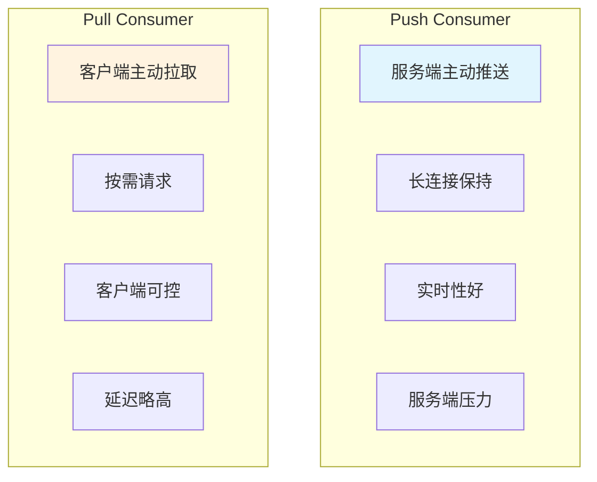

| 模式 | Push Consumer | Pull Consumer |
|------|--------------|---------------|
| **投递方向** | 服务端 → 客户端 | 客户端 → 服务端 |
| **实时性** | 高（立即推送） | 中（轮询间隔） |
| **流控** | 服务端控制 | 客户端控制 |
| **连接** | 需保持长连接 | 可短连接 |
| **适用场景** | 低延迟、实时处理 | 批量处理、可控速率 |

## 与项目 kv_engine/storage 模块对比

### 架构差异总览

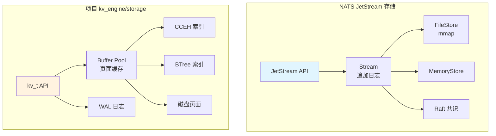

### 核心差异分析

| 维度 | NATS JetStream | 项目 kv_engine |
|------|----------------|----------------|
| **存储模型** | 追加日志（Append-Only） | 页面式存储（Page-Oriented） |
| **写入方式** | 顺序追加 | 页面内更新 |
| **读取方式** | 折叠日志取最新值 | 直接页面查找 |
| **内存管理** | mmap 零拷贝 | Buffer Pool LRU |
| **索引结构** | 内置于 Stream | 独立 CCEH/BTree |
| **持久化** | FileStore/MemoryStore | WAL + 页面刷盘 |
| **一致性** | Raft 多副本 | 单机 ACID |
| **并发模型** | Go goroutine + channel | 单线程 + 锁 |

### 存储模型对比

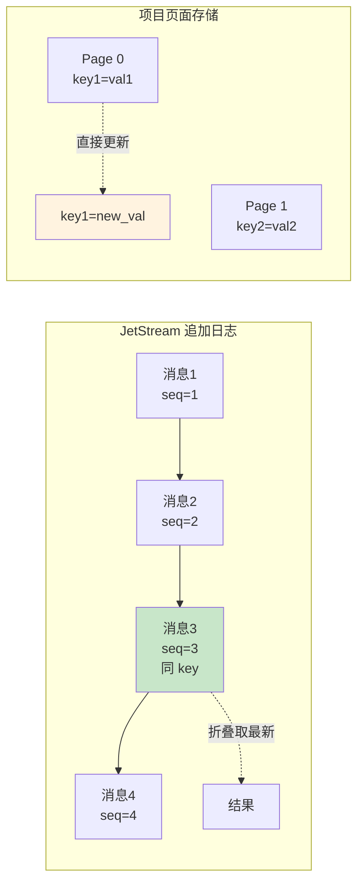

```c
// NATS 追加日志模型
// 优势：
// - 写入顺序 IO，高吞吐
// - 天然支持多版本历史
// - 无需原地更新
// 劣势：
// - 读需折叠确定最新值
// - 空间占用大（保留历史）
// - 需定期压缩

// 项目页面存储模型
// 优势：
// - 读直接查找，低延迟
// - 空间效率高（仅保留最新）
// - 页面管理灵活
// 劣势：
// - 写入涉及页面内移动
// - 碎片整理复杂
// - 无历史版本支持
```

### 内存管理对比

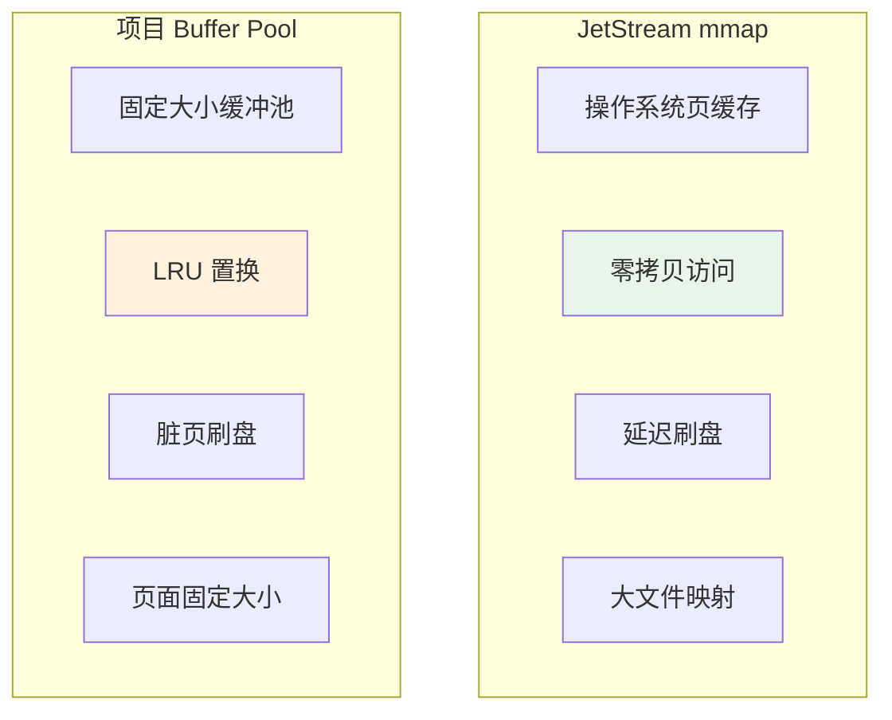

```c
// 项目 Buffer Pool 实现 (bufmgr.h)

typedef struct buffer_pool_s {
    // 缓冲区数组
    page_t *pages;
    // 页面数量
    size_t page_count;
    // 页面大小
    size_t page_size;

    // Hash 表：page_id → buffer_id
    hash_table_t *page_table;

    // LRU 链表
    list_t *lru_list;

    // 脏页链表
    list_t *dirty_list;

    // 锁
    pthread_mutex_t lock;
} buffer_pool_t;

// 与 mmap 的关键区别：
// 1. 固定大小缓冲池，不映射整个文件
// 2. LRU 置换算法，控制内存使用
// 3. 显式脏页管理，精确刷盘控制
// 4. 锁机制保护，并发安全
```

### 可借鉴的设计要点

```c
// 项目可借鉴的 JetStream 设计

// 1. 追加写模式选项
typedef enum kv_write_mode_e {
    KV_WRITE_INPLACE = 0,   // 原地更新（当前模式）
    KV_WRITE_APPEND   = 1,  // 追加写（借鉴 JetStream）
} kv_write_mode_t;

// 追加写实现思路：
// - 所有写入追加到日志末尾
// - CCEH 索引维护 key → 日志位置
// - 后台线程定期压缩合并
// - 优势：写入吞吐提升，支持历史版本

// 2. mmap 零拷贝读取
// - 对大 value（>4KB）使用 mmap
// - 减少用户空间拷贝
// - 利用操作系统页缓存

// 3. Block 文件分段
// - 按大小或时间滚动文件
// - 避免单文件过大
// - 便于空间回收

// 4. 消费者偏移模型
// - 支持 Watch 监听 key 变化
// - 记录消费偏移，支持重放
// - 适用于实时订阅场景
```

## 要点总结

### JetStream 存储核心特性

| 特性 | 说明 | 影响 |
|------|------|------|
| **追加写日志** | 消息顺序追加 | 高写入吞吐 |
| **mmap 零拷贝** | 操作系统页缓存共享 | 低读延迟 |
| **Block 分段** | 按大小/时间滚动文件 | 空间管理灵活 |
| **三级索引** | Subject/时间/序列 | 多维度查询 |
| **Raft 复制** | 多副本一致性 | 高可用 |

### FileStore vs MemoryStore 选择

| 场景 | 推荐存储 | 原因 |
|------|---------|------|
| **生产环境** | FileStore | 数据持久化、崩溃恢复 |
| **临时缓存** | MemoryStore | 极致性能、无需持久化 |
| **高吞吐写入** | FileStore | mmap 追加写高效 |
| **低延迟读取** | MemoryStore | 纯内存访问 |

### 与项目 kv_engine 的借鉴方向

| 借鉴点 | 实现难度 | 收益 |
|--------|---------|------|
| **追加写模式** | 中 | 写吞吐提升、历史版本支持 |
| **mmap 零拷贝** | 低 | 大 value 场景延迟降低 |
| **Block 分段** | 低 | 空间回收、文件管理 |
| **Watch 机制** | 中 | 实时订阅能力 |

## 思考题

1. **存储模型选择**：JetStream 的追加日志模型与项目的页面式模型，在读写比例不同的场景下各有什么优势和劣势？项目的追加写改造是否值得做？

2. **mmap 与 Buffer Pool**：JetStream 使用 mmap 零拷贝，项目使用 Buffer Pool LRU 缓存。两种方案在什么场景下各有优势？是否可以混合使用？

3. **消费者偏移管理**：JetStream 的 Consumer 偏移模型与 Kafka 的 Consumer Group 有何异同？如果要在项目中实现类似 Watch 监听机制，应该采用 Push 还是 Pull 模式？

4. **Raft 与存储的关系**：JetStream 的 Raft 日志与 Stream 消息存储是什么关系？Raft 日志是否就是 Stream 消息？两者的生命周期如何协调？

5. **MemoryStore 适用场景**：MemoryStore 在什么场景下比 FileStore 更合适？如果进程重启，MemoryStore 的数据丢失对业务有什么影响？

6. **Block 分段策略**：JetStream 的 Block 按大小和时间滚动，与项目的 WAL 文件切割策略有何异同？分段大小如何选择？

---

**参考资料**：
- [NATS JetStream 文档](https://docs.nats.io/nats-concepts/jetstream)
- [NATS Server 源码](https://github.com/nats-io/nats-server)
- [JetStream FileStore 源码](https://github.com/nats-io/nats-server/tree/main/server/filestore)
- 项目相关文档：`docs/db_wiki/02_key_value/nats/10_project_connection.md`