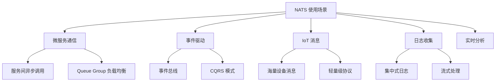

# NATS 使用场景与实验

## 学习目标

- 掌握 NATS 的典型使用场景
- 通过实验验证 NATS 的性能

## 使用场景总览



## 场景 1：微服务通信

```go
// 使用 NATS 作为微服务消息总线
// 服务 A: 订单服务
nc.Publish("orders.created", orderData)

// 服务 B: 库存服务
nc.Subscribe("orders.created", func(msg *nats.Msg) {
    var order Order
    json.Unmarshal(msg.Data, &order)
    // 扣减库存
    msg.Ack()
})

// 服务 C: 通知服务
nc.Subscribe("orders.>", func(msg *nats.Msg) {
    // 发送通知
})

// Queue Group 负载均衡
// 库存服务多个实例，使用 Queue Group
nc.QueueSubscribe("orders.created", "inventory-workers", handler)
```

## 场景 2：IoT 消息

```go
// IoT 设备使用 NATS 上报数据
// 设备主题: sensors.<device_id>.temperature

// 设备端
nc.Publish("sensors.device_001.temperature", tempData)

// 平台端
nc.Subscribe("sensors.>.temperature", func(msg *nats.Msg) {
    // 处理温度数据
})

// 使用 JetStream 持久化
js, _ := nc.JetStream()
js.Publish("sensors.raw", reading)
```

## 实验：搭建 NATS 集群

```bash
# Docker 启动单节点
docker run -d --name nats-test \
  -p 4222:4222 -p 8222:8222 \
  nats:latest

# 启动 3 节点集群
# Node 1
docker run -d --name nats1 \
  -p 4222:4222 -p 8222:8222 \
  nats:latest \
  -cluster nats://0.0.0.0:6222 \
  -routes nats://nats1:6222,nats://nats2:6222

# Node 2 & 3 类似

# 监控
# 访问 http://localhost:8222 查看监控页面

# 测试
nats pub test "hello"  # 发布消息
nats sub test           # 订阅消息
```

## 性能测试

```bash
# 使用 nats-bench 工具
# 安装
go install github.com/nats-io/nats.go/tools/nats-bench@latest

# 测试发布性能
nats-bench -s nats://localhost:4222 -np 10 -n 100000 pub test

# 测试订阅性能
nats-bench -s nats://localhost:4222 -ns 10 -n 100000 sub test

# 测试请求-回复
nats-bench -s nats://localhost:4222 -n 100000 req test
```

## 要点总结

- 微服务间异步通信的首选方案
- Queue Group 实现负载均衡
- 适合 IoT 场景的海量设备消息
- 监控端口 8222 提供实时状态

## 思考题

1. NATS 相比 Kafka 在微服务场景下的优势是什么？
2. NATS 的 Queue Group 和 Kafka 的 Consumer Group 有何异同？
3. 在 IoT 场景下，NATS 的轻量级设计如何体现？