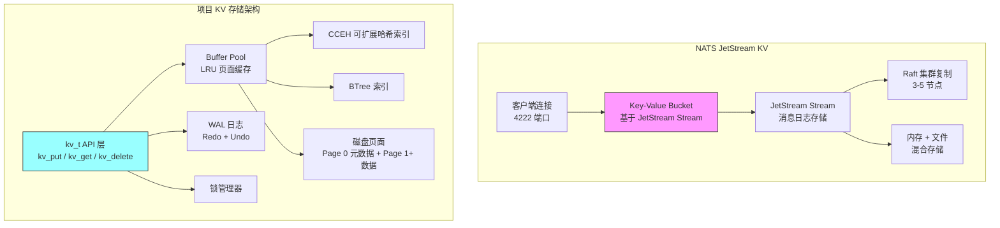
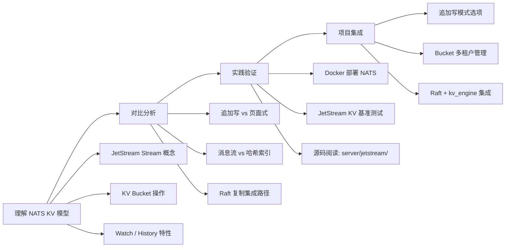

# NATS 项目关联

## 学习目标

- 分析 NATS JetStream KV 存储与本书项目 KV 存储引擎的架构差异
- 探讨 NATS 设计对项目 `kv_engine`、`index`、`storage` 模块的启发
- 明确可借鉴的设计要点和学习路径

## 架构对比总览



## 模块对应关系

| 层级 | NATS JetStream KV | 项目对应模块 | 状态 |
|------|-------------------|-------------|------|
| **接口层** | NATS 协议 (4222 TCP) | `kv.h` API | 已实现 |
| **KV 模型** | Bucket (基于 Stream) | `kv_engine.h` / `storage_ops_t` | 已实现 |
| **存储模型** | 追加日志（消息流） | Buffer Pool + 页面式 | 已实现 |
| **内存索引** | Stream 内部索引 | CCEH / BTree | 已实现 |
| **持久化** | FileStore / MemoryStore | WAL + 页面刷盘 | 已实现 |
| **一致性** | Raft 共识 (3-5 副本) | 单机无复制 | 待实现 |
| **并发模型** | Go goroutine + 异步 IO | 单线程 + 锁管理器 | 可优化 |
| **TTL 支持** | MaxAge 策略 | kv_ttl_mgr | 已实现 |

## 核心设计对比

### 1. 存储模型本质差异

NATS JetStream KV 与项目 KV 存储引擎最根本的区别在于存储模型：

- **NATS**：基于**追加日志**（Append-Only Log）。每个 KV 操作（Put/Delete）被转化为一条 JetStream 消息，追加到 Stream 中。Bucket 的最新状态通过对 Stream 中的消息进行折叠（折叠最后一个版本的 key）得到。
- **项目**：基于**页面式存储**（Page-Oriented）。数据存储在固定大小的页面中，`kv_put` 直接在数据页上更新或插入记录，通过 Buffer Pool 管理缓存和刷盘。

```c
// NATS 的 KV 存储本质
// 每个 Put 操作 = 向 Stream 发布一条消息
// Bucket 状态 = Stream 消息的折叠结果
// 删除 = 发布一条 tombstone（墓碑）消息

// 项目的 KV 存储本质 (kv.c)
// 每个 Put 操作 = 在数据页上直接写入记录
// 记录格式: [key_len(4)][value_len(4)][key][value]
// 页面内顺序存储，线性搜索查找
static int kv_page_insert(buffer_pool_t *pool, page_id_t page_id,
                          const void *key, size_t key_len,
                          const void *value, size_t value_len) {
    page_t *page = buffer_get_page(pool, page_id);
    size_t record_size = sizeof(kv_record_t) + key_len + value_len;
    uint16_t offset = page_alloc_space(page, record_size);
    // 写入 key_len, value_len, key, value
    // 标记脏页
    return 0;
}
```

**对比总结**：

| 特性 | NATS JetStream KV | 项目 KV 引擎 |
|------|-------------------|-------------|
| **写入模式** | 追加消息到 Stream | 直接在数据页覆写 |
| **读取路径** | 折叠 Stream → 读取最新值 | 页面线性查找 → 读取值 |
| **空间回收** | 基于 MaxAge/MaxMsgs 自动过期 | 手动删除 + 碎片整理 |
| **历史版本** | 天然保留（Stream 中所有版本） | 仅保留最新版本 |
| **写放大** | 低（纯追加） | 中（页面内移动） |
| **读放大** | 高（需折叠确定最新值） | 低（直接查找） |

### 2. 索引设计差异

NATS JetStream 的 KV Bucket 不维护独立的索引结构，其"索引"本质上是 Stream 的消息流。每次读取时，JetStream 按 key 筛选消息，取最后一条（last-per-subject 语义）。

项目的 KV 引擎使用页面内的线性搜索（`kv_page_find`），在大数据量场景下性能受限。项目另有独立的 CCEH 哈希索引和 BTree 索引作为可选索引结构：

```c
// 项目 CCEH 索引 (cceh.h)
// - 可扩展哈希（Extendible Hashing）
// - 分段设计，支持动态扩容
// - 目录翻倍 + 段分裂
cceh_index_t *cceh_index_create(uint32_t segment_capacity,
                                 uint32_t initial_global_depth);
int cceh_index_insert(cceh_index_t *index,
                      const void *key, uint32_t keylen,
                      const void *value, uint32_t valuelen);
int cceh_index_lookup(const cceh_index_t *index,
                      const void *key, uint32_t keylen,
                      void **value_out, uint32_t *valuelen_out);
```

| 特性 | NATS JetStream KV | 项目 CCEH 索引 |
|------|-------------------|---------------|
| **索引结构** | 无独立索引（基于消息流） | 分段可扩展哈希 |
| **查找复杂度** | O(N) 折叠（受 Stream 大小影响） | O(1) 期望 |
| **范围查询** | 不支持原生范围扫描 | BTree 支持范围扫描 |
| **动态扩容** | 不适用 | 目录翻倍 + 段分裂 |
| **并发控制** | 无锁（Go 通道模型） | 需外层锁保护 |

### 3. 持久化与一致性

```c
// 项目 WAL 日志 (wal.h)
// 二进制日志格式，支持 Redo/Undo
typedef enum wal_log_type_e {
    WAL_LOG_UPDATE = 1,
    WAL_LOG_INSERT = 2,
    WAL_LOG_DELETE = 3,
    WAL_LOG_COMMIT = 4,
    WAL_LOG_ABORT = 5,
    WAL_LOG_CHECKPOINT = 6,
} wal_log_type_t;

// WAL 重放恢复
int kv_replay_wal(kv_t *db, const char *wal_path) {
    return wal_redo(wal_path, 0, kv_wal_apply, db);
}
```

| 特性 | NATS JetStream KV | 项目 KV 引擎 |
|------|-------------------|-------------|
| **持久化机制** | FileStore（文件）或 MemoryStore | WAL + Buffer Pool 脏页刷盘 |
| **一致性模型** | Raft 共识（集群模式） | 单机 ACID（WAL + 锁） |
| **崩溃恢复** | 重放 JetStream 日志 | WAL Redo 恢复 |
| **复制** | 内建 Raft 多副本 | 无（单机） |
| **TTL/过期** | Stream MaxAge 策略 | kv_ttl_mgr 单独管理 |

### 4. 并发模型

NATS 使用 Go 语言的 goroutine + channel 模型实现高并发，每个客户端连接由一个 goroutine 处理，消息传递通过 channel 完成无锁通信。项目当前采用单线程 + 锁管理器模式：

```c
// 项目锁管理器 (kv.h)
struct kv_s {
    // ...
    lock_manager_t *lock_mgr;   // 锁管理器
};

// | 维度 | NATS | 项目 |
// |------|------|------|
// | 并发单元 | goroutine (轻量线程) | 单线程 |
// | 通信方式 | channel (CSP 模型) | 共享内存 + 锁 |
// | IO 模型 | 异步非阻塞 (Go net) | 同步阻塞 |
// | 锁粒度 | 无锁 (通道通信) | 页面级锁 |
```

## 可借鉴的设计要点

### 1. 追加写存储模型

NATS JetStream 的追加写模型天然适合写密集型场景。项目的页面式存储在写入时涉及页面内记录的移动（`kv_page_delete` 中的 `memmove`），在大 value 场景下开销较大。

```c
// 可借鉴的追加写优化
// 将 kv_put 改为追加写到日志末尾
// 索引维护 key → 最新位置映射

// 追加写流程
// 1. 分配新的日志槽位
// 2. 写入 key + value + 元数据
// 3. 更新哈希索引指向新位置
// 4. 后台线程异步合并旧记录

// 优势
// - 写入变成顺序 IO
// - 避免页面内碎片整理
// - 天然支持多版本（可回滚）
```

**具体建议**：
- 在 `kv_engine.c` 中增加"追加写"模式选项
- 将 `kv_record_t` 改为追加到 WAL 风格的文件末尾
- CCEH 索引维护 key → 文件偏移的映射
- 后台线程异步执行"压缩"操作，合并旧版本

### 2. Bucket 抽象与多租户

NATS JetStream KV 的 Bucket 概念提供了天然的命名空间隔离。项目当前每个数据库文件对应一个 `kv_t` 实例，缺乏多租户管理。

```c
// NATS 的 Bucket 模型
// nats kv add BUCKET_NAME --history 5 --max-value-size 1024
// 每个 Bucket 独立命名空间
// Bucket 之间完全隔离

// 项目可借鉴
// 在 kv_engine.h 基础上增加 Bucket 管理
typedef struct kv_bucket_s {
    char name[64];          // Bucket 名称
    kv_t *kv;               // 底层 KV 存储
    uint32_t max_history;   // 保留历史版本数（借鉴 NATS --history）
    size_t max_value_size;  // 最大值大小
} kv_bucket_t;

// 新增 API
kv_bucket_t *kv_bucket_create(const char *name, kv_bucket_config_t *config);
kv_result_t kv_bucket_put(kv_bucket_t *bucket, const void *key, size_t klen,
                          const void *value, size_t vlen);
kv_result_t kv_bucket_get(kv_bucket_t *bucket, const void *key, size_t klen,
                          void **value, size_t *vlen);
```

### 3. 历史版本与 Watch

NATS JetStream KV 支持 `--history` 参数保留 key 的多个历史版本，以及 Watch 机制监听 key 的变化。项目当前仅保留最新版本。

```c
// 可借鉴的历史版本设计
// 在 kv_record_t 中增加版本号
typedef struct kv_versioned_record_s {
    uint32_t key_len;
    uint32_t value_len;
    uint64_t version;       // 单调递增版本号
    uint64_t timestamp;     // 写入时间戳
    bool tombstone;         // 是否已删除（墓碑标记）
    /* 后面是 key + value 数据 */
} kv_versioned_record_t;

// 版本查询 API
// 支持按版本号读取历史值
kv_result_t kv_get_version(kv_t *db, const void *key, size_t klen,
                           uint64_t version, void **value, size_t *vlen);
```

### 4. Raft 复制集成

NATS JetStream 使用内建 Raft 实现多副本复制（3 或 5 节点），保证高可用。项目已在 `raft.h/c` 中实现了 Raft 核心（Leader 选举、日志复制、安全性），可用于为 KV 引擎增加复制能力。

```c
// 项目已有 Raft 实现 (raft.h)
typedef struct {
    uint64_t term;
    uint64_t index;
    uint8_t  type;      // 0: Normal, 1: ConfChange
    uint8_t *data;
    size_t   len;
} raft_entry_t;

// 集成路径
// kv_put → raft_propose → Raft 日志复制 → 提交 → apply 到 kv_t
// kv_get → 本地读取（线性一致读需通过 Raft）
```

| 集成步骤 | 改动范围 | 难度 |
|---------|---------|------|
| 1. kv_put 写 Raft 日志 | `kv.c` / `kv_engine.c` | 中 |
| 2. Raft apply 回调写 kv_t | `raft.c` + 回调注册 | 中 |
| 3. 线性一致读 | Raft ReadIndex 协议 | 高 |
| 4. 集群成员变更 | Raft ConfChange | 高 |
| 5. 快照传输 | Raft Snapshot | 中 |

### 5. 协议兼容层

NATS 使用自定义二进制协议（基于 TCP），不同于 Redis 的 RESP 协议。项目当前使用 C API（`kv.h`），无网络协议层。

```c
// 可借鉴的协议层设计
// 在 kv_engine 之上增加网络协议适配层

// NATS 协议层示例
// ┌─────────────────────┐
// │  TCP Server (4222)  │
// │  NATS 协议解析      │
// │  SUB/PUB/REQ 路由   │
// ├─────────────────────┤
// │  KV Bucket 适配     │
// │  Bucket Put/Get     │
// ├─────────────────────┤
// │  kv_t API           │
// │  kv_put/kv_get/...  │
// └─────────────────────┘
```

## 项目模块关联分析

### kv_engine 模块

```
engineering/src/db/core/kv_engine.c
engineering/include/db/kv_engine.h

与 NATS JetStream KV 的对应：
- kv_engine_create/open/close ↔ NATS KV Bucket 生命周期
- kv_engine_insert/update/delete ↔ Bucket Put/Delete
- kv_engine_get ↔ Bucket Get

当前差异：
- NATS 支持 Bucket 级别的 TTL（MaxAge）
- NATS 支持 Watch 监听 key 变化
- NATS 支持多副本复制

可增强方向：
1. 增加 Bucket 命名空间隔离
2. 增加 Watch/Callback 机制
3. 集成 Raft 复制（项目中已有 raft.h/c）
```

### index 模块

```
engineering/src/db/index/hash/cceh/
engineering/include/db/index/hash/cceh.h

与 NATS 的对应：
- NATS 无独立索引（基于 Stream 消息流）
- CCEH 提供 O(1) 期望查找，远优于 NATS 的 O(N) 折叠

可借鉴设计：
1. 追加写 + 哈希索引：类似 LSM-Tree 思想
2. 版本号索引：支持历史版本查询
3. 索引持久化：当前 CCEH 为纯内存，可借鉴 NATS FileStore 的持久化策略
```

### storage 模块

```
engineering/src/db/storage/
├── buffer/          # Buffer Pool
├── access/          # Heap/BTree AM
├── disk/            # 磁盘管理

与 NATS 的对应：
- Buffer Pool ↔ NATS MemoryStore
- 页面刷盘 ↔ NATS FileStore 写入
- WAL ↔ JetStream 消息日志

可借鉴设计：
1. MemoryStore 模式：全部数据在内存，定期快照到磁盘
2. 文件存储优化：NATS FileStore 的文件分段策略
3. 压缩机制：NATS 定期合并压缩，项目可借鉴类似的碎片整理
```

### raft 模块

```
engineering/src/db/core/raft.c
engineering/include/db/raft.h

与 NATS Raft 的对应：
- 项目已有 Raft 核心（Leader 选举、日志复制、安全性）
- NATS Raft 用于 JetStream 消息复制

可借鉴设计：
1. Raft 集成到 kv_put 路径：写操作先复制后提交
2. 快照集成：Raft 快照与 KV 数据快照结合
3. 成员变更管理：动态扩缩容
```

## 学习与实践路径



### 阶段 1：NATS KV 模型理解

| 目标 | 操作 | 关键命令 |
|------|------|---------|
| 部署 NATS | Docker 启动 | `docker run -d -p 4222:4222 nats:latest` |
| 创建 KV Bucket | nats CLI | `nats kv add mybucket --history 5` |
| KV 操作 | 读写测试 | `nats kv put mybucket key val` / `nats kv get mybucket key` |
| Watch 监听 | 实时监控 | `nats kv watch mybucket` |
| 历史版本 | 查看历史 | `nats kv history mybucket key` |

### 阶段 2：对比分析

```bash
# 部署 NATS 并创建测试 Bucket
docker run -d --name nats-test \
  -p 4222:4222 -p 8222:8222 \
  nats:latest

# 创建带历史版本的 Bucket
nats kv add testbucket --history 10

# 写入并查看历史
nats kv put testbucket user:1 "{\"name\":\"Alice\"}"
nats kv put testbucket user:1 "{\"name\":\"Alice\",\"age\":30}"
nats kv history testbucket user:1

# 对比项目 KV 引擎的类似操作
# 项目当前不支持历史版本，可通过 WAL 回放实现类似功能
```

### 阶段 3：源码阅读

```
nats-server/
├── server/
│   ├── jetstream/          # JetStream 核心
│   │   ├── kv.go           # KV Bucket 实现（关键！）
│   │   ├── stream.go       # Stream 管理
│   │   └── consumer.go     # Consumer 管理
│   ├── raft/               # Raft 实现
│   └── nats.go             # 主逻辑
├── internal/
│   └── server/
│       └── filestore/      # 文件存储引擎
```

**关键文件**：
- `server/jetstream/kv.go`：NATS KV Bucket 的完整实现，约 500 行，核心逻辑清晰
- `server/consumer.go`：Consumer 管理，展示 Push/Pull 模式
- `internal/server/filestore/`：FileStore 实现，展示了文件分段和压缩策略

### 阶段 4：项目集成

| 改造项 | 影响模块 | 优先级 | 难度 | 说明 |
|--------|---------|--------|------|------|
| 追加写模式 | `kv.c` / `kv_engine.c` | 中 | 中 | 增加日志结构写入选项 |
| Bucket 管理 | `kv_engine.h` | 低 | 低 | 多租户命名空间 |
| Watch 机制 | `kv.h` / `kv_engine.h` | 低 | 中 | 回调注册与通知 |
| 历史版本 | `kv.c` / `kv_record_t` | 中 | 中 | 版本号 + 墓碑标记 |
| Raft 集成 | `kv.c` + `raft.h` | 高 | 高 | 写路径集成 Raft |
| 协议兼容 | 新增 `server/` 目录 | 低 | 高 | NATS 协议解析层 |

## 要点总结

| 对比维度 | NATS JetStream KV | 项目现状 | 借鉴方向 |
|----------|-------------------|---------|---------|
| **存储模型** | 追加日志（消息流） | 页面式存储 | 追加写模式选项 |
| **索引结构** | 无独立索引 | CCEH 哈希索引 | 哈希索引 + 追加写组合（LSM 风格） |
| **持久化** | FileStore / MemoryStore | WAL + Buffer Pool | 纯内存模式选项 |
| **一致性** | Raft 多副本 | 单机 | 集成现有 raft.h/c |
| **多租户** | Bucket 命名空间 | 单库单文件 | Bucket 抽象层 |
| **历史版本** | --history N 保留 N 个版本 | 仅最新版本 | 版本号 + 墓碑标记 |
| **监听机制** | Watch 实时推送 | 无 | 回调注册 |
| **并发模型** | Go goroutine + channel | 单线程 + 锁 | 异步 IO 模型 |

## 思考题

1. **存储模型选择**：NATS 的追加日志模型与项目的页面式模型，在读写比例不同的场景下各有什么优势和劣势？项目的追加写改造是否值得做？

2. **索引对比**：NATS 不使用独立索引（通过消息折叠获取最新值），而项目使用 CCEH 哈希索引。在什么场景下"无索引"的设计反而更好？什么场景下哈希索引不可或缺？

3. **Raft 集成权衡**：项目已有 Raft 实现，集成到 kv_put 路径需要多少改动？Raft 复制带来的写入延迟增加 vs 高可用收益，在单机开发环境中是否值得？

4. **历史版本实现**：NATS 的 `--history` 参数通过保留多条 Stream 消息实现。在项目的页面式存储中，如何高效实现历史版本查询？是否需要改变存储格式？

5. **Watch 机制设计**：如果要在项目中实现类似 NATS Watch 的 key 变更监听，应该采用 Push 模式（回调通知）还是 Pull 模式（客户端轮询）？各自的开销和复杂度如何？

6. **协议层扩展**：NATS 使用自定义二进制 TCP 协议。如果项目要支持 NATS 协议兼容，是直接在 `kv.h` 上层封装协议解析，还是另起一个独立的协议适配层？

---

**参考资料**：
- [NATS JetStream KV](https://docs.nats.io/nats-concepts/jetstream/key-value-store)
- [NATS GitHub](https://github.com/nats-io/nats-server)
- [JetStream KV 源码](https://github.com/nats-io/nats-server/blob/main/server/jetstream/kv.go)
- 项目源码：`engineering/src/db/core/kv_engine.c`、`engineering/include/db/kv.h`、`engineering/include/db/index/hash/cceh.h`