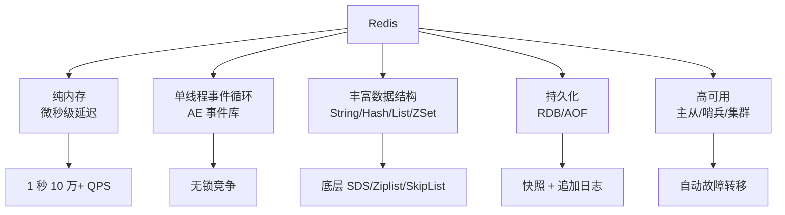

# Redis 项目概览

## 学习目标

- 了解 Redis 作为内存 KV 缓存的行业标准地位
- 掌握 Redis 的纯内存 + 单线程事件循环设计

## 项目定位

> Redis 是一个开源的内存数据结构存储系统，用作数据库、缓存和消息代理。

**基本信息**：
- 开发方：Redis 社区（原 Salvatore Sanfilippo）
- 首次发布：2009 年
- 开源协议：BSD 3-Clause
- GitHub Stars：约 68k

## 核心设计



```c
// 核心事件循环
aeEventLoop *el = aeCreateEventLoop(1024);
aeCreateFileEvent(el, fd, AE_READABLE, acceptHandler, server);
aeMain(el);  // 事件循环主函数
```

## 要点总结

- 纯内存存储，微秒级延迟
- 单线程事件循环，避免锁竞争
- 丰富的数据结构类型
- 支持 RDB 快照和 AOF 日志两种持久化

## 思考题

1. Redis 为什么选择单线程模型？6.0 之后引入的多线程用在哪里？
2. SDS 相比 C 字符串的优势有哪些？
3. Redis 集群的 Hash Slot 如何分配和迁移？