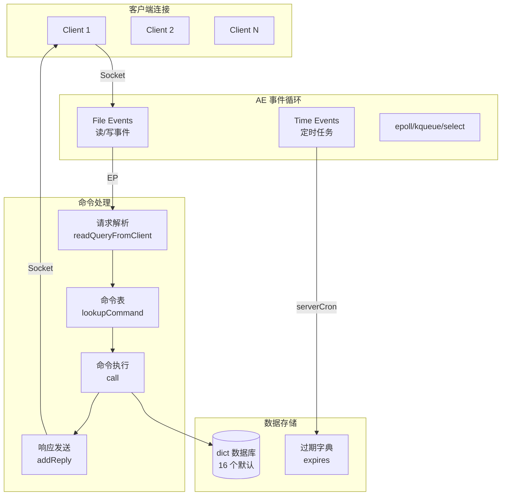
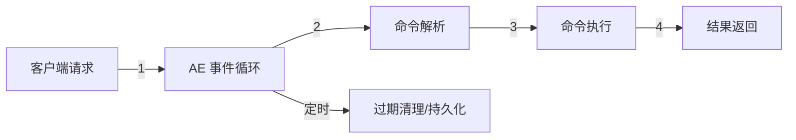

# Redis 架构设计

## 学习目标

- 理解 Redis 的 AE 事件循环架构
- 掌握 Redis 单线程模型与多线程演进

## 整体架构



## 事件循环

```c
// aeMain — 事件循环主循环
void aeMain(aeEventLoop *eventLoop) {
    eventLoop->stop = 0;
    while (!eventLoop->stop) {
        aeProcessEvents(eventLoop, AE_ALL_EVENTS);
    }
}

// aeProcessEvents — 处理文件事件和定时事件
int aeProcessEvents(aeEventLoop *el, int flags) {
    // 1. 计算最近定时事件的过期时间
    // 2. 调用多路复用 API 等待事件
    // 3. 处理就绪的文件事件
    // 4. 处理已过期的定时事件
}
```

## 单线程模型



**单线程设计原因**：
- 纯内存操作，CPU 不是瓶颈
- 避免锁竞争，简化实现
- 利用 IO 多路复用，单线程处理大量连接

## 多线程演进

| 版本 | 特性 | 说明 |
|------|------|------|
| 2.4 | 单线程 | 所有命令串行执行 |
| 4.0 | 异步删除 | UNLINK/FLUSHDB ASYNC 后台线程 |
| 6.0 | IO 多线程 | 网络读写多线程，命令执行仍单线程 |
| 7.0 | 优化 | 多线程进一步优化 |

## 要点总结

- AE 事件循环封装 epoll/kqueue/select
- 单线程执行命令，避免锁竞争
- 6.0 引入 IO 多线程加速网络读写
- serverCron 定期处理过期键/持久化/集群心跳

## 思考题

1. Redis 6.0 的 IO 多线程默认是关闭的，什么场景下需要开启？
2. serverCron 函数每秒执行多少次？主要处理哪些任务？