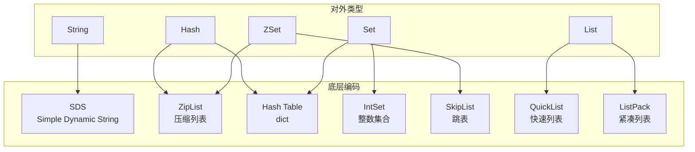

# Redis 数据结构

## 学习目标

- 掌握 Redis 五种基本数据结构的底层实现
- 理解 SDS、ZipList、SkipList 等核心数据结构

## 数据结构总览



## SDS（Simple Dynamic String）

```c
struct sdshdr {
    int len;    // 已用长度
    int free;   // 空闲长度
    char buf[]; // 数据数组
};
```

**优势**：O(1) 获取长度、二进制安全、预分配减少 realloc

## ZipList（压缩列表）

```c
// 内存布局
[zlbytes][zltail][zllen][entry1][entry2]...[zlend]
// entry 结构
[prevlen][encoding][content]
```

**优势**：内存紧凑，适合小数据量

## SkipList（跳表）

```c
typedef struct zskiplistNode {
    sds ele;              // 成员对象
    double score;         // 分值
    struct zskiplistNode *backward; // 后退指针
    struct zskiplistLevel {
        struct zskiplistNode *forward; // 前进指针
        unsigned long span;             // 跨度
    } level[];
} zskiplistNode;
```

**优势**：O(logN) 查找，实现简单，范围查询高效

## 编码转换条件

| 类型 | 编码 | 转换条件 |
|------|------|---------|
| String | int/embstr/raw | 根据值和长度自动选择 |
| Hash | ziplist → hashtable | 任一字段 > 512 或长度 > 64 |
| List | quicklist/listpack | 默认 quicklist |
| Set | intset → hashtable | 元素 > 512 或非整数 |
| ZSet | ziplist → skiplist | 元素 > 128 或长度 > 64 |

## 要点总结

- 每种对外类型对应 2 种底层编码，根据数据量自动切换
- SDS 是 Redis 的字符串基石，替代 C 字符串
- SkipList 是 ZSet 的核心实现，支持范围查询
- 编码转换不可逆

## 思考题

1. ZipList 的连锁更新问题是什么？如何避免？
2. QuickList 是如何结合 ZipList 和双向链表优点的？
3. 为什么 ZSet 同时使用 SkipList 和 Hash Table？