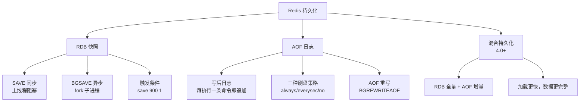

# Redis 持久化机制

## 学习目标

- 理解 RDB 快照和 AOF 日志两种持久化方式
- 掌握混合持久化的原理和适用场景

## 持久化总览



## RDB 快照

```c
// rdb.c — RDB 持久化
int rdbSave(char *filename) {
    // 1. 创建临时文件
    // 2. 写入 RDB 版本号
    // 3. 遍历所有数据库，写入键值对
    // 4. 写入 CRC64 校验和
    // 5. 原子重命名
}

int rdbSaveBackground(char *filename) {
    // fork 子进程执行 rdbSave
    // 父进程继续处理请求
    // 写时复制（COW）
}
```

**RDB 文件结构**：
```
REDIS0009[db_version][db_data][EOF][checksum]
```

## AOF 日志

```c
// aof.c — AOF 追加
void feedAppendOnlyFile(struct redisCommand *cmd, int dictid, robj **argv, int argc) {
    // 1. 构造命令文本
    // 2. 追加到 AOF 缓冲区
    // 3. 根据刷盘策略写入磁盘
}

// 刷盘策略
// appendfsync always   — 每条命令 fsync
// appendfsync everysec — 每秒 fsync（默认）
// appendfsync no       — 由 OS 决定
```

**AOF 重写**：
```c
int rewriteAppendOnlyFileBackground(void) {
    // fork 子进程
    // 读取当前内存状态，用最少的命令重建
    // 父进程新命令缓存到 AOF 重写缓冲区
    // 重写完成后合并
}
```

## 混合持久化（4.0+）


**配置**：`aof-use-rdb-preamble yes`

## 三种持久化对比

| 特性 | RDB | AOF | 混合 |
|------|-----|-----|------|
| 数据完整性 | 可能丢最后一批 | 根据策略丢 0-1s | 丢最后 1s |
| 加载速度 | 快 | 慢 | 较快 |
| 文件大小 | 紧凑 | 较大 | 中等 |
| 性能影响 | BGSAVE 有 fork 开销 | 持续追加影响小 | 综合 |

## 要点总结

- RDB 是二进制快照，适合备份和灾难恢复
- AOF 是命令日志，数据完整性更高
- 4.0 混合持久化结合两者优点
- BGSAVE 通过 fork + COW 避免阻塞主线程

## 思考题

1. fork 子进程时，COW 在什么情况下会导致内存翻倍？
2. AOF 重写和 BGSAVE 是否可以同时进行？