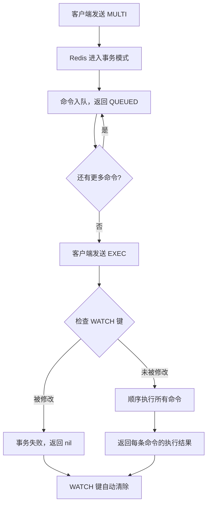
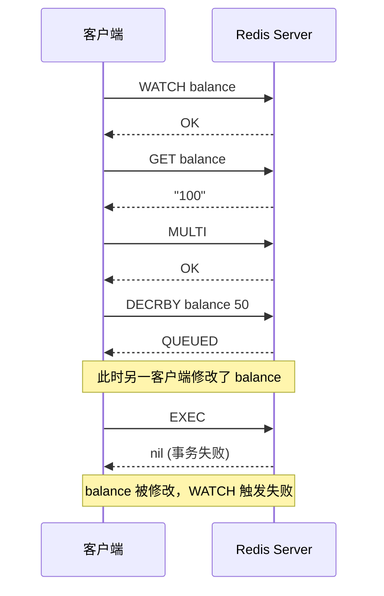
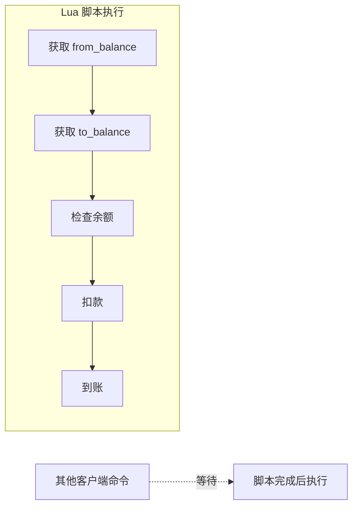
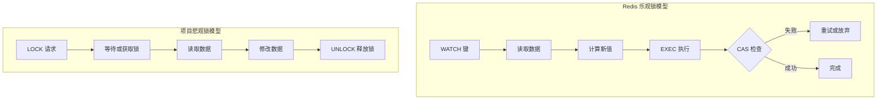

# Redis 事务与 MVCC

## 学习目标

- 理解 Redis MULTI/EXEC/WATCH 事务机制的工作原理
- 掌握乐观锁（WATCH + CAS）的实现方式
- 了解 Lua 脚本原子性的保证机制
- 对比 Redis 事务与关系型数据库 ACID 的差异
- 建立与项目 lock.c/lock.h 模块的关联认知

## 核心概念

### Redis 事务模型

Redis 的事务与传统关系型数据库有本质区别。Redis 事务是一组命令的**顺序执行保证**，而非完整的 ACID 事务。

```
┌─────────────────────────────────────────────────────────────┐
│                   Redis 事务模型                             │
├─────────────────────────────────────────────────────────────┤
│  MULTI ──→ 命令入队 ──→ EXEC ──→ 顺序执行                   │
│                                                             │
│  特点：                                                     │
│  - 无回滚机制（命令执行失败不会撤销已执行命令）               │
│  - 无隔离级别（事务执行期间其他命令可插入）                   │
│  - 乐观锁支持（WATCH 实现 CAS 语义）                         │
└─────────────────────────────────────────────────────────────┘
```

### MULTI/EXEC/WATCH 三剑客

| 命令 | 作用 | 说明 |
|------|------|------|
| `MULTI` | 开启事务 | 进入事务模式，后续命令入队 |
| `EXEC` | 执行事务 | 按顺序执行队列中的所有命令 |
| `DISCARD` | 取消事务 | 放弃队列中的命令 |
| `WATCH` | 监听键 | 实现乐观锁，键被修改则事务失败 |

### 事务执行流程



### WATCH + CAS 乐观锁

Redis 通过 `WATCH` 命令实现乐观锁（Optimistic Locking），本质是 **CAS（Compare-And-Swap）** 模式。



#### WATCH 实现原理

```c
// Redis 源码中的 watched_keys 结构
typedef struct redisDb {
    dict *watched_keys;  // 键 → 监听该键的客户端链表
    // ...
} redisDb;

// 当键被修改时触发
void touchWatchedKey(redisDb *db, robj *key) {
    list *clients = dictFetchValue(db->watched_keys, key);
    if (clients) {
        listIter li;
        listNode *ln;
        listRewind(clients, &li);
        while ((ln = listNext(&li))) {
            client *c = listNodeValue(ln);
            c->flags |= CLIENT_DIRTY_CAS;  // 标记事务失败
        }
    }
}
```

### Lua 脚本原子性

Redis 的 Lua 脚本提供比事务更强的原子性保证：**整个脚本执行期间，Redis 不会执行其他命令**。

```lua
-- 转账脚本示例：原子性扣款
local from_balance = redis.call('GET', KEYS[1])
local to_balance = redis.call('GET', KEYS[2])
local amount = tonumber(ARGV[1])

if tonumber(from_balance) >= amount then
    redis.call('DECRBY', KEYS[1], amount)
    redis.call('INCRBY', KEYS[2], amount)
    return 1  -- 成功
else
    return 0  -- 余额不足
end
```



### Redis 事务 vs 关系型数据库 ACID

| 维度 | Redis 事务 | 关系型数据库 |
|------|-----------|-------------|
| **原子性** | ❌ 无回滚 | ✅ 支持 ROLLBACK |
| **一致性** | ⚠️ 部分支持 | ✅ 约束检查完整 |
| **隔离性** | ❌ 无隔离级别 | ✅ 支持 4 级隔离 |
| **持久性** | ✅ 取决于持久化配置 | ✅ WAL 保证 |
| **并发控制** | 乐观锁（WATCH） | 悲观锁/乐观锁/MVCC |
| **回滚能力** | ❌ 不支持 | ✅ 完整回滚 |

#### 为什么 Redis 不支持回滚？

Redis 设计者 antirez 的解释：

1. **命令错误应在开发阶段发现**：语法错误、类型错误应该在测试中暴露
2. **回滚与 Redis 设计哲学冲突**：Redis 追求简单高效，回滚日志会显著增加复杂度
3. **性能优先**：回滚需要维护 undo 日志，影响单线程性能

```
┌─────────────────────────────────────────────────────────────┐
│               Redis 不支持回滚的原因                          │
├─────────────────────────────────────────────────────────────┤
│  命令错误类型：                                              │
│  ┌─────────────────────────────────────────────────────┐   │
│  │ 语法错误 — MULTI 阶段即可发现，EXEC 直接拒绝         │   │
│  │ 类型错误 — EXEC 时发现，后续命令继续执行             │   │
│  │ 逻辑错误 — 程序员责任，Redis 不负责业务逻辑          │   │
│  └─────────────────────────────────────────────────────┘   │
│                                                             │
│  设计哲学：简单 > 功能完整                                   │
└─────────────────────────────────────────────────────────────┘
```

## 与项目 lock.c/lock.h 模块的关联

项目的锁管理器 (`engineering/include/db/lock.h`) 实现了完整的悲观锁体系，与 Redis 的乐观锁形成对比。

### 架构对比



### 功能对比

| 功能 | Redis WATCH | 项目 lock.h |
|------|------------|-------------|
| 锁类型 | 乐观锁 | 悲观锁 |
| 锁粒度 | 键级别 | 库/表/页/行 |
| 死锁检测 | 无 | ✅ 支持 |
| 锁升级 | 不适用 | ✅ 行→页→表 |
| 意向锁 | 无 | ✅ IS/IX/SIX |
| 锁超时 | 无（EXEC 即失败） | ✅ 可配置超时 |
| 冲突处理 | 立即失败 | 等待或超时 |

### 代码关联示例

项目中的锁管理器提供了 Redis 缺失的悲观锁能力：

```c
// 项目中的悲观锁使用示例
// engineering/include/db/lock.h

// Redis 风格（乐观锁）需要在应用层实现重试
bool redis_style_update(lock_manager_t *mgr, txn_t *txn, 
                        uint64_t row_id, int delta) {
    while (true) {
        // 读取当前值（无锁）
        int current = read_value(row_id);
        int new_value = current + delta;
        
        // 尝试 CAS 式更新
        if (try_update(row_id, current, new_value)) {
            return true;  // 成功
        }
        // 失败则重试
    }
}

// 项目风格（悲观锁）
bool project_style_update(lock_manager_t *mgr, txn_t *txn,
                          uint64_t row_id, int delta) {
    // 获取排他锁
    lock_result_t result = lock_acquire(mgr, txn, LOCK_ROW, row_id, 
                                        table_id, LOCK_MODE_X, 5000);
    if (result != LOCK_OK) {
        return false;  // 超时或死锁
    }
    
    // 持有锁期间安全修改
    int current = read_value(row_id);
    update_value(row_id, current + delta);
    
    // 释放锁
    lock_release(mgr, txn, LOCK_ROW, row_id, LOCK_MODE_X);
    return true;
}
```

### 死锁检测对比

Redis 乐观锁天然无死锁问题，而项目锁管理器需要主动检测：

```c
// 项目中的死锁检测
// engineering/include/db/lock.h

// 死锁检测算法：等待图 DFS
bool lock_detect_deadlock(lock_manager_t *mgr);

// 死锁解决：选择 victim 回滚
txn_t *lock_detect_and_resolve_deadlock(lock_manager_t *mgr);

// Redis 无需此机制：
// - WATCH 不阻塞，无等待依赖
// - 事务失败立即返回，无死锁风险
```

## 要点总结

### Redis 事务特点

1. **无回滚机制**：命令执行失败不撤销已执行命令
2. **乐观锁支持**：WATCH 实现 CAS 语义
3. **顺序执行保证**：EXEC 后命令原子性执行
4. **无隔离级别**：事务执行期间其他命令可插入

### Lua 脚本优势

- 整个脚本原子执行
- 可实现复杂业务逻辑
- 减少 RTT 开销
- 比 MULTI/EXEC 更可靠

### 与项目锁管理器的互补

| 场景 | 推荐方案 |
|------|---------|
| 高并发读、低冲突写 | Redis WATCH（乐观锁） |
| 高冲突写、强一致性要求 | 项目 lock.h（悲观锁） |
| 复杂事务、需要回滚 | 项目 lock.h + WAL |
| 简单原子操作 | Redis Lua 脚本 |

## 思考题

1. Redis 事务的"无回滚"设计在什么场景下是优势？什么场景下是劣势？

2. 如果在项目中实现类似 WATCH 的乐观锁机制，应该如何设计？

   <details>
   <summary>提示</summary>
   
   考虑：
   - 版本号/时间戳机制
   - read_set/write_set 记录
   - commit 时的冲突检测
   - 回滚策略
   </details>

3. 为什么 Redis 选择单线程 + 乐观锁，而项目存储引擎选择多锁粒度 + 悲观锁？

4. 如何用 Lua 脚本实现一个支持回滚的迷你事务系统？

   ```lua
   -- 思考方向
   local undo_log = {}
   -- 记录修改前的值
   -- 失败时执行回滚
   ```

5. 对比项目的意向锁（IS/IX/SIX）与 Redis 的 WATCH，它们解决的核心问题有何不同？

## 参考资源

- [Redis 官方文档 - Transactions](https://redis.io/docs/interact/transactions/)
- [Redis 官方文档 - EVAL script](https://redis.io/commands/eval/)
- 项目源码：`engineering/include/db/lock.h`