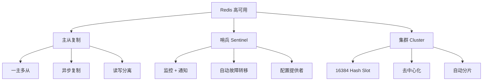
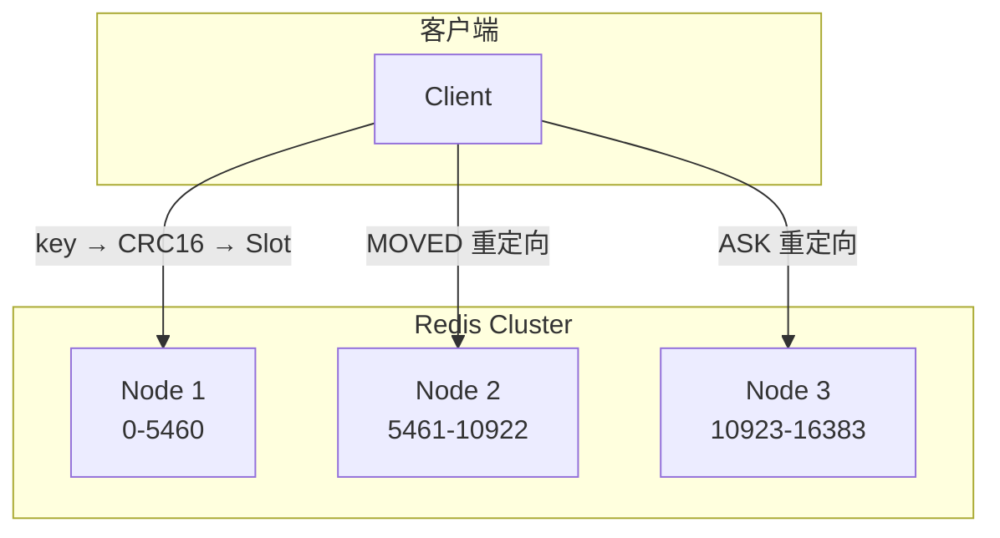

# Redis 高可用架构

## 学习目标

- 掌握 Redis 主从复制、哨兵、集群三种高可用方案
- 理解 Redis 集群的 Hash Slot 分片机制

## 高可用总览



## 主从复制

```c
// replication.c — 主从复制
void replicationFeedSlaves(aeEventLoop *el, int fd, void *privdata, int mask) {
    // 主节点将命令传播给所有从节点
    // 从节点在 repl-backlog 中追加快照后的增量
}

// 复制步骤
// 1. 从节点发送 SLAVEOF 命令
// 2. 主节点 BGSAVE 生成 RDB
// 3. 主节点发送 RDB 给从节点
// 4. 从节点加载 RDB
// 5. 主节点发送缓冲区的增量命令
// 6. 复制完成，持续增量同步
```

## 哨兵（Sentinel）

```c
// sentinel.c — 哨兵实现
// 哨兵是特殊的 Redis 实例
// 主要工作：
// - 每 10 秒向主从发送 INFO
// - 每 1 秒向所有实例发送 PING
// - 通过投票判断主节点是否客观下线

// 故障转移流程
// 1. 主观下线（SDOWN）— 单个哨兵认为不可达
// 2. 客观下线（ODOWN）— 多数哨兵确认不可达
// 3. 选举领头哨兵
// 4. 选新主节点
// 5. 修改配置，通知客户端
```

## 集群（Cluster）



**Hash Slot 计算**：
```c
// cluster.c
unsigned int keyHashSlot(char *key, int keylen) {
    // 计算 CRC16(key) & 16383
    return crc16(key, keylen) & 0x3FFF;
}
```

**集群通信**：
```c
// Gossip 协议
// 每个节点通过 PING/PONG 交换状态
// 每秒随机选择 5 个节点发送 PING
// 10% 的概率选择未通信最久的节点

// 节点间完整 du
// MEET: 加入集群
// PING: 心跳检测
// PONG: 心跳响应
// FAIL: 标记故障
```

## 三种方案对比

| 特性 | 主从复制 | 哨兵 | 集群 |
|------|---------|------|------|
| 分片 | 否 | 否 | 是 |
| 自动故障转移 | 需手动 | 自动 | 自动 |
| 数据容量 | 单机 | 单机 | 多机 |
| 复杂度 | 低 | 中 | 高 |
| 适用场景 | 读写分离 | 高可用 | 大数据量 |

## 要点总结

- 主从复制是基础，哨兵和集群在此基础上构建
- 集群使用 16384 个 Hash Slot 自动分片
- 使用 Gossip 协议进行节点间通信
- 客户端需要处理 MOVED/ASK 重定向

## 思考题

1. 为什么 Redis Cluster 是 16384 个 Slot 而不是更多？
2. 哨兵选举的 Raft 风格算法与标准 Raft 有何不同？
3. 集群模式下，事务和 Lua 脚本如何处理跨 Slot 操作？