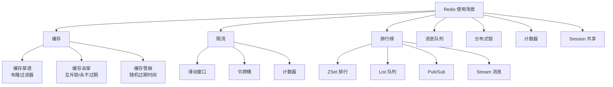

# Redis 使用场景

## 学习目标

- 掌握 Redis 的典型应用场景
- 理解 Redis 在缓存、限流、排行榜等场景的最佳实践

## 使用场景总览



## 缓存场景

```python
# 缓存穿透 — 布隆过滤器
# 查询不存在的数据，大量请求打到 DB
from redisbloom import Client

rb = Client()
rb.bfAdd("users", "user:10086")
exists = rb.bfExists("users", "user:99999")  # False

# 缓存击穿 — 热点 key 过期
# 解决方案：互斥锁
def get_hot_data(key):
    data = redis.get(key)
    if data is None:
        if redis.setnx("lock:" + key, 1):
            data = db.query(key)
            redis.setex(key, 3600, data)
            redis.delete("lock:" + key)
        else:
            time.sleep(0.1)
            return get_hot_data(key)
    return data

# 缓存雪崩 — 大量 key 同时过期
# 解决方案：随机过期时间
redis.setex(key, 3600 + random.randint(0, 600), data)
```

## 限流场景

```python
# 滑动窗口限流 — 1 分钟内最多 100 次
def sliding_window_ratelimit(user_id, max_reqs=100, window=60):
    key = f"ratelimit:{user_id}"
    now = time.time()
    pipe = redis.pipeline()
    pipe.zadd(key, {now: now})
    pipe.zremrangebyscore(key, 0, now - window)
    pipe.zcard(key)
    pipe.expire(key, window)
    _, _, count, _ = pipe.execute()
    return count <= max_reqs

# 令牌桶限流
def token_bucket_ratelimit(user_id, max_tokens=100, rate=10):
    key = f"token_bucket:{user_id}"
    # 使用 Lua 脚本保证原子性
    lua = """
    local key = KEYS[1]
    local now = tonumber(ARGV[1])
    local rate = tonumber(ARGV[2])
    local max = tonumber(ARGV[3])
    local tokens = redis.call('get', key)
    if tokens then
        tokens = math.min(max, tokens + rate * (now - last_time))
    else
        tokens = max
    end
    if tokens >= 1 then
        redis.call('set', key, tokens - 1)
        redis.call('set', key .. ':time', now)
        return 1
    end
    return 0
    """
    return redis.eval(lua, 1, key, time.time(), rate, max_tokens)
```

## 排行榜

```python
# 生成排行榜
ZADD leaderboard 1000 "user:1"
ZADD leaderboard 950  "user:2"
ZADD leaderboard 800  "user:3"

# 获取 TOP 10
ZREVRANGE leaderboard 0 9 WITHSCORES

# 获取用户排名
ZREVRANK leaderboard "user:1"

# 按时间范围查询
ZREVRANGEBYSCORE leaderboard 1000 900
```

## 分布式锁

```python
# Redlock 算法简化版
def acquire_lock(lock_name, acquire_timeout=10, lock_timeout=10):
    lock_key = f"lock:{lock_name}"
    lock_value = str(uuid.uuid4())
    end = time.time() + acquire_timeout
    while time.time() < end:
        if redis.setnx(lock_key, lock_value):
            redis.expire(lock_key, lock_timeout)
            return lock_value
        time.sleep(0.001)
    return None

def release_lock(lock_name, lock_value):
    lock_key = f"lock:{lock_name}"
    # Lua 脚本保证原子释放
    lua = """
    if redis.call('get', KEYS[1]) == ARGV[1] then
        return redis.call('del', KEYS[1])
    end
    return 0
    """
    redis.eval(lua, 1, lock_key, lock_value)
```

## 要点总结

- 缓存场景需防范穿透、击穿、雪崩
- ZSet 天然适合排行榜和延时队列
- Stream 类型是 5.0 引入的消息队列方案
- 分布式锁需要确保原子性和安全释放

## 思考题

1. Redis 做消息队列相比 Kafka 的劣势是什么？
2. Redlock 算法存在哪些争议？为什么有些专家不推荐使用？
3. 在大规模集群中，Redis 缓存和本地缓存如何配合使用？